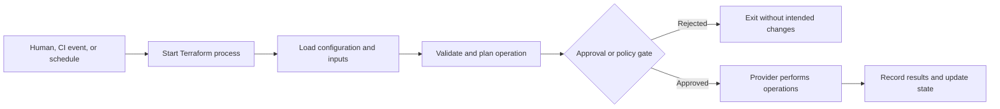
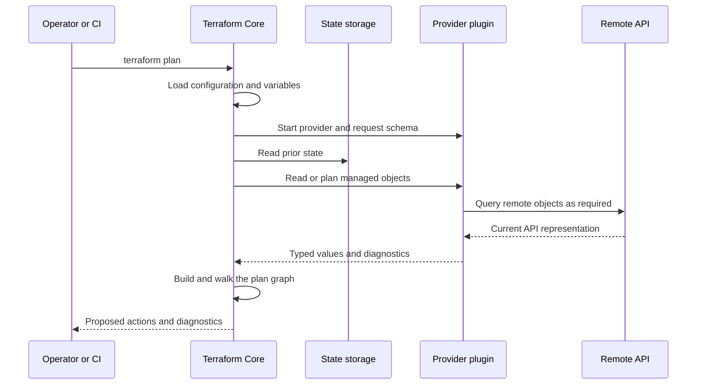
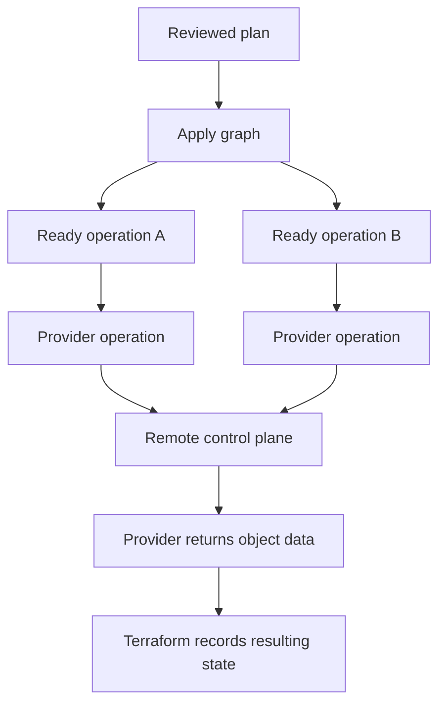
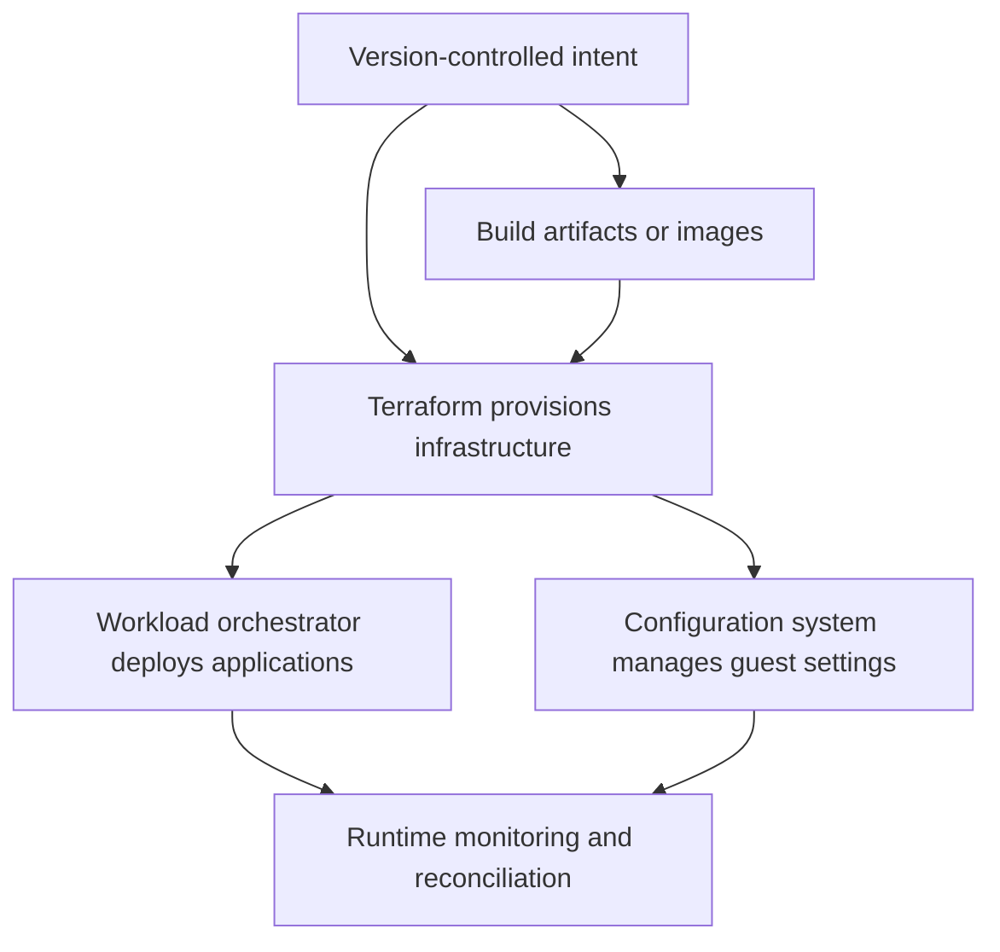
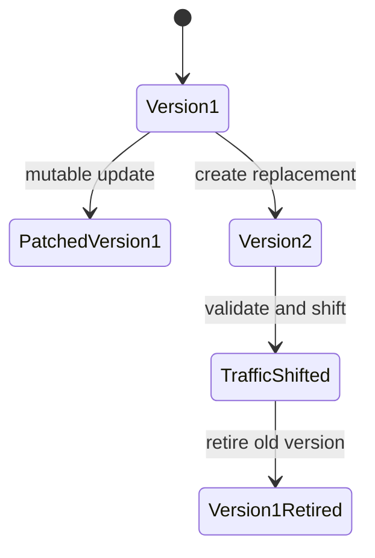

<!-- AUTO-GENERATED by scripts/sync-terraform-curriculum.mjs. Edit the canonical curriculum, not this file. -->

> [!NOTE]
> This page is generated from the reviewed Terraform Mastery curriculum at commit [`c3566e80e995`](https://github.com/thokchomlolet03-cpu/terraform-mastery/commit/c3566e80e995cf4d47c4b756af8674bfd89ef5fb). The source repository is authoritative.

## Lessons in this module

- [01.01 Automation as repeatable execution](#0101-automation-as-repeatable-execution)
- [01.02 From configuration to a cloud API](#0102-from-configuration-to-a-cloud-api)
- [01.03 Choosing the right automation boundary](#0103-choosing-the-right-automation-boundary)

---

## 01.01 Automation as repeatable execution

> Automation is a repeatable decision and action performed by software when a
> person, schedule, or event supplies a trigger.

### Why this matters

Terraform is often introduced as a sequence of commands. That encourages command
memorization without understanding what a run needs or why it can fail. This
lesson builds the smallest accurate model of automation before adding providers,
state, or cloud infrastructure.

### Learning outcomes

After this lesson, you should be able to:

- distinguish a trigger, process, input, side effect, and result;
- explain why repeatability requires explicit inputs and observable outputs;
- place Terraform CLI between an operator or CI runner and provider APIs;
- identify deterministic and externally variable parts of a Terraform run.

### Analogy: a restaurant order ticket

A diner describes a desired meal. A waiter records it as a ticket. The kitchen
interprets the ticket, performs work in a valid order, and reports what was served.

| Restaurant | Automation system |
| --- | --- |
| Diner's request | Desired outcome |
| Order ticket | Machine-readable input |
| Kitchen procedure | Program logic |
| Appliances and cooks | External systems and APIs |
| Completed plate | Side effect and result |
| Receipt | Execution record |

The ticket is not the meal. A Terraform configuration is also not infrastructure;
it is an input to a program that may request changes.

#### Where the analogy breaks

A kitchen follows a mostly imperative recipe. Terraform configuration is mostly
declarative: it describes objects and relationships. Terraform Core, together
with providers, determines the actions required for a particular operation.

### First-principles reconstruction

Any useful automation requires five things.

#### 1. Trigger

A human command, Git push, API call, or schedule starts a process. Hardware timers,
network interrupts, operating-system schedulers, and process creation support
these triggers, but they are platform layers rather than Terraform concepts.

#### 2. Inputs

Terraform may need configuration, variable values, credentials, provider schemas,
and prior state. Hidden inputs make a run difficult to reproduce.

#### 3. Decision logic

Terraform loads configuration, validates it against provider schemas, constructs
an operation-specific graph, reads managed objects when appropriate, and proposes
changes.

#### 4. Effectors

Terraform Core does not implement every cloud resource. Provider plugins translate
Terraform operations into calls to remote APIs or local facilities.

#### 5. Observability

Exit codes, plans, diagnostics, logs, state updates, and API responses make the
outcome visible. Without observable results, repetition is repeated hope.

### Execution model



This separates **starting Terraform** from **changing infrastructure**.
`terraform validate` and `terraform plan` do not execute the proposed
infrastructure changes. `terraform apply` executes an approved plan.

### Determinism and external reality

Terraform can parse identical text consistently, but an entire run depends on
external facts:

- Terraform and provider versions;
- variables, environment, credentials, and permissions;
- prior state;
- remote objects and API behavior;
- time, quotas, eventual consistency, and concurrent actors.

Reproducibility therefore requires controlled versions and inputs, protected
state, and a reviewed plan close to apply time.

### Safe experiment

Use Lab 01, which relies on local providers and creates no paid cloud resources.

1. Read its configuration without running Terraform.
2. Predict which files and values will be created.
3. Run `terraform init` and identify the local artifacts it adds.
4. Run `terraform plan` and explain why the plan is not yet an effect.
5. Run the lab verifier.
6. Destroy any local resources the lab created.

### Failure laboratory

Temporarily provide an invalid variable value. Predict whether the failure occurs
during parsing, validation, initialization, planning, or apply. Restore the value
after observing the diagnostic.

### Retrieval questions

1. Why is a Terraform configuration not infrastructure?
2. Which external inputs can make two runs behave differently?
3. What is the boundary between Terraform Core and a provider?
4. Why does a successful process start not imply a successful change?
5. What evidence would you preserve to reproduce a failed run?

### Teach-back prompt

Explain a Terraform run using the restaurant ticket analogy, then name two ways
the analogy is incomplete.

### Official sources

- [Terraform workflow for provisioning infrastructure](https://developer.hashicorp.com/terraform/cli/run)
- [Terraform Core architecture summary](https://github.com/hashicorp/terraform/blob/main/docs/architecture.md)
- [Providers](https://developer.hashicorp.com/terraform/language/providers)

### Website storyboard

Animate a trigger entering a five-stage pipeline. Let readers pause at each stage
to reveal inputs, outputs, and possible failures. The approval gate should show
that a plan can exist without being applied.

[View this lesson in the canonical curriculum source](https://github.com/thokchomlolet03-cpu/terraform-mastery/blob/c3566e80e995cf4d47c4b756af8674bfd89ef5fb/01_Foundations_The_Physical_and_OS_Reality/01_01_automation_first_principles.md)

---

## 01.02 From configuration to a cloud API

> Terraform Core decides *what operation is needed*; a provider decides *how to
> communicate with the target system*.

### Why this matters

A resource block is not a direct cloud API request. It participates in Terraform's
configuration model, provider schema, dependency graph, state mapping, and plan
before a provider may call a remote API.

### Learning outcomes

- Distinguish a cloud console, control plane, Terraform Core, and provider.
- Explain how provider schemas give meaning to resource arguments.
- Describe the plan-and-apply path without inventing provider internals.
- Explain why console and Terraform workflows can produce similar outcomes through
  different requests.

### Analogy: Terraform Core as a general contractor

A building owner provides a specification. A general contractor coordinates
specialists. An electrician knows the electrical interface; a plumber knows the
plumbing interface.

| Construction | Terraform |
| --- | --- |
| Building specification | Terraform configuration |
| General contractor | Terraform Core |
| Specialist contract | Provider schema and protocol |
| Electrician or plumber | Provider plugin |
| Permit office or utility | Remote control-plane API |
| Inspection record | Plan, diagnostics, and state |

#### Where the analogy breaks

Terraform does not understand business intent. It evaluates configuration and
provider responses. A valid and successful configuration can still describe a bad
architecture.

### First-principles reconstruction

#### The target system

A cloud control plane exposes authenticated operations through interfaces. The
browser console is one client. CLIs, SDKs, and Terraform providers are other
clients.

They do not necessarily send identical requests. A console may use private or
composite endpoints; a provider may use a public SDK and several API calls. The
accurate claim is that both request control-plane changes—not that their packets
are identical.

#### The provider contract

Terraform loads a required provider and requests schema information. The schema
defines resource types, data sources, arguments, attributes, value types, and
behavior the provider communicates to Core.

Without a provider schema, this block has no complete operational meaning:

```hcl
resource "example_server" "web" {
  size = "small"
}
```

Terraform language identifies a resource block. Only the provider can define
whether `size` is valid and how the resource operations work.

### Plan request flow



The exact protocol varies by version. The durable model is that Core coordinates
the operation and providers mediate target-specific behavior.

### Apply request flow



Independent vertices may run concurrently. Dependencies constrain ordering. API
acceptance may precede resource readiness, so providers often poll or retry.

### Worked example

```hcl
terraform {
  required_providers {
    local = {
      source  = "hashicorp/local"
      version = "~> 2.0"
    }
  }
}

resource "local_file" "message" {
  filename = "${path.module}/generated/message.txt"
  content  = "Terraform reached a provider boundary."
}
```

Core understands the language and graph. The `local` provider defines
`local_file` and implements the filesystem operation.

### Safe experiment

1. Put the example in a temporary directory.
2. Predict what `terraform init` downloads.
3. Run `terraform providers schema -json` and locate `local_file`.
4. Run `terraform plan -out=tfplan`.
5. Compare `terraform show tfplan` with `terraform show -json tfplan`.
6. Apply the saved plan, inspect the file, and destroy the resource.

### Failure laboratory

Replace `content` with an unsupported argument name. Decide whether the target
system must be contacted before Terraform rejects it. Use the diagnostic to
identify the validation layer.

### Retrieval questions

1. Why can Core parse a block without knowing how to create its resource?
2. What does a provider schema contribute?
3. Why is “the console and Terraform send identical packets” unsafe?
4. Which component maps resource operations to a target API?
5. Why can API acceptance and resource readiness be different moments?

### Teach-back prompt

Use the contractor analogy to explain Core, providers, and the control plane, then
explain where the analogy fails.

### Official sources

- [Terraform language overview](https://developer.hashicorp.com/terraform/language)
- [Providers](https://developer.hashicorp.com/terraform/language/providers)
- [Terraform Core architecture summary](https://github.com/hashicorp/terraform/blob/main/docs/architecture.md)
- [How Terraform works with plugins](https://developer.hashicorp.com/terraform/plugin/how-terraform-works)

### Website storyboard

Create a two-mode sequence diagram for `plan` and `apply`. Selecting a participant
reveals the information it owns. A comparison view shows the console and Terraform
as different clients of a control plane.

[View this lesson in the canonical curriculum source](https://github.com/thokchomlolet03-cpu/terraform-mastery/blob/c3566e80e995cf4d47c4b756af8674bfd89ef5fb/01_Foundations_The_Physical_and_OS_Reality/01_02_cloud_control_plane_mechanics.md)

---

## 01.03 Choosing the right automation boundary

> Compare tools by the state they own and the lifecycle they control, not by
> whether they all use configuration files.

### Why this matters

“Terraform versus Ansible” is usually the wrong question. The useful design
question is: **which system owns which objects and reconciles which lifecycle?**

### Learning outcomes

- Classify tools by ownership, execution model, and lifecycle.
- Separate infrastructure provisioning, image creation, and application delivery.
- Explain mutable and immutable strategies without treating either as absolute.
- Select Terraform only when its state and provider model fit the problem.

### Analogy: layers of a theatre production

- A contractor creates the theatre: infrastructure provisioning.
- A workshop builds reusable sets: artifact or image creation.
- A stage crew configures the venue: configuration management.
- A stage manager coordinates scenes: workload orchestration.
- A script repository records approved intent: version control and GitOps.

One team can perform several roles, but confused ownership creates conflicting
work.

#### Where the analogy breaks

Software layers overlap. Terraform providers can configure SaaS or Kubernetes
objects, and configuration tools can create cloud resources. These categories
describe primary ownership models, not hard technical laws.

### First-principles classification

#### 1. What objects does the system own?

Cloud networks, IAM policies, images, OS packages, workloads, DNS records, and
database migrations have different lifecycles.

#### 2. What memory does it keep?

Terraform maps addresses to remote objects through state. Other systems may query
reality directly, store desired state in a control plane, or keep no ownership
record.

#### 3. Who initiates reconciliation?

- **Push:** an operator or CI runner starts an operation.
- **Pull:** an agent or controller repeatedly observes and reconciles desired state.

Terraform CLI normally uses triggered runs. Kubernetes controllers are a classic
continuous reconciliation model.

#### 4. How are changes introduced?

- **Mutable:** alter an existing object when supported.
- **Immutable:** create a replacement, shift use, and retire the prior object.

Terraform supports both. Provider behavior and the target API determine whether a
change updates in place or requires replacement.

### Responsibility map



The arrows are dependencies, not a mandatory product stack.

### Decision table

| Need | Likely primary mechanism | Why |
| --- | --- | --- |
| Provision a VPC and managed database | Terraform provider | Durable remote objects with dependencies |
| Build a hardened VM image | Image build pipeline | Produces a versioned artifact |
| Install packages inside long-lived VMs | Configuration management | Owns guest configuration |
| Continuously maintain application replicas | Runtime controller | Reconciles workloads continuously |
| Release a new application revision | Delivery pipeline | Owns application rollout |
| Run a one-time data migration | Purpose-built imperative job | Ordered business operation |

### Declarative does not mean safe

A declarative configuration can request deletion, public access, or an expensive
fleet. Safety comes from reviewed plans, policy, validation, restricted
credentials, tests, and small blast radii—not syntax alone.

### Mutable versus immutable



Neither is universally correct. Databases often need managed in-place evolution;
stateless application instances are frequently safer to replace.

### Safe experiment

Choose five objects from a familiar system. For each, record its desired-state
owner, current-state source, trigger model, update behavior, and rollback method.
Mark any object with two competing owners; it is a likely source of drift.

### Failure laboratory

Imagine Terraform and a deployment script both set a Cloud Run service's image and
scaling fields. Walk through alternating runs. Assign one authoritative owner for
service configuration and one controlled mechanism for releasing an image.

### Retrieval questions

1. Why is object ownership more useful than product labels?
2. Does Terraform guarantee immutable infrastructure?
3. How does a triggered run differ from continuous reconciliation?
4. When is an imperative job more appropriate than Terraform?
5. What failure occurs when two systems own the same field?

### Teach-back prompt

Explain the layers using the theatre analogy. Then classify one real system and
identify any overlapping ownership.

### Official sources

- [What is Terraform?](https://developer.hashicorp.com/terraform/intro)
- [Terraform language](https://developer.hashicorp.com/terraform/language)
- [Resource behavior](https://developer.hashicorp.com/terraform/language/resources/behavior)
- [Terraform workflow](https://developer.hashicorp.com/terraform/cli/run)

### Website storyboard

Build a draggable ownership map. Readers place objects into provisioning, image,
configuration, runtime, or migration layers. Warn when two tools own the same
field.

[View this lesson in the canonical curriculum source](https://github.com/thokchomlolet03-cpu/terraform-mastery/blob/c3566e80e995cf4d47c4b756af8674bfd89ef5fb/01_Foundations_The_Physical_and_OS_Reality/01_03_iac_taxonomy_and_design_paradigms.md)
