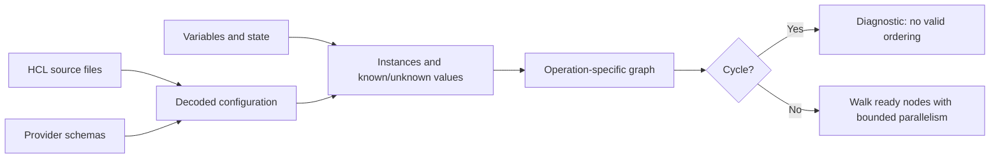
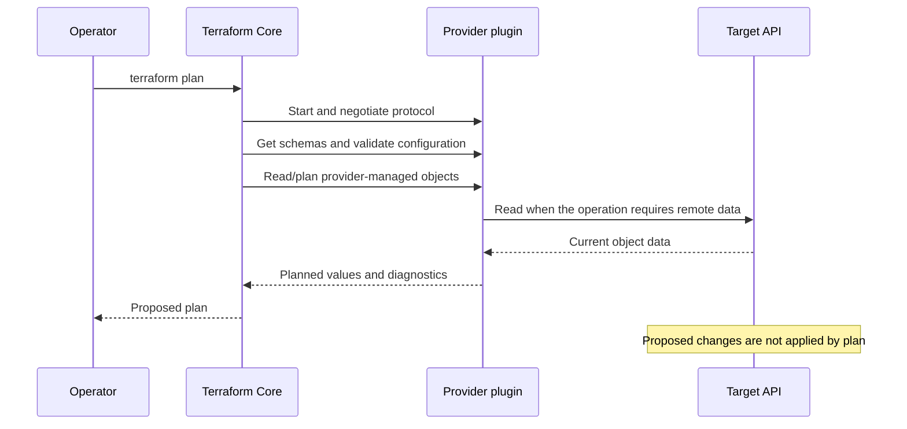
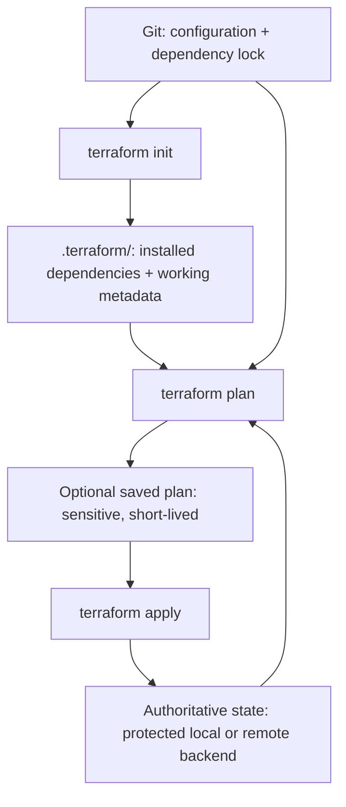

<!-- AUTO-GENERATED by scripts/sync-terraform-curriculum.mjs. Edit the canonical curriculum, not this file. -->

> [!NOTE]
> This page is generated from the reviewed Terraform Mastery curriculum at commit [`c3566e80e995`](https://github.com/thokchomlolet03-cpu/terraform-mastery/commit/c3566e80e995cf4d47c4b756af8674bfd89ef5fb). The source repository is authoritative.

## Lessons in this module

- [02.01 From configuration to an operation graph](#0201-from-configuration-to-an-operation-graph)
- [02.02 Terraform Core and provider plugins](#0202-terraform-core-and-provider-plugins)
- [02.03 Terraform's local artifacts](#0203-terraforms-local-artifacts)

---

## 02.01 From configuration to an operation graph

> Terraform uses references and provider schemas to build a graph for the current
> operation; file order is not execution order.

### Why this matters

Most mistakes about Terraform ordering begin with reading `.tf` files as a shell
script. Terraform combines the configuration files in a module, evaluates
expressions in context, expands resource instances, and constructs a graph for a
particular operation. Understanding that model explains concurrency, unknown
values, cycle errors, and why moving a block within a file normally changes
nothing.

### Learning outcomes

After this lesson, you should be able to:

- distinguish source syntax, configuration objects, resource instances, and graph nodes;
- infer dependencies from expression references;
- explain the narrow purpose of `depends_on`;
- read a graph without assuming every node is a remote resource;
- diagnose a simple dependency cycle.

### Analogy: a construction dependency board

A project manager may schedule painting only after the wall exists, while ordering
unrelated furniture at the same time. The written order of tasks on the board does
not determine the work order; prerequisites do.

#### Where the analogy breaks

Terraform does not maintain one permanent project board. It builds and transforms
graphs for specific operations. Graph nodes can represent provider configuration,
resource-instance operations, expansion, outputs, and other internal work—not
only visible infrastructure objects. Exact node types and transformations are
implementation details and can change between Terraform versions.

### First-principles reconstruction

#### Inputs

- all configuration files in the current module and referenced child modules;
- variable values and workspace context;
- provider schemas and provider configurations;
- prior state and, depending on the command and options, refreshed remote data;
- the requested operation, such as validate, plan, apply, or destroy.

#### Constraints

An expression that reads another object's attribute cannot be evaluated before
the producing operation makes that value available. Provider configuration must
be ready before provider-managed operations. A valid execution order cannot exist
when required dependencies form an unbreakable cycle.

#### Transformation

Terraform loads and decodes configuration, evaluates what it can, creates
operation-specific nodes, adds dependency edges, validates that the graph has no
cycles, and walks ready nodes with bounded parallelism. The official internals
documentation describes the graph-building stages; it does not promise a public
API for a particular topological-sort algorithm.

#### Outputs

The result depends on the command: diagnostics, a proposed plan, applied remote
operations and new state, or a DOT representation from `terraform graph`.

### Execution model



### Worked example

```hcl
resource "local_file" "message" {
  filename = "${path.module}/message.txt"
  content  = "hello"
}

output "message_path" {
  value = local_file.message.filename
}
```

The output expression creates a dependency because it reads an attribute of
`local_file.message`. Placing the `output` block first would not reverse that
dependency.

Use `depends_on` only for a dependency Terraform cannot infer from expressions.
Broad explicit dependencies can make more values unknown during planning and can
reduce safe concurrency.

### Safe experiment

Use Lab 02; it creates local files and random values rather than paid cloud
resources.

1. Draw the expected dependency graph from the references.
2. Run `terraform init` and `terraform graph`.
3. Render the DOT output with Graphviz if installed.
4. Compare your drawing with the output, noting internal nodes Terraform adds.
5. Move a block to a different position and confirm that references, not file
   order, preserve the meaningful dependency.
6. Run `terraform test` and clean up local artifacts.

### Failure laboratory

Create two local values or resources with mutual references. Predict the earliest
command that can report the cycle, run it, and record the complete dependency path
from the diagnostic. Restore the valid configuration afterward.

### Retrieval questions

1. Why is “Terraform executes top to bottom” incorrect?
2. What information creates an implicit dependency?
3. Why can excessive `depends_on` make a plan less precise?
4. Why should internal graph node types not become a module interface?
5. What makes a dependency cycle impossible to schedule?

### Teach-back prompt

Explain how three resources can be declared in one order, planned in dependency
order, and partially operated in parallel. Then explain what evidence you would
inspect rather than guessing.

### Official sources

- [Terraform dependency graph internals](https://developer.hashicorp.com/terraform/internals/graph)
- [References to named values](https://developer.hashicorp.com/terraform/language/expressions/references)
- [`depends_on` meta-argument](https://developer.hashicorp.com/terraform/language/meta-arguments/depends_on)
- [`terraform graph`](https://developer.hashicorp.com/terraform/cli/commands/graph)

### Website storyboard

Let the learner rearrange HCL blocks and predict whether the graph changes. A
second control adds and removes expression references so the dependency arrows,
unknown values, and ready-node set change for the correct reason.

[View this lesson in the canonical curriculum source](https://github.com/thokchomlolet03-cpu/terraform-mastery/blob/c3566e80e995cf4d47c4b756af8674bfd89ef5fb/02_Terraform_Core_Architecture_and_Internals/02_01_core_engine_ast_and_dag.md)

---

## 02.02 Terraform Core and provider plugins

> Terraform Core coordinates the run; provider plugins supply schemas and
> resource-specific behavior through a versioned protocol.

### Why this matters

Terraform can manage many APIs without embedding every product SDK in the CLI.
This boundary also explains why `terraform init` installs providers, why provider
versions affect plans, and why a provider crash is different from a Terraform
language error.

### Learning outcomes

After this lesson, you should be able to:

- assign responsibilities to Terraform Core and to a provider;
- distinguish provider installation, startup, configuration, planning, and apply;
- explain why provider schemas are needed before planning resource changes;
- interpret provider logs without treating the transport as a public interface;
- describe how the dependency lock file constrains provider selection.

### Analogy: an architect and licensed specialists

An architect coordinates a building plan but asks electrical and structural
specialists for domain rules and operations. Each specialist works through an
agreed contract, so the architect does not need to contain every specialty.

#### Where the analogy breaks

Provider plugins are executable programs, not independent decision-makers. Core
still owns the overall configuration, dependency graph, run lifecycle, and state
coordination. The plugin protocol and its compatibility guarantees matter; socket
paths, process-launch mechanics, logs, and other transport details are not stable
module-facing contracts.

### First-principles reconstruction

#### Inputs

- `required_providers` source addresses and version constraints;
- the dependency lock file's selected versions and checksums;
- provider configuration and credentials;
- Terraform configuration, prior state, and proposed values;
- a protocol version supported by Core and the provider.

#### Constraints

Core cannot validate provider-specific attributes or plan provider-managed
objects without the provider schema and planning behavior. The provider cannot
choose the entire run order because it sees operations through the protocol
boundary rather than owning the full Terraform graph.

#### Transformation

`terraform init` resolves and installs suitable provider packages. Commands that
need a provider start its executable and negotiate a supported protocol. Core asks
for schemas, validates configuration, and sends operation requests. During apply,
the provider translates an approved resource change into calls to its target API
and returns the resulting state and diagnostics.

#### Outputs

Provider responses include schemas, planned values, applied state, and
diagnostics. Core combines these with the rest of the graph and persists state at
appropriate checkpoints.

### Execution model



### Worked example

```hcl
terraform {
  required_providers {
    local = {
      source  = "hashicorp/local"
      version = "~> 2.0"
    }
  }
}

resource "local_file" "example" {
  filename = "${path.module}/example.txt"
  content  = "provider boundary"
}
```

Core understands the generic `resource` construct. The local provider defines the
`local_file` schema and implements how that resource is planned, created, read,
updated, and deleted.

### Safe experiment

1. In Lab 01, move `.terraform/` to a temporary backup only when no Terraform
   process is running and no local artifact is needed.
2. Run `terraform init` and observe the installed provider path and lockfile.
3. Run `terraform providers schema -json` and identify one required, optional,
   computed, and sensitive attribute if the schema contains each kind.
4. Run a plan with `TF_LOG=DEBUG`; capture only the provider lifecycle lines and
   redact paths or environment data before sharing.
5. Unset `TF_LOG`, remove the temporary backup if it is no longer needed, and run
   the verifier.

### Failure laboratory

Change the required provider constraint to a version range incompatible with the
locked selection. Predict whether normal initialization or `init -upgrade` can
resolve it. Read the diagnostic, then restore the original constraint and lockfile.

### Retrieval questions

1. What does Core know that an individual provider does not?
2. Why is a provider schema needed during validation and planning?
3. What is the difference between installing and configuring a provider?
4. Why should lessons avoid depending on an exact socket path or log message?
5. When can `plan` still cause remote read requests without applying changes?

### Teach-back prompt

Trace one resource from `required_providers` through initialization, planning, and
apply. Identify the owner of each decision and the evidence you can inspect.

### Official sources

- [Terraform Core architecture](https://github.com/hashicorp/terraform/blob/main/docs/architecture.md)
- [Terraform plugin protocol](https://developer.hashicorp.com/terraform/plugin/terraform-plugin-protocol)
- [Provider requirements](https://developer.hashicorp.com/terraform/language/providers/requirements)
- [`terraform providers schema`](https://developer.hashicorp.com/terraform/cli/commands/providers/schema)

### Website storyboard

Use a split-screen sequence: Core on the left, one provider in the center, and a
target API on the right. A command selector reveals which messages and remote
effects are possible during `init`, `validate`, `plan`, and `apply`.

[View this lesson in the canonical curriculum source](https://github.com/thokchomlolet03-cpu/terraform-mastery/blob/c3566e80e995cf4d47c4b756af8674bfd89ef5fb/02_Terraform_Core_Architecture_and_Internals/02_02_grpc_plugin_system_and_ipc.md)

---

## 02.03 Terraform's local artifacts

> Configuration, installed dependencies, dependency selections, plans, and state
> have different lifecycles and must not share one Git or security policy.

### Why this matters

A repository can be reproducible while still leaking secrets or committing
machine-specific files. Correct artifact classification prevents both mistakes.
It also makes CI caches, incident recovery, and provider upgrades easier to
reason about.

### Learning outcomes

After this lesson, you should be able to:

- distinguish configuration, `.terraform/`, `.terraform.lock.hcl`, plan files, and state;
- decide which artifacts belong in version control;
- explain what the lock file does and does not guarantee;
- identify why state and saved plans require sensitive-data controls;
- rebuild disposable artifacts without deleting authoritative state.

### Analogy: source recipe, pantry, receipt, and inventory ledger

Configuration is the recipe. `.terraform/` is a local pantry of installed tools
and working metadata. The dependency lock file is a receipt recording chosen
provider packages and checksums. State is an inventory ledger connecting
Terraform addresses to managed objects and recorded attributes.

#### Where the analogy breaks

State is not merely a human-readable list, and its JSON representation is an
internal format rather than a public editing interface. A saved plan may contain
configuration, values, and sensitive data. The lock file verifies selected
provider packages against recorded checksums but does not prove that provider
source code is safe or make every execution environment identical.

### First-principles reconstruction

#### Inputs

- checked-in `.tf` and `.tf.json` configuration;
- provider source addresses and version constraints;
- backend configuration and workspace selection;
- a prior lock file and prior state, if they exist;
- the current platform and Terraform version.

#### Constraints

Installed packages can differ by operating system and CPU architecture. State can
contain credentials or sensitive values even when outputs are marked `sensitive`.
Backend working metadata may contain information that should not be published.

#### Transformation

`terraform init` prepares the working directory, installs modules and providers,
and creates or updates dependency selections. Planning can create an opaque saved
plan. Apply updates authoritative state as operations complete. Backend choice
determines whether authoritative state is local or remote;
`.terraform/terraform.tfstate` can instead be local backend metadata and must not
be confused with managed-object state.

#### Outputs

| Artifact | Typical policy | Reason |
| --- | --- | --- |
| Terraform configuration | Commit | Reviewed source input |
| `.terraform/` | Ignore; rebuild with `init` | Machine/work-directory-specific dependencies and metadata |
| `.terraform.lock.hcl` | Commit for normal root modules | Repeats provider selections and verifies packages with recorded checksums |
| `terraform.tfstate*` | Never commit | Authoritative operational data that can include secrets |
| Saved plan files | Never commit; protect and expire | Opaque execution artifact that can contain sensitive values |
| Crash logs and debug logs | Ignore and inspect before sharing | May include configuration or sensitive runtime data |

### Execution model



### Worked example

After initialization, inspect selections without reverse-engineering binaries:

```bash
terraform version
terraform providers
terraform providers lock -platform=darwin_arm64 -platform=linux_amd64
git status --short
```

Review lockfile changes exactly as dependency changes. Do not edit state with a
text editor; use supported Terraform commands and take a protected backup before
state operations.

### Safe experiment

1. In a clean copy of Lab 01, record `git status --short`.
2. Run `terraform init` and classify every new path.
3. Run `terraform plan -out=learning.tfplan` and inspect it with
   `terraform show learning.tfplan`.
4. Confirm `.gitignore` excludes the plan and state artifacts.
5. Remove only the disposable saved plan, then run the lab verifier.

### Failure laboratory

Temporarily move `.terraform/` to a separate temporary directory and run
`terraform plan`. Observe the initialization diagnostic. Restore or rerun
`terraform init`; do not move or delete state as part of this exercise.

### Retrieval questions

1. Why is `.terraform/` reproducible but state may not be?
2. What does committing `.terraform.lock.hcl` improve?
3. What security property does the lock file not provide?
4. Why can a saved plan require controls similar to state?
5. How can `.terraform/terraform.tfstate` differ from root `terraform.tfstate`?

### Teach-back prompt

Given a directory containing `.tf`, `.terraform/`, a lock file, a saved plan, and
state, explain which artifacts you would commit, cache, encrypt, expire, or rebuild.

### Official sources

- [`terraform init`](https://developer.hashicorp.com/terraform/cli/commands/init)
- [Dependency lock file](https://developer.hashicorp.com/terraform/language/files/dependency-lock)
- [State](https://developer.hashicorp.com/terraform/language/state)
- [Sensitive data in state](https://developer.hashicorp.com/terraform/language/state/sensitive-data)
- [Saved plan security warning](https://developer.hashicorp.com/terraform/cli/commands/plan#plan-file)

### Website storyboard

Build an artifact-classification exercise. Learners drag files into commit, cache,
protect, expire, or rebuild columns and receive an explanation for each choice.

[View this lesson in the canonical curriculum source](https://github.com/thokchomlolet03-cpu/terraform-mastery/blob/c3566e80e995cf4d47c4b756af8674bfd89ef5fb/02_Terraform_Core_Architecture_and_Internals/02_03_filesystem_artifacts_deep_dive.md)
