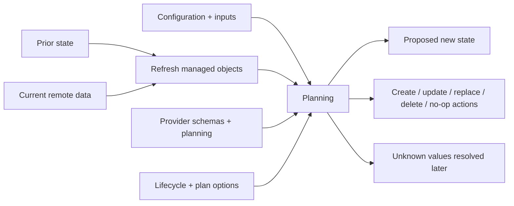
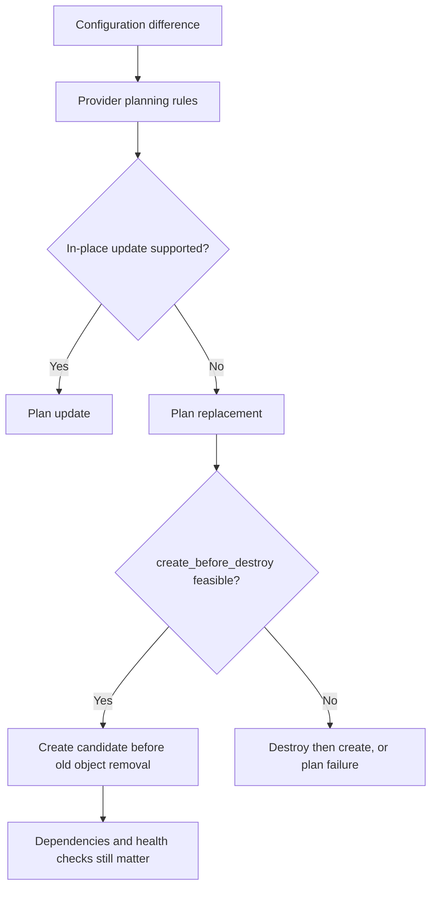
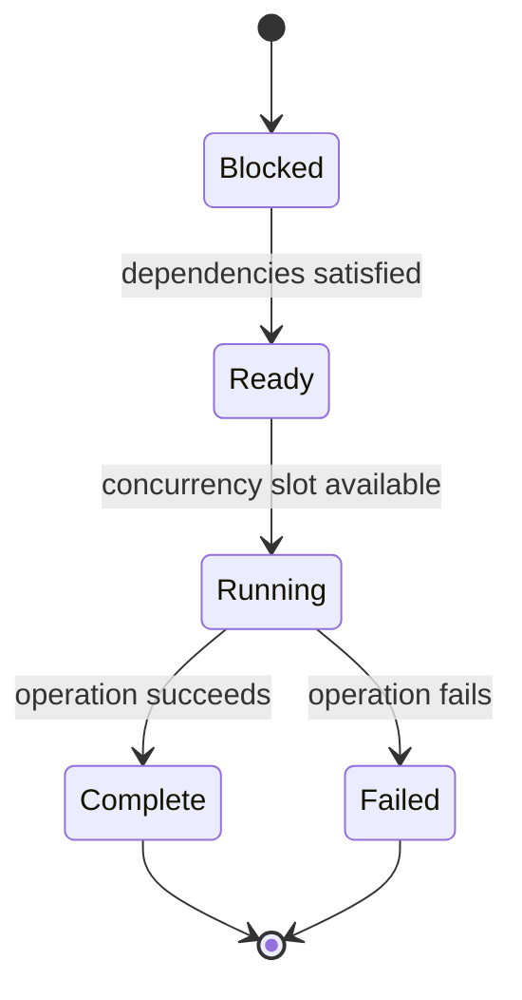

<!-- AUTO-GENERATED by scripts/sync-terraform-curriculum.mjs. Edit the canonical curriculum, not this file. -->

> [!NOTE]
> This page is generated from the reviewed Terraform Mastery curriculum at commit [`c3566e80e995`](https://github.com/thokchomlolet03-cpu/terraform-mastery/commit/c3566e80e995cf4d47c4b756af8674bfd89ef5fb). The source repository is authoritative.

## Lessons in this module

- [03.01 How Terraform creates a plan](#0301-how-terraform-creates-a-plan)
- [03.02 Provider resource lifecycle and replacement](#0302-provider-resource-lifecycle-and-replacement)
- [03.03 Graph walking and bounded concurrency](#0303-graph-walking-and-bounded-concurrency)

---

## 03.01 How Terraform creates a plan

> A plan is a provider-informed proposal built from configuration, prior state,
> refreshed object data, schemas, and values that may still be unknown.

### Why this matters

Calling Terraform a “three-way merge” is memorable but incomplete. Terraform does
not compare three uniform documents with a fixed truth table. Providers interpret
resource semantics, some values are unknown until apply, lifecycle rules can alter
actions, and different planning modes have different goals.

### Learning outcomes

After this lesson, you should be able to:

- distinguish configuration, prior state, refreshed state, and proposed new state;
- explain what normal, destroy, and refresh-only planning modes intend to do;
- identify known and unknown values in a plan;
- distinguish a speculative plan from a saved plan intended for apply;
- explain why a plan can become stale.

### Analogy: revising a building plan after an inspection

An architect has a requested design, the last recorded building plan, and a fresh
inspection report. Specialists use all three to propose work. Some final details,
such as a newly assigned serial number, cannot be known until construction.

#### Where the analogy breaks

There is no universal comparison table that maps every difference to an HTTP verb.
Each provider defines schema and planning behavior for its resource types. A read
can normalize values, a provider can mark a change as replacement, lifecycle rules
can affect ordering, and remote data can change after the inspection.

### First-principles reconstruction

#### Inputs

- current configuration and input values;
- prior Terraform state;
- provider schemas and provider planning logic;
- current remote-object data read during refresh, unless refresh is disabled;
- lifecycle rules, command options, and the selected planning mode.

#### Constraints

Terraform must preserve dependencies and type rules. Values produced only by
remote creation or update remain unknown during planning. Refresh is an
observation step, not a guarantee that reality stays unchanged afterward.

#### Transformation

In normal mode, Terraform reads managed remote objects, updates its working view,
compares the current configuration with prior state, asks providers to plan
resource changes, and assembles actions that should move managed objects toward
the configuration. Destroy mode proposes removal. Refresh-only mode proposes
state and root-output updates without proposing changes to remote objects.

#### Outputs

A plan contains proposed actions, before/after values, unknown-value markers,
diagnostics, dependencies, and plan options. `terraform plan` alone does not apply
the proposed infrastructure changes.

### Execution model



### Worked example

```hcl
resource "random_id" "release" {
  byte_length = 4
}

resource "local_file" "release" {
  filename = "${path.module}/release-${random_id.release.hex}.txt"
  content  = "release ${random_id.release.hex}"
}
```

Before the first apply, `random_id.release.hex` is unknown. Terraform can still
plan the dependency and the file creation, but it cannot display the final
filename. Unknown does not mean erroneous; it means deferred until the producing
operation returns a value.

### Safe experiment

1. Use Lab 02 and predict which values will be unknown on the first plan.
2. Run `terraform plan -out=learning.tfplan`.
3. Inspect it with `terraform show` and `terraform show -json`.
4. Apply only the saved plan and compare the resolved values with your prediction.
5. Run a second plan and explain the no-change result.
6. Destroy the lab's local artifacts.

### Failure laboratory

Create a saved plan, then change its configuration before attempting to apply it.
Observe Terraform's protection against applying a plan whose configuration no
longer matches. Restore the lab afterward. Do not perform this experiment against
shared or production state.

### Retrieval questions

1. Why is planning more than comparing configuration directly with a cloud API?
2. What is the difference between refreshed state and prior state?
3. Why can a valid plan contain unknown values?
4. How does refresh-only mode differ from normal mode?
5. Why should automation apply a reviewed saved plan rather than create a new one?

### Teach-back prompt

Explain the inputs and output of normal planning without using the phrase
“three-way merge.” Then identify two reasons a speculative plan can become stale.

### Official sources

- [`terraform plan`](https://developer.hashicorp.com/terraform/cli/commands/plan)
- [Terraform CLI workflow](https://developer.hashicorp.com/terraform/cli/run)
- [Resource instance change lifecycle](https://developer.hashicorp.com/terraform/plugin/framework/resources/plan-modification)
- [Plan representation and unknown values](https://developer.hashicorp.com/terraform/internals/json-format)

### Website storyboard

Build a planning workbench with five input cards. Readers toggle refresh and
planning modes, then predict actions and unknown values before revealing the plan.

[View this lesson in the canonical curriculum source](https://github.com/thokchomlolet03-cpu/terraform-mastery/blob/c3566e80e995cf4d47c4b756af8674bfd89ef5fb/03_The_Reconciliation_Engine_and_State_Machine/03_01_three_way_merge_algorithm.md)

---

## 03.02 Provider resource lifecycle and replacement

> Providers implement resource lifecycle operations and planning rules; Terraform
> Core coordinates those operations without assuming a particular cloud API verb.

### Why this matters

The shortcut “CRUD equals POST, GET, PATCH, DELETE” fails across real APIs and
modern provider implementations. Some creates require many requests, updates may
be modeled as replacement, reads may normalize data, and a failed operation can
still leave a remote object that must be recorded or recovered.

### Learning outcomes

After this lesson, you should be able to:

- identify Core and provider responsibilities across a resource lifecycle;
- explain create, read, update, and delete as semantic operations rather than HTTP verbs;
- identify replacement in a plan before apply;
- explain how provider plan modification can require replacement;
- evaluate `create_before_destroy` without promising zero downtime.

### Analogy: replacing a passport

Some details can be corrected on an account, while changing a passport's identity
requires issuing a new document and invalidating the old one. The authority—not
the applicant—defines which changes require replacement.

#### Where the analogy breaks

Provider behavior is code and schema, not a single government rulebook. A provider
can use SDKs, multiple API calls, polling, imports, private state, and plan
modifiers. Replacement order also depends on lifecycle configuration, dependency
edges, uniqueness constraints, quotas, and provider behavior.

### First-principles reconstruction

#### Inputs

- configured and prior resource values;
- provider schema, validation, and plan-modification rules;
- current remote-object data;
- lifecycle meta-arguments and explicit replacement requests;
- target API permissions, quotas, and availability.

#### Constraints

Terraform needs a stable resource identity in state. Some remote systems cannot
change an identity-defining property in place. Providers must return diagnostics
and the most accurate state they can after operations, including partial results.

#### Transformation

Core sends lifecycle requests through the provider protocol. The provider validates
and plans provider-specific values, marks replacement when required, performs the
semantic create/read/update/delete operation, waits or polls when necessary, and
returns new state and diagnostics. Core schedules those operations in the wider
dependency graph.

#### Outputs

A plan can show create (`+`), update in place (`~`), destroy (`-`), replacement,
or no change. Replacement can be destroy-then-create or create-then-destroy, but
the displayed plan—not a memorized default—must be reviewed.

### Execution model



### Worked example

```hcl
resource "random_id" "stable" {
  byte_length = 4

  keepers = {
    release = var.release
  }

  lifecycle {
    create_before_destroy = true
  }
}
```

Changing `var.release` causes the provider-managed value to be replaced. The plan
shows the replacement ordering. This local example demonstrates the mechanism,
but it does not prove an application will avoid downtime: traffic shifting,
health, names, quotas, and dependent resources remain system-design concerns.

### Safe experiment

1. Create the example in a temporary local-only Terraform directory.
2. Apply with one `release` value.
3. Change the value and predict the replacement symbols and order.
4. Run `terraform plan` and compare it with your prediction.
5. Remove `create_before_destroy`, plan again, and explain the difference.
6. Destroy the local resource.

### Failure laboratory

Add a precondition that rejects the new release value. Predict whether Terraform
will destroy the existing object first. Run the plan and observe that validation
can prevent the proposed replacement before apply. Restore the configuration.

### Retrieval questions

1. Why is a provider Create operation not synonymous with HTTP POST?
2. Who decides that a particular attribute change requires replacement?
3. What evidence tells you the planned replacement order?
4. Why does `create_before_destroy` not guarantee zero downtime?
5. What must a provider report after a partially successful operation?

### Teach-back prompt

Explain replacement to an application owner, separating Terraform behavior from
API constraints and from the wider availability architecture.

### Official sources

- [Provider Framework resources](https://developer.hashicorp.com/terraform/plugin/framework/resources)
- [Create resource operation](https://developer.hashicorp.com/terraform/plugin/framework/resources/create)
- [Plan modification and replacement](https://developer.hashicorp.com/terraform/plugin/framework/resources/plan-modification)
- [`lifecycle` meta-argument](https://developer.hashicorp.com/terraform/language/meta-arguments/lifecycle)

### Website storyboard

Animate an attribute change entering provider planning. Let the learner choose an
in-place or replacement prediction, then reveal order, constraints, and potential
availability gaps.

[View this lesson in the canonical curriculum source](https://github.com/thokchomlolet03-cpu/terraform-mastery/blob/c3566e80e995cf4d47c4b756af8674bfd89ef5fb/03_The_Reconciliation_Engine_and_State_Machine/03_02_provider_crud_contract.md)

---

## 03.03 Graph walking and bounded concurrency

> Terraform can operate independent graph nodes concurrently while dependency
> edges and the `-parallelism` limit bound what is ready and active.

### Why this matters

Parallelism can reduce run time, but increasing it blindly can amplify API
throttling, quota pressure, eventual-consistency failures, and blast radius.
Internal goroutine and channel details are useful when developing Terraform Core,
but users should reason from the documented graph and concurrency controls.

### Learning outcomes

After this lesson, you should be able to:

- identify ready, running, blocked, completed, and failed graph nodes;
- explain the difference between dependency ordering and concurrency limits;
- use `-parallelism` as a diagnostic or operational control;
- distinguish Terraform concurrency from provider retry behavior;
- explain why lowering parallelism cannot repair a missing dependency.

### Analogy: airport runways and departure clearances

Many aircraft may be ready, but runway capacity limits simultaneous departures.
An aircraft waiting for passengers is dependency-blocked; adding another runway
does not make those passengers arrive sooner.

#### Where the analogy breaks

Terraform's graph changes by operation, and remote APIs have their own independent
concurrency, retry, and consistency behavior. `-parallelism` limits concurrent
operations during graph walking; it does not configure a provider's internal SDK,
remote service limits, or application traffic.

### First-principles reconstruction

#### Inputs

- an acyclic operation graph;
- completed prerequisite nodes and newly available values;
- the `-parallelism` limit, which defaults to 10 for applicable CLI operations;
- provider and remote API behavior;
- cancellation and failure diagnostics.

#### Constraints

A node cannot begin until its dependencies permit it. At most the configured
number of graph operations may run concurrently. Providers and remote services can
impose stricter effective limits. Some failures stop dependent work while already
completed operations remain real.

#### Transformation

Terraform walks the graph, starts ready nodes within the concurrency bound,
records results, and makes dependent nodes eligible as prerequisites complete.
The exact scheduling and Go synchronization implementation are not public
configuration contracts and should not be the basis of module design.

#### Outputs

The run produces ordered diagnostics, remote side effects during apply, and state
updates for completed operations. A failed apply is not a transaction rollback;
the next plan must inspect what succeeded and what remains.

### Execution model



For a graph `A → C`, `B → C`, and independent `D`, nodes A, B, and D may start
together if three slots are available. C becomes ready only after both A and B
complete. With `-parallelism=1`, the same dependencies hold but ready operations
run one at a time.

### Worked example

```bash
terraform plan -parallelism=1
terraform plan -parallelism=3
```

Compare traces or elapsed time only in a safe lab. Do not infer correctness from
speed. If results change because of an undeclared side-effect dependency, model
that dependency or redesign the ownership boundary.

### Safe experiment

1. Use Lab 01 or Lab 02 and draw its independent branches.
2. Run a normal plan with `TF_LOG=DEBUG`, redacting logs before sharing.
3. Repeat with `-parallelism=1`.
4. Compare operation overlap while confirming the proposed result is equivalent.
5. Unset `TF_LOG` and run the lab tests.

### Failure laboratory

Introduce a failure in one branch that has another independent branch. Predict
which nodes are blocked, which may already complete, and what the next plan will
show. Use only local resources and clean up after recording the evidence.

### Retrieval questions

1. What is the difference between a blocked node and a ready node?
2. What exactly does `-parallelism` limit?
3. Why can lowering parallelism reduce symptoms without fixing dependency design?
4. Who owns retries for a throttled API request?
5. Why must a failed apply be followed by a fresh plan?

### Teach-back prompt

Given a four-node graph and a parallelism limit of two, narrate the possible
execution order and explain which parts Terraform does not guarantee publicly.

### Official sources

- [Terraform dependency graph](https://developer.hashicorp.com/terraform/internals/graph)
- [`terraform plan` options](https://developer.hashicorp.com/terraform/cli/commands/plan)
- [`terraform apply` options](https://developer.hashicorp.com/terraform/cli/commands/apply)
- [Resources and partial state behavior](https://developer.hashicorp.com/terraform/language/resources)

### Website storyboard

Create a graph scheduler with a parallelism slider. Color nodes by state and let
learners inject latency or failure to see dependencies and partial completion.

[View this lesson in the canonical curriculum source](https://github.com/thokchomlolet03-cpu/terraform-mastery/blob/c3566e80e995cf4d47c4b756af8674bfd89ef5fb/03_The_Reconciliation_Engine_and_State_Machine/03_03_dag_parallel_execution_and_concurrency.md)
