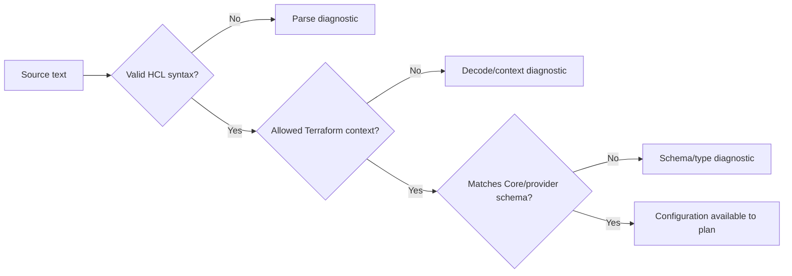
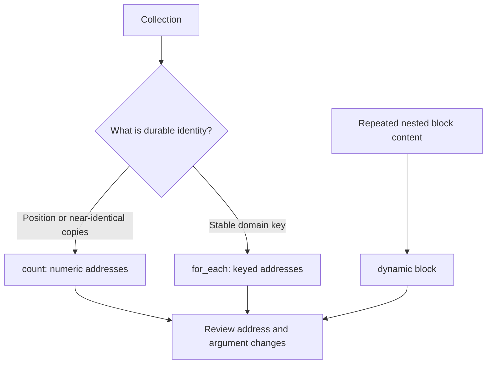
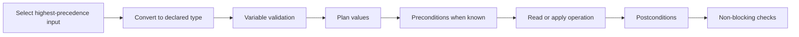
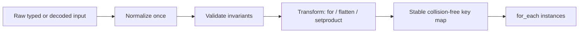

<!-- AUTO-GENERATED by scripts/sync-terraform-curriculum.mjs. Edit the canonical curriculum, not this file. -->

> [!NOTE]
> This page is generated from the reviewed Terraform Mastery curriculum at commit [`c3566e80e995`](https://github.com/thokchomlolet03-cpu/terraform-mastery/commit/c3566e80e995cf4d47c4b756af8674bfd89ef5fb). The source repository is authoritative.

## Lessons in this module

- [04.01 Terraform language: syntax, context, and schema](#0401-terraform-language-syntax-context-and-schema)
- [04.02 Instance identity, `count`, `for_each`, and dynamic blocks](#0402-instance-identity-count-foreach-and-dynamic-blocks)
- [04.03 Module inputs, type constraints, and validation](#0403-module-inputs-type-constraints-and-validation)
- [04.04 Data transformation and disciplined error handling](#0404-data-transformation-and-disciplined-error-handling)

---

## 04.01 Terraform language: syntax, context, and schema

> HCL supplies arguments, blocks, and expressions; Terraform and its providers
> define what those constructs mean in each context.

### Why this matters

A file can be valid HCL but invalid Terraform, and a Terraform resource block can
be structurally valid while violating its provider schema. Separating syntax from
context makes diagnostics easier to classify and prevents memorizing an outdated
list of supposedly universal block types.

### Learning outcomes

After this lesson, you should be able to:

- distinguish HCL native syntax from the Terraform language;
- identify block types, labels, arguments, nested blocks, and expressions;
- distinguish Terraform Core schemas from provider-defined schemas;
- classify parsing, context, type, and provider-schema diagnostics;
- explain what `fmt`, `validate`, and `providers schema` each establish.

### Analogy: grammar and specialist forms

Grammar determines whether a sentence is structurally readable. A specialist
form then defines which fields exist, what each field means, and which values are
acceptable. Correct grammar does not make an invented field valid.

#### Where the analogy breaks

Terraform expressions can reference values and create dependency edges; ordinary
forms do not. Some schemas come from Terraform Core and others from provider
plugins. Validation can also be deferred when a value is unknown until planning or
apply.

### First-principles reconstruction

#### Inputs

- UTF-8 `.tf` files using Terraform's HCL-based native syntax;
- the Terraform version and its built-in block schemas;
- installed provider plugins and their schemas;
- expression contexts containing variables, locals, resources, and functions.

#### Constraints

An argument has a name and an expression. A block has a type, zero or more labels,
and a body. The enclosing context decides which arguments and nested blocks are
legal. Resource-type arguments are defined by the selected provider version.

#### Transformation

Terraform parses source syntax, decodes blocks according to their context, obtains
provider schemas where required, evaluates expressions as far as their values are
known, and emits diagnostics for invalid structure, references, types, or schema
content.

#### Outputs

The result may be formatted source, diagnostics, a decoded configuration ready for
planning, or machine-readable provider schema data. None of these alone proves
that credentials, permissions, quotas, or remote behavior will succeed at apply.

### Execution model



### Worked example

```hcl
resource "local_file" "lesson" {
  filename = "${path.module}/lesson.txt"
  content  = upper("terraform language")
}
```

- `resource` is the block type.
- `local_file` and `lesson` are labels required by the resource-block schema.
- `filename` and `content` are arguments defined for `local_file` by the provider.
- `upper("terraform language")` is an expression returning a string.
- `${path.module}` is a reference evaluated in Terraform's expression context.

Top-level constructs evolve. Learn their individual contracts—such as
`terraform`, `provider`, `resource`, `data`, `variable`, `locals`, `output`,
`module`, `check`, `import`, `moved`, and `removed`—rather than asserting a fixed
number of “foundational blocks.”

### Safe experiment

1. In Lab 01, run `terraform fmt -check` and `terraform validate`.
2. Add a syntax error and classify the diagnostic; restore the file.
3. Add an unknown argument to a `local_file` resource and classify that diagnostic.
4. Run `terraform providers schema -json` and locate the real `local_file` schema.
5. Restore the lab and run its verifier.

### Failure laboratory

Place a valid-looking argument in the wrong block context. Predict whether parsing
or schema decoding rejects it. Record the diagnostic language, then restore the
configuration.

### Retrieval questions

1. How can valid HCL still be invalid Terraform configuration?
2. Who defines the arguments of `local_file`?
3. What is the difference between an argument and a resource attribute?
4. What does `terraform validate` not prove about remote infrastructure?
5. Why is a fixed count of Terraform block types a fragile teaching device?

### Teach-back prompt

Annotate one resource block and explain every token by syntax role, Terraform
context, schema owner, expression result, and possible dependency.

### Official sources

- [Terraform configuration syntax](https://developer.hashicorp.com/terraform/language/syntax/configuration)
- [Expressions](https://developer.hashicorp.com/terraform/language/expressions)
- [Resource block reference](https://developer.hashicorp.com/terraform/language/block/resource)
- [`terraform providers schema`](https://developer.hashicorp.com/terraform/cli/commands/providers/schema)

### Website storyboard

Create an interactive block annotator. Clicking source tokens highlights syntax,
context, schema ownership, expression type, and dependency role in separate colors.

[View this lesson in the canonical curriculum source](https://github.com/thokchomlolet03-cpu/terraform-mastery/blob/c3566e80e995cf4d47c4b756af8674bfd89ef5fb/04_HCL_Language_Grammar_and_Expressions/04_01_hcl_grammar_blocks_and_schema.md)

---

## 04.02 Instance identity, `count`, `for_each`, and dynamic blocks

> Choose instance keys from stable domain identity; use dynamic blocks only to
> generate repeated nested configuration.

### Why this matters

Changing collection shape can change Terraform addresses even when the human
names look similar. Address changes can cause updates or replacements depending on
provider behavior. The central design question is not “list or map?” but “what
identity should remain stable as the collection changes?”

### Learning outcomes

After this lesson, you should be able to:

- predict addresses created by `count` and `for_each`;
- choose stable keys that represent durable identity;
- explain the known-value and sensitivity restrictions on `for_each`;
- distinguish resource-instance expansion from dynamic nested blocks;
- migrate identity deliberately rather than relying on positional coincidence.

### Analogy: numbered seats and named lockers

Seats are addressed by position: removing seat 1 shifts how later positions are
interpreted. Lockers can be addressed by durable names: removing Ada's locker does
not rename Ben's locker.

#### Where the analogy breaks

Terraform does not automatically understand a business identity. A badly chosen
map key can be just as unstable as a list index. Address changes do not guarantee
remote destruction; the provider's plan determines whether changed arguments can
update in place or require replacement.

### First-principles reconstruction

#### Inputs

- a non-negative whole number for `count`, or a map/set of strings for `for_each`;
- collection values known before remote resource operations;
- non-sensitive keys suitable for display in Terraform addresses;
- a block whose instances or nested blocks need repetition.

#### Constraints

One block cannot use both `count` and `for_each`. `count` instances use numeric
indices. `for_each` instances use map keys or set members. Dynamic blocks generate
nested blocks and cannot generate meta-arguments such as `lifecycle`.

#### Transformation

Terraform expands a resource or module block into addressed instances before
planning their operations. `dynamic` instead iterates a collection to construct
nested block bodies inside a containing block.

#### Outputs

```text
count:    local_file.user[0]
          local_file.user[1]

for_each: local_file.user["ada"]
          local_file.user["ben"]
```

### Execution model



### Worked example

```hcl
variable "users" {
  type = map(object({
    message = string
  }))
}

resource "local_file" "user" {
  for_each = var.users

  filename = "${path.module}/${each.key}.txt"
  content  = each.value.message
}
```

The keys become part of persistent resource addresses. They must therefore be
stable, unique, known during planning, non-sensitive, and meaningful enough to
survive ordinary attribute changes. Do not use mutable display names as keys when
an immutable service identifier exists.

A dynamic nested block has a different purpose:

```hcl
dynamic "setting" {
  for_each = var.settings
  iterator = item
  content {
    namespace = item.value.namespace
    name      = item.value.name
    value     = item.value.value
  }
}
```

Prefer literal nested blocks when repetition is small; excessive dynamic content
can hide a module's interface.

### Safe experiment

1. Create three local files with `count` from a list of names.
2. Apply, remove the first name, and predict every address and argument change.
3. Review the plan without applying it.
4. Rebuild the example using a map and `for_each`.
5. Remove one key and compare the second plan.
6. Destroy the local resources.

### Failure laboratory

Attempt to use `random_id.example.hex` as a `for_each` key before it exists.
Observe why Terraform requires instance identity before remote operations. Restore
the valid configuration afterward.

### Retrieval questions

1. What becomes the identity of a `count` instance?
2. What properties make a good `for_each` key?
3. Why must `for_each` keys be known and non-sensitive?
4. Why does an address shift not by itself prove remote destruction?
5. What can a dynamic block generate, and what can it not generate?

### Teach-back prompt

Given five business objects, choose `count` or `for_each`, define their addresses,
and defend how those addresses behave when an object is inserted, renamed, or
removed.

### Official sources

- [`count` meta-argument](https://developer.hashicorp.com/terraform/language/meta-arguments/count)
- [`for_each` meta-argument](https://developer.hashicorp.com/terraform/language/meta-arguments/for_each)
- [Dynamic blocks](https://developer.hashicorp.com/terraform/language/expressions/dynamic-blocks)
- [Resource addressing](https://developer.hashicorp.com/terraform/cli/state/resource-addressing)

### Website storyboard

Show the same collection as indexed seats and keyed lockers. Learners remove an
element and predict address changes before the corresponding plan is revealed.

[View this lesson in the canonical curriculum source](https://github.com/thokchomlolet03-cpu/terraform-mastery/blob/c3566e80e995cf4d47c4b756af8674bfd89ef5fb/04_HCL_Language_Grammar_and_Expressions/04_02_meta_arguments_and_dynamic_blocks.md)

---

## 04.03 Module inputs, type constraints, and validation

> A module interface is trustworthy when value origin, accepted shape, failure
> timing, and error behavior are explicit.

### Why this matters

Terraform can receive the same root input from several sources. It can also check
an input, an assumption before operating, a guarantee after reading or changing an
object, or a non-blocking health assertion. Mixing those mechanisms produces
surprising precedence and validation timing.

### Learning outcomes

After this lesson, you should be able to:

- resolve root-module variable precedence;
- distinguish root variable assignment from child-module arguments;
- design precise collection and structural type constraints;
- choose variable validation, precondition, postcondition, or `check`;
- predict whether a failed condition blocks or warns.

### Analogy: a typed contract with layered amendments

A contract defines accepted fields and rules. Later, authorized amendments can
override earlier defaults according to a published precedence order. Inspections
then check assumptions before work and guarantees after work.

#### Where the analogy breaks

Terraform root-variable sources are merged by CLI rules, while child modules
receive arguments directly from their caller. Unknown values can defer some
conditions. A failed postcondition cannot roll back operations already completed,
and a failed `check` assertion reports a warning rather than blocking the run.

### First-principles reconstruction

#### Inputs

For Terraform CLI root modules, precedence from highest to lowest is:

1. `-var` and `-var-file` options in command-line order, and HCP Terraform values;
2. `*.auto.tfvars` and `*.auto.tfvars.json` in lexical order;
3. `terraform.tfvars.json`;
4. `terraform.tfvars`;
5. `TF_VAR_name` environment variables;
6. the variable's `default` value.

Child modules receive values from arguments in their parent module block; they do
not independently load the root module's `.tfvars` files.

#### Constraints

Type constraints convert compatible values and reject incompatible shapes.
Primitive types are `string`, `number`, and `bool`; collection types include
`list`, `set`, and `map`; structural types include `tuple` and `object`. Optional
object attributes can provide defaults at the interface boundary.

#### Transformation

Terraform selects a root input by precedence, converts it to the declared type,
runs variable validations, evaluates preconditions when their information is
available, evaluates postconditions after planning/applying or reading, and runs
checks at the end of plan/apply.

#### Outputs

- Variable validation and failed preconditions stop relevant operations.
- Failed postconditions stop downstream work but do not undo completed changes.
- Failed `check` assertions produce warnings and allow the operation to continue.
- Error messages should state the violated rule and how to correct it.

### Execution model



### Worked example

```hcl
variable "service" {
  type = object({
    name     = string
    replicas = number
    labels   = optional(map(string), {})
  })

  validation {
    condition     = var.service.replicas >= 1 && var.service.replicas <= 10
    error_message = "service.replicas must be between 1 and 10, inclusive."
  }
}
```

The object type documents the complete input shape. The validation expresses a
domain rule that the number type alone cannot capture.

Choose the narrowest mechanism:

| Need | Mechanism |
| --- | --- |
| Reject a malformed module argument | Variable validation |
| Verify an assumption before a block operates | Precondition |
| Verify a guarantee produced by a resource/data source | Postcondition |
| Observe broader health without blocking the operation | `check` block |

### Safe experiment

1. Create a local configuration with a variable default.
2. Set conflicting values through `TF_VAR_`, `terraform.tfvars`, an auto file,
   and `-var`; predict the selected value before each plan.
3. Add the object constraint and test a compatible conversion and an invalid value.
4. Add a precondition and a local-only `check` assertion; compare error and warning.
5. Remove temporary files and environment variables.

### Failure laboratory

Set the same value in `a.auto.tfvars` and `z.auto.tfvars`. Predict which wins,
confirm the lexical-order rule, then delete both files. Never place secrets in this
experiment.

### Retrieval questions

1. Which root-variable source has the highest precedence in Terraform CLI?
2. How does a child module receive its variable values?
3. What is the difference between collection and structural types?
4. Which validation mechanism should represent an assumption versus a guarantee?
5. Which failed condition warns instead of blocking?

### Teach-back prompt

Diagnose a variable whose observed value differs from its default, then choose the
correct validation layer for input syntax, a resource prerequisite, a produced
guarantee, and an external health signal.

### Official sources

- [Input variables and precedence](https://developer.hashicorp.com/terraform/language/values/variables)
- [Type constraints](https://developer.hashicorp.com/terraform/language/expressions/type-constraints)
- [Validate configuration](https://developer.hashicorp.com/terraform/language/validate)
- [Custom conditions](https://developer.hashicorp.com/terraform/language/expressions/custom-conditions)

### Website storyboard

Build a precedence stack where learners add conflicting sources and reveal the
winner. Follow it with a validation timeline showing blocking errors and warnings.

[View this lesson in the canonical curriculum source](https://github.com/thokchomlolet03-cpu/terraform-mastery/blob/c3566e80e995cf4d47c4b756af8674bfd89ef5fb/04_HCL_Language_Grammar_and_Expressions/04_03_variable_precedence_and_validation.md)

---

## 04.04 Data transformation and disciplined error handling

> Normalize data once, derive stable keyed collections, and let the rest of the
> module use a predictable shape.

### Why this matters

Complex infrastructure is often a data-modeling problem. Nested input can be
clear at the module boundary but unsuitable for `for_each`. Transformation is
powerful, yet unstable keys or widespread `try()` calls can hide errors and cause
address churn.

### Learning outcomes

After this lesson, you should be able to:

- choose collection and structural types intentionally;
- transform nested values with `for` expressions and `flatten`;
- generate combinations with `setproduct` when the domain requires them;
- derive stable, collision-free keys for `for_each`;
- confine `try` and `can` to normalization and validation.

### Analogy: an intake desk and a standardized work queue

An intake desk accepts several documented forms, verifies them, and converts them
into one standard work item. Downstream teams operate on that normalized format
instead of repeatedly guessing which form arrived.

#### Where the analogy breaks

Terraform types can contain unknown, null, and sensitive values with propagation
rules. Transformations also influence resource identity when their results become
`for_each` keys. `try` catches only dynamic evaluation errors; it cannot repair an
undeclared reference or invalid syntax.

### First-principles reconstruction

#### Inputs

- typed variables, decoded JSON/YAML, provider values, and local values;
- collection operators and pure functions;
- a domain rule defining uniqueness and identity;
- explicit defaults for optional attributes.

#### Constraints

Maps have string keys and uniform element types; objects have named attributes
with independently constrained types. Lists are ordered and uniform; tuples have a
fixed sequence of element types. `for_each` ultimately needs a known map or set of
strings with non-sensitive identity values.

#### Transformation

Use a normalization local to convert accepted input shapes into one predictable
object. Use nested `for` expressions plus `flatten` for parent/child structures,
or `setproduct` for genuine Cartesian combinations. Convert the result to a map
whose key is derived from immutable domain identity and cannot collide.

#### Outputs

Downstream configuration receives one typed, documented shape. Instance addresses
remain stable across non-identity attribute changes. Invalid or ambiguous input
fails close to the module boundary with an actionable message.

### Execution model



### Worked example

```hcl
variable "services" {
  type = map(object({
    regions = set(string)
    port    = number
    labels  = optional(map(string), {})
  }))
}

locals {
  service_regions = flatten([
    for service_name, service in var.services : [
      for region in service.regions : {
        key          = "${service_name}::${region}"
        service_name = service_name
        region       = region
        port         = service.port
        labels       = service.labels
      }
    ]
  ])

  service_region_map = {
    for item in local.service_regions : item.key => item
  }
}
```

The key combines two domain identities. Changing `port` or `labels` does not
change the address. If either name may contain `::`, validate or encode components
so two different pairs cannot generate the same key.

Use `setproduct` only when every combination is intended:

```hcl
locals {
  environment_region_pairs = setproduct(
    ["test", "production"],
    ["eu-west", "me-central"],
  )
}
```

Normalize uncertain decoded data in one place:

```hcl
locals {
  raw = jsondecode(var.service_json)
  normalized = {
    name   = tostring(local.raw.name)
    labels = try(tomap(local.raw.labels), {})
  }
}
```

Use `can()` mainly for compact validation tests. Use `try()` for simple dynamic
attribute access or type conversion during normalization. Do not scatter fallbacks
through resource blocks, where they can conceal malformed input.

### Safe experiment

1. Evaluate the examples in `terraform console` with two services and two regions.
2. Predict the flattened list and final map keys before printing them.
3. Change a non-key attribute and confirm the key set remains unchanged.
4. Introduce a potential key collision and add validation that rejects it.
5. Test a missing optional `labels` attribute and inspect the normalized result.

### Failure laboratory

Attempt `try(local.not_declared, "fallback")`. Observe that a statically invalid
reference is not caught. Replace it with a valid object missing an optional dynamic
attribute, then observe the intended fallback behavior.

### Retrieval questions

1. How do `map` and `object` differ?
2. When should you use `flatten` versus `setproduct`?
3. Which attributes should influence a `for_each` key?
4. What kinds of errors can `try` not catch?
5. Why should normalization be concentrated in local values?

### Teach-back prompt

Take a nested service/region input, derive its instance keys on paper, identify a
collision risk, and explain how normalization keeps resource blocks simple.

### Official sources

- [Type constraints](https://developer.hashicorp.com/terraform/language/expressions/type-constraints)
- [`for` expressions](https://developer.hashicorp.com/terraform/language/expressions/for)
- [`flatten` function](https://developer.hashicorp.com/terraform/language/functions/flatten)
- [`setproduct` function](https://developer.hashicorp.com/terraform/language/functions/setproduct)
- [`try` function](https://developer.hashicorp.com/terraform/language/functions/try)
- [`can` function](https://developer.hashicorp.com/terraform/language/functions/can)

### Website storyboard

Create a transformation pipeline that shows nested input becoming a flat list and
then a keyed map. Let learners mutate attributes and see whether addresses remain
stable or collide.

[View this lesson in the canonical curriculum source](https://github.com/thokchomlolet03-cpu/terraform-mastery/blob/c3566e80e995cf4d47c4b756af8674bfd89ef5fb/04_HCL_Language_Grammar_and_Expressions/04_04_advanced_data_structures_matrix_and_safe_eval.md)
