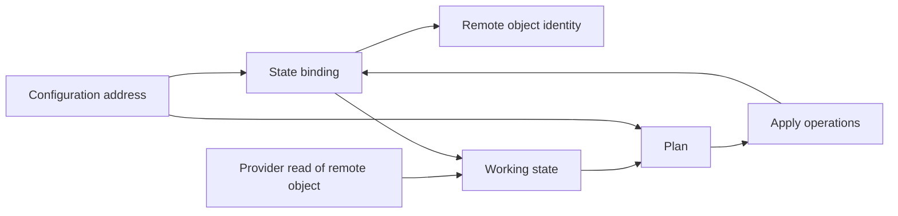
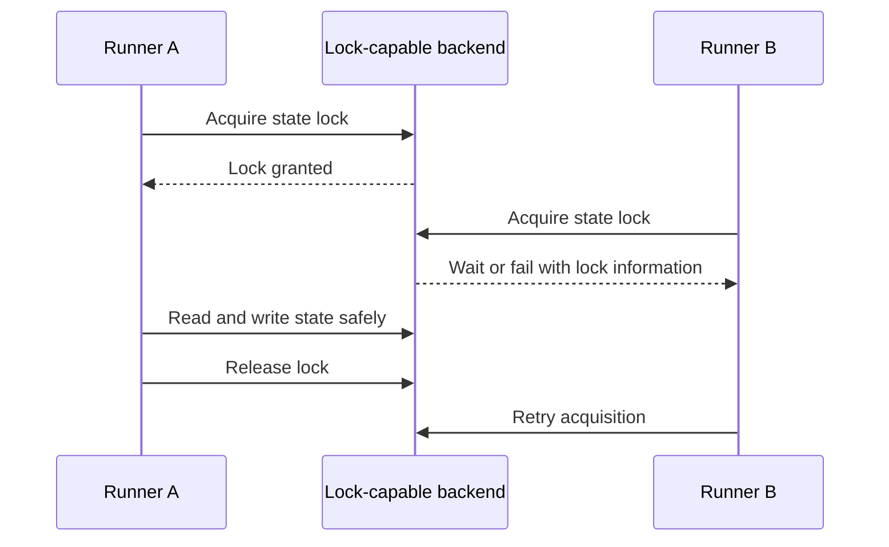
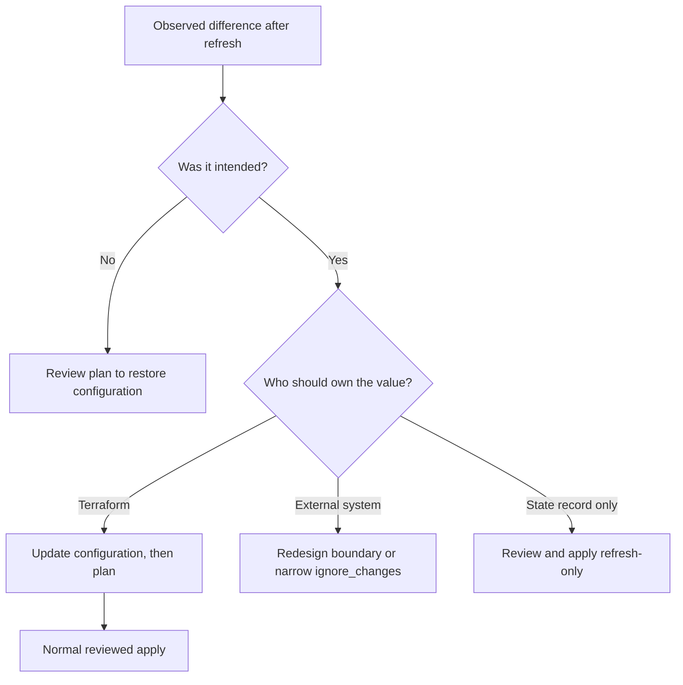
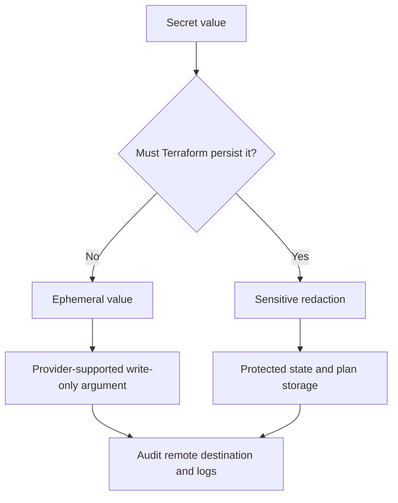

<!-- AUTO-GENERATED by scripts/sync-terraform-curriculum.mjs. Edit the canonical curriculum, not this file. -->

> [!NOTE]
> This page is generated from the reviewed Terraform Mastery curriculum at commit [`c3566e80e995`](https://github.com/thokchomlolet03-cpu/terraform-mastery/commit/c3566e80e995cf4d47c4b756af8674bfd89ef5fb). The source repository is authoritative.

## Lessons in this module

- [05.01 State as bindings and operational memory](#0501-state-as-bindings-and-operational-memory)
- [05.02 Remote backends and state locking](#0502-remote-backends-and-state-locking)
- [05.03 Drift, refresh, and reconciliation decisions](#0503-drift-refresh-and-reconciliation-decisions)
- [05.04 Sensitive, ephemeral, and protected state data](#0504-sensitive-ephemeral-and-protected-state-data)

---

## 05.01 State as bindings and operational memory

> Configuration expresses intent, remote systems hold objects, and Terraform state
> records which resource instance is bound to which remote object plus the metadata
> needed to manage it.

### Why this matters

Treating state as a disposable cache risks duplicate objects or lost management.
Treating it as unquestionable cloud truth is also wrong: remote objects can drift,
and refresh can update Terraform's view. The useful model is operational memory
whose bindings must preserve a one-to-one relationship.

### Learning outcomes

After this lesson, you should be able to:

- explain the primary purpose of state bindings;
- distinguish configuration intent, prior state, and current remote data;
- explain Terraform's one-resource-instance-to-one-object expectation;
- inspect state through supported CLI and JSON interfaces;
- recover disposable working data without casually deleting authoritative state.

### Analogy: a property registry

A registry links a legal parcel reference to a physical property and records
metadata required to administer it. Losing the registry does not demolish the
building, but it does break the trusted link used for future administration.

#### Where the analogy breaks

Terraform state is a versioned implementation format, not a legal authority or a
general asset inventory. It can be refreshed from providers, contains only what
Terraform and providers record, and may include sensitive values. Its raw JSON is
not a stable integration contract.

### First-principles reconstruction

#### Inputs

- resource-instance addresses from configuration;
- remote-object identities returned or imported through providers;
- attributes, dependency metadata, outputs, and provider-specific private data;
- the selected workspace and backend.

#### Constraints

Terraform expects each managed remote object to be bound to one resource instance.
Concurrent or manual mutations must not create competing snapshots. State format
can evolve, so direct parsing and editing create maintenance and corruption risk.

#### Transformation

After successful lifecycle operations, Terraform records or updates bindings and
object data. Refresh reads managed objects through providers and updates the
working state used for planning. Supported state, import, moved, and removed
operations change bindings deliberately.

#### Outputs

A state snapshot supports later planning, dependency behavior, outputs, and
resource-instance lookup. Local backends normally write `terraform.tfstate` and a
backup; remote backends store authoritative state remotely and may keep only
working metadata locally.

### Execution model



### Worked example

```hcl
resource "local_file" "lesson" {
  filename = "${path.module}/state-lesson.txt"
  content  = "state binds this address to this local object"
}
```

After apply, inspect through supported interfaces:

```bash
terraform state list
terraform state show local_file.lesson
terraform show -json
terraform output -json
```

Use the JSON output formats documented for external consumption. Do not write
automation against undocumented fields from raw state snapshots when a supported
interface exists.

### Safe experiment

1. Apply the local-only example in a temporary directory.
2. Record its Terraform address and operating-system path.
3. Run `terraform state list` and `terraform state show`.
4. Change the file manually and run `terraform plan` to observe refresh and drift.
5. Apply or destroy the local object, then remove the temporary directory.

### Failure laboratory

Copy the directory without its state and run a plan. Observe that the existing
file alone does not recreate the missing binding. Do not apply the duplicate plan;
restore the original state and destroy normally.

### Retrieval questions

1. What is the primary purpose of Terraform state?
2. Why is state neither a disposable cache nor perfect remote truth?
3. What one-to-one invariant does Terraform expect?
4. Which commands provide supported inspection interfaces?
5. Why is direct raw-state editing dangerous?

### Teach-back prompt

Explain what remains in the remote system, what is lost operationally, and what
must be reconstructed when a valid state snapshot is lost.

### Official sources

- [Terraform state](https://developer.hashicorp.com/terraform/language/state)
- [Purpose of state](https://developer.hashicorp.com/terraform/language/state/purpose)
- [`terraform state`](https://developer.hashicorp.com/terraform/cli/commands/state)
- [JSON output format](https://developer.hashicorp.com/terraform/internals/json-format)

### Website storyboard

Animate a binding between configuration address and remote identity. Let learners
remove configuration, state, or the remote object and predict the next plan.

[View this lesson in the canonical curriculum source](https://github.com/thokchomlolet03-cpu/terraform-mastery/blob/c3566e80e995cf4d47c4b756af8674bfd89ef5fb/05_State_Management_Locking_and_Drift/05_01_state_file_internals.md)

---

## 05.02 Remote backends and state locking

> A backend defines state storage and, when supported, locking behavior; locking
> serializes writers but does not make an apply transactionally reversible.

### Why this matters

Team workflows need durable storage, access control, recovery, and protection from
simultaneous writers. Backend capabilities differ and evolve. An architecture
built around obsolete locking details can become both expensive and misleading.

### Learning outcomes

After this lesson, you should be able to:

- distinguish remote storage, state locking, versioning, and encryption;
- verify whether a selected backend supports locking;
- configure current S3 lockfile-based locking;
- explain why DynamoDB locking is now a migration concern, not the default design;
- apply a safe `force-unlock` decision process.

### Analogy: a library's single editing key

Many people may read a catalog, but only the holder of an editing key may publish
the next edition. Archive versions support recovery if the new edition is damaged.

#### Where the analogy breaks

Terraform locks cover state operations supported by the backend, not all remote
cloud actions by every actor. A process can create infrastructure and fail before
finishing. Object versioning does not automatically choose the correct snapshot,
and force-unlocking an active writer can create competing writers.

### First-principles reconstruction

#### Inputs

- backend type, configuration, credentials, and state location;
- backend-specific locking capability and settings;
- access policies, encryption, audit logging, and recovery controls;
- a Terraform operation that may write state.

#### Constraints

Not every backend supports locking. Terraform automatically locks for operations
that can write state when the backend supports it. Disabling locking is unsafe when
another writer may run. Backend credentials must not be hardcoded in configuration
or passed in ways that persist them to `.terraform/` or plan artifacts.

#### Transformation

Terraform acquires the backend lock, reads the latest state, performs the planned
work, writes updated state as operations complete, and releases the lock. A second
writer must wait or fail according to command options and backend behavior.

#### Outputs

The backend stores the authoritative snapshot and lock metadata. Versioning or
platform history can retain recoverable revisions. Logs should identify the actor,
state location, operation, and time without exposing credentials or state content.

### Execution model



### Worked example

Current Terraform supports S3 lockfile-based state locking:

```hcl
terraform {
  backend "s3" {
    bucket       = "example-terraform-state"
    key          = "network/terraform.tfstate"
    region       = "us-east-1"
    encrypt      = true
    use_lockfile = true
  }
}
```

The S3 backend documentation recommends bucket versioning for recovery. Grant
least-privilege permissions to the state object and, when `use_lockfile` is true,
the corresponding `.tflock` object. DynamoDB-based S3 locking is deprecated; use
it only as documented during a compatibility migration from older Terraform
versions.

### Safe experiment

Use Lab 03's local-state concurrency simulation to observe contention without
creating cloud resources.

1. Read its scripts and predict which process holds the lock.
2. Start the provided long-running operation.
3. Run a second operation and capture the lock diagnostic.
4. Let the first process finish naturally.
5. Confirm the next operation succeeds and inspect state with Terraform commands.

### Failure laboratory

Review a lock diagnostic and write a force-unlock checklist. The minimum gate is:
identify the state path, lock ID, owner, operation, and runner; prove the holder is
no longer active; preserve logs; obtain the required approval; then use the exact
lock ID. Do not execute `force-unlock` merely because a run is slow.

### Retrieval questions

1. Which backend property prevents concurrent state writers?
2. Why are encryption, versioning, and locking separate controls?
3. What is the current recommended S3 locking option?
4. Why does a state lock not make apply atomic?
5. What evidence is required before force-unlocking?

### Teach-back prompt

Design a backend control set for a team and explain storage, locking, encryption,
access, audit, recovery, and credential handling as separate decisions.

### Official sources

- [State locking](https://developer.hashicorp.com/terraform/language/state/locking)
- [S3 backend and lockfile](https://developer.hashicorp.com/terraform/language/backend/s3)
- [Backend configuration](https://developer.hashicorp.com/terraform/language/backend)
- [`terraform force-unlock`](https://developer.hashicorp.com/terraform/cli/commands/force-unlock)

### Website storyboard

Simulate two runners competing for one state. Controls toggle locking, versioning,
and an unsafe force-unlock so learners can distinguish each failure mode.

[View this lesson in the canonical curriculum source](https://github.com/thokchomlolet03-cpu/terraform-mastery/blob/c3566e80e995cf4d47c4b756af8674bfd89ef5fb/05_State_Management_Locking_and_Drift/05_02_remote_backends_and_distributed_mutex_locking.md)

---

## 05.03 Drift, refresh, and reconciliation decisions

> Refresh observes managed objects; a plan then shows whether configuration will
> restore, accept, ignore, replace, or otherwise respond to the observed difference.

### Why this matters

Not every external change is unwanted drift. Autoscaling, provider-computed
attributes, incident actions, and shared ownership may be intentional. Terraform
can detect differences, but humans must decide whether configuration or the remote
system represents the desired outcome.

### Learning outcomes

After this lesson, you should be able to:

- distinguish observed difference from undesired drift;
- explain refresh during normal planning;
- use refresh-only mode for an intentional state update;
- evaluate restore, codify, import, ignore, or transfer-ownership responses;
- explain the risks of `-refresh=false` and routine resource targeting.

### Analogy: inventory reconciliation after a night shift

A morning manager compares the approved inventory plan, last night's ledger, and
a physical count. A difference may be theft, spoilage, or an authorized emergency
transfer. Counting detects the difference; policy decides the response.

#### Where the analogy breaks

Provider reads can normalize values, omit inaccessible details, or return computed
attributes. Remote systems may change between refresh and apply. Terraform manages
only its recorded objects and does not discover every unbound object automatically.

### First-principles reconstruction

#### Inputs

- configuration intent and lifecycle rules;
- prior state bindings and attributes;
- provider reads of current managed objects;
- ownership policy and evidence for out-of-band changes;
- planning mode and refresh options.

#### Constraints

Normal planning refreshes managed objects by default. `-refresh=false` trades
freshness for fewer reads and can produce an incomplete or incorrect plan.
Refresh-only mode proposes state/output changes but does not rewrite configuration.

#### Transformation

Terraform reads each managed object as needed, updates its working state, and asks
providers to plan against configuration. Operators classify each difference and
choose a response: restore configuration, codify the accepted change, import or
move ownership, use narrowly justified `ignore_changes`, or remove management.

#### Outputs

A normal plan proposes remote actions to align managed objects with configuration.
A refresh-only plan proposes state and root-output updates to match remote objects
without proposing remote-object mutations. Applying refresh-only may still leave a
future normal plan if configuration does not express the accepted outcome.

### Execution model



### Worked example

For a locally managed file:

1. Apply `content = "approved"`.
2. Manually change the file to `emergency`.
3. Run `terraform plan` and observe the proposed response.
4. Decide whether `approved` or `emergency` is desired.
5. If accepting `emergency`, update configuration first and plan again.

This keeps configuration as the reviewed expression of intent. Refresh-only is
appropriate when the goal is specifically to update state and outputs to an
intentional external change, with the consequence understood.

### Safe experiment

1. Use a local-only resource from Lab 04.
2. Predict its plan after an out-of-band edit and after out-of-band deletion.
3. Run normal and refresh-only plans without applying either.
4. Compare their intended outcomes.
5. Restore through configuration and run the verifier.

### Failure laboratory

Run a plan with `-refresh=false` after changing the local object. Compare it with a
normal plan and identify the stale assumptions. Do not combine this exercise with
`-target` or use either option against shared infrastructure.

### Retrieval questions

1. Why is every external difference not automatically undesired drift?
2. What does normal planning refresh by default?
3. What does refresh-only mode change, and what does it not change?
4. Why can the next normal plan differ after refresh-only apply?
5. When is ownership redesign better than `ignore_changes`?

### Teach-back prompt

Given a manual incident change, explain how you would preserve evidence, decide
ownership, update configuration or state, and prevent an accidental reversal.

### Official sources

- [`terraform plan` planning modes](https://developer.hashicorp.com/terraform/cli/commands/plan)
- [Refresh-only tutorial](https://developer.hashicorp.com/terraform/tutorials/state/refresh)
- [`ignore_changes`](https://developer.hashicorp.com/terraform/language/meta-arguments/lifecycle#ignore_changes)
- [Resource targeting caveats](https://developer.hashicorp.com/terraform/cli/commands/plan#resource-targeting)

### Website storyboard

Present an incident-change decision tree. Learners choose restore, codify, accept
state, share ownership, or remove ownership and see the next normal plan.

[View this lesson in the canonical curriculum source](https://github.com/thokchomlolet03-cpu/terraform-mastery/blob/c3566e80e995cf4d47c4b756af8674bfd89ef5fb/05_State_Management_Locking_and_Drift/05_03_state_drift_and_refresh_mechanics.md)

---

## 05.04 Sensitive, ephemeral, and protected state data

> `sensitive` controls disclosure in normal UI output; ephemeral values and
> provider-supported write-only arguments control persistence.

### Why this matters

Redaction is not encryption and does not remove a value from state or saved plans.
Terraform 1.10+ adds ephemeral values, and Terraform 1.11+ supports provider-defined
write-only arguments, but these features have context restrictions and do not
eliminate the need to protect state.

### Learning outcomes

After this lesson, you should be able to:

- distinguish redaction, omission, encryption, and access control;
- predict when a sensitive value persists in state or a saved plan;
- identify appropriate uses for ephemeral variables and resources;
- verify whether a provider supports a write-only argument;
- design state access, audit, retention, and incident controls.

### Analogy: sealed paper versus a temporary access badge

A sealed document hides its contents during ordinary handling but still contains
them. A temporary badge exists only for a session and is not filed afterward.

#### Where the analogy breaks

Terraform can propagate sensitivity through expressions, and ephemeral values are
allowed only in specific contexts. A secret sent to a remote service may still be
stored by that service, provider logs, CI logs, or another resource. Omission from
Terraform state is only one boundary.

### First-principles reconstruction

#### Inputs

- secret origin, lifetime, and consumers;
- Terraform and provider versions;
- provider schema support for ephemeral resources or write-only arguments;
- backend encryption and access controls;
- plan, state, log, cache, and artifact retention policies.

#### Constraints

`sensitive = true` redacts values from normal Terraform CLI and HCP Terraform UI
output, but sensitive values remain in state and plan files. `terraform output
-raw` and `-json` can reveal sensitive outputs. Ephemeral values cannot be used in
ordinary persistent contexts because Terraform cannot reproduce them later.

#### Transformation

Classify each secret. Prefer short-lived credentials for provider authentication.
When supported, pass temporary secrets through ephemeral variables/resources into
write-only provider arguments. For values that must persist in state, minimize
scope and protect the backend with encryption, least privilege, audit logs,
version retention, and controlled recovery.

#### Outputs

The design should state whether each value is displayed, persisted in plans,
persisted in state, stored by a remote secret manager, logged, rotated, and
recoverable. “Hidden in plan output” is not an adequate security classification.

### Execution model



### Worked example

For short-lived provider authentication:

```hcl
variable "api_token" {
  type      = string
  sensitive = true
  ephemeral = true
}

provider "example" {
  api_token = var.api_token
}
```

For managed-resource secrets, consult the exact provider resource schema and
documentation for a write-only argument, commonly named with `_wo`, plus its
version argument. Do not invent a write-only name for a resource that lacks one.

### Safe experiment

1. In a disposable local configuration, define a sensitive non-ephemeral variable
   and output.
2. Run a saved plan and confirm normal UI redaction.
3. Inspect the plan JSON in a private terminal and confirm why the artifact is
   sensitive; do not paste its contents into logs.
4. Repeat with an ephemeral provider-authentication variable in a compatible
   example and inspect the allowed reference contexts.
5. Delete all temporary plans and state securely according to local policy.

### Failure laboratory

Attempt to use an ephemeral variable in a normal root output. Observe the context
restriction. Then change the design so the value is consumed only by an allowed
ephemeral context.

### Retrieval questions

1. What does `sensitive = true` protect?
2. Where can a sensitive non-ephemeral value still appear?
3. What Terraform versions introduced ephemeral values and write-only arguments?
4. Who defines whether a managed resource has a write-only argument?
5. Which controls remain necessary even when ephemeral values are used?

### Teach-back prompt

Create a data-flow threat model for one credential from issuance through CI,
Terraform, provider, remote API, logs, state, rotation, and revocation.

### Official sources

- [Manage sensitive data](https://developer.hashicorp.com/terraform/language/manage-sensitive-data)
- [Sensitive data in state](https://developer.hashicorp.com/terraform/language/state/sensitive-data)
- [Ephemeral resources](https://developer.hashicorp.com/terraform/language/resources/ephemeral)
- [Write-only arguments](https://developer.hashicorp.com/terraform/plugin/framework/resources/write-only-arguments)

### Website storyboard

Build a secret-flow diagram with toggles for sensitive, ephemeral, and write-only.
Each storage and disclosure location lights up so learners can see the difference.

[View this lesson in the canonical curriculum source](https://github.com/thokchomlolet03-cpu/terraform-mastery/blob/c3566e80e995cf4d47c4b756af8674bfd89ef5fb/05_State_Management_Locking_and_Drift/05_04_secrets_in_state_and_security.md)
