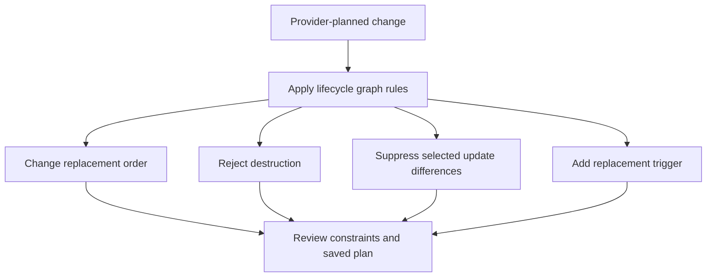
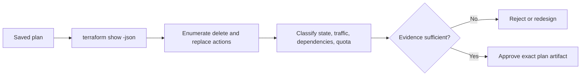
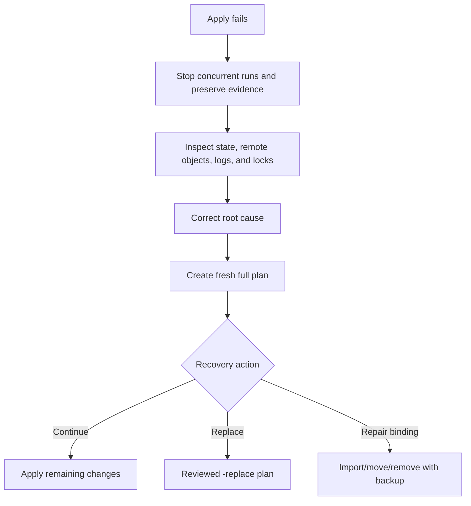
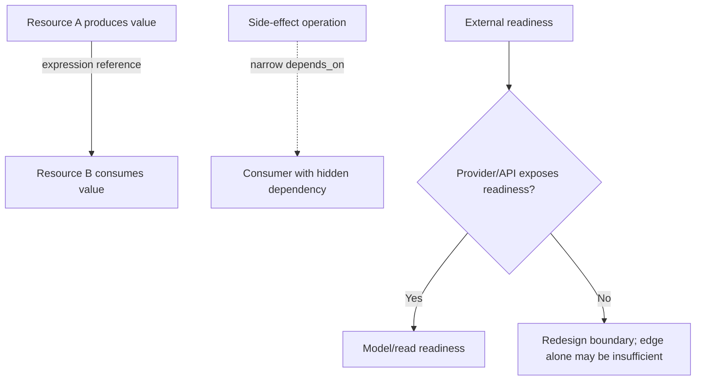

<!-- AUTO-GENERATED by scripts/sync-terraform-curriculum.mjs. Edit the canonical curriculum, not this file. -->

> [!NOTE]
> This page is generated from the reviewed Terraform Mastery curriculum at commit [`c3566e80e995`](https://github.com/thokchomlolet03-cpu/terraform-mastery/commit/c3566e80e995cf4d47c4b756af8674bfd89ef5fb). The source repository is authoritative.

## Lessons in this module

- [06.01 Lifecycle rules as graph constraints](#0601-lifecycle-rules-as-graph-constraints)
- [06.02 Reading and governing replacement plans](#0602-reading-and-governing-replacement-plans)
- [06.03 Partial apply, degraded objects, and recovery](#0603-partial-apply-degraded-objects-and-recovery)
- [06.04 Implicit and explicit dependency design](#0604-implicit-and-explicit-dependency-design)

---

## 06.01 Lifecycle rules as graph constraints

> Lifecycle rules alter planning and graph traversal; they do not override remote
> uniqueness, capacity, dependency, health, or recovery constraints.

### Why this matters

Lifecycle settings are often taught as switches for safety or zero downtime. In
reality, they change a plan under specific conditions and can create new failure
modes. Correct use begins with the remote system's constraints and a reviewed plan.

### Learning outcomes

After this lesson, you should be able to:

- explain `create_before_destroy`, `prevent_destroy`, `ignore_changes`, and
  `replace_triggered_by` as planning rules;
- predict important propagation and configuration-removal behavior;
- identify unique-name, quota, dependency, and health constraints;
- distinguish change suppression from ownership design;
- verify lifecycle effects in a saved plan.

### Analogy: changing railway routing rules

A dispatcher can require a replacement train to arrive before retiring the old
one, block a planned retirement, or let another operator control one section. The
rules alter scheduling but cannot create another platform or guarantee passengers
have transferred.

#### Where the analogy breaks

Terraform lifecycle behavior is encoded into an operation graph and state. In
particular, `create_before_destroy` can propagate to dependencies. Most lifecycle
settings are not retained when their configuration disappears, so deleting a block
also deletes protections such as `prevent_destroy` from the next configuration.

### First-principles reconstruction

#### Inputs

- provider-planned create, update, replace, or delete actions;
- literal lifecycle settings processed before general expression evaluation;
- dependency edges and state-recorded lifecycle behavior;
- remote uniqueness, capacity, quota, and availability constraints.

#### Constraints

`create_before_destroy` requires old and new objects to coexist and may propagate
to dependencies. `prevent_destroy` rejects a planned destruction only while the
rule remains in configuration. `ignore_changes` ignores selected arguments during
update planning but still considers them during create. `replace_triggered_by`
references managed resources or their attributes, not arbitrary plain values.

#### Transformation

Terraform incorporates lifecycle rules while constructing its operation graph.
They can reverse replacement order, reject a plan, suppress selected update diffs,
or add replacement triggers. The provider still defines whether a direct argument
change is updatable or replace-only.

#### Outputs

The plan is the evidence: it shows whether an object updates, replaces, deletes,
or is blocked. Availability remains a system property involving coexistence,
health checks, traffic routing, data migration, and rollback.

### Execution model



### Worked example

```hcl
resource "random_id" "release" {
  byte_length = 4

  keepers = {
    version = var.release_version
  }

  lifecycle {
    create_before_destroy = true
  }
}
```

Changing the keeper plans replacement, and the lifecycle rule requests creation
before destruction. This demonstrates ordering, not service availability.

Important boundaries:

- `prevent_destroy` is a last guard, not backup or authorization policy.
- Removing a protected resource block can still plan destruction because the rule
  is no longer present.
- `ignore_changes = all` means Terraform can create and destroy the object but will
  not propose updates; that is a major ownership decision.
- Use `terraform_data` when a plain value needs resource-like replacement triggers.

### Safe experiment

1. Apply the local `random_id` example.
2. Change the release version and save a plan.
3. Inspect replacement order in human and JSON plan output.
4. Add `prevent_destroy` and observe the rejected replacement.
5. Restore the configuration and destroy the local resource.

### Failure laboratory

Design a resource name that cannot coexist, then explain why
`create_before_destroy` cannot satisfy the remote uniqueness constraint. Use a
local mock or written plan; do not create paid cloud resources.

### Retrieval questions

1. What does `create_before_destroy` guarantee, and what does it not guarantee?
2. Why can it affect dependencies?
3. Why can removing a block bypass `prevent_destroy`?
4. When does `ignore_changes` still consider an argument?
5. What may appear in `replace_triggered_by`?

### Teach-back prompt

Review a proposed database replacement and explain lifecycle ordering, coexistence,
data migration, traffic cutover, validation, rollback, and recovery separately.

### Official sources

- [`lifecycle` reference](https://developer.hashicorp.com/terraform/language/meta-arguments/lifecycle)
- [Resource behavior](https://developer.hashicorp.com/terraform/language/resources)
- [`terraform_data`](https://developer.hashicorp.com/terraform/language/resources/terraform-data)
- [Plan JSON representation](https://developer.hashicorp.com/terraform/internals/json-format)

### Website storyboard

Create a replacement timeline with uniqueness, quota, health, and dependency
toggles. The learner sees why ordering alone cannot promise zero downtime.

[View this lesson in the canonical curriculum source](https://github.com/thokchomlolet03-cpu/terraform-mastery/blob/c3566e80e995cf4d47c4b756af8674bfd89ef5fb/06_Lifecycle_Rules_Edge_Cases_and_Failure_Prevention/06_01_lifecycle_meta_arguments.md)

---

## 06.02 Reading and governing replacement plans

> Replacement is a planned delete-and-create pair whose order and impact must be
> evaluated from the plan, provider documentation, and system architecture.

### Why this matters

Resource replacement is sometimes harmless and sometimes catastrophic. A static
list of supposedly immutable cloud arguments becomes stale as providers and APIs
change. A durable skill is detecting replacement mechanically and evaluating the
specific object's data, dependencies, traffic, recovery, and ownership.

### Learning outcomes

After this lesson, you should be able to:

- recognize create, update, delete, and both replacement orderings;
- inspect machine-readable plan actions;
- identify the provider-planned attribute that requires replacement;
- assess stateful and stateless replacement differently;
- define approval evidence for destructive production plans.

### Analogy: replacing a bridge span

An engineering plan may replace one span. The notation alone does not reveal
whether traffic can use a temporary span, whether utilities cross it, or whether
the old structure contains irreplaceable historical material.

#### Where the analogy breaks

Terraform plan symbols are UI summaries, not direct HTTP calls. A provider may use
multiple API requests, polling, and intermediate objects. Replacement can be
requested by provider planning, `-replace`, `replace_triggered_by`, or lifecycle
conditions rather than a single legacy `ForceNew` flag.

### First-principles reconstruction

#### Inputs

- a saved non-speculative plan;
- provider version and resource documentation;
- plan JSON action arrays and before/after values;
- dependency, data, traffic, quota, and recovery architecture;
- environment-specific approval policy.

#### Constraints

Replacement creates a new remote identity and removes an old one, but ordering can
differ. Sensitive plan data must be protected. Search text is insufficient as a
policy gate because output wording can change and not every impact appears as
“forces replacement.”

#### Transformation

Terraform and the provider determine the action. Reviewers identify every delete
and replacement, classify criticality, verify coexistence and recovery, and approve
the exact saved plan. Automation should evaluate the documented JSON plan format
rather than screen-scraping terminal text.

#### Outputs

In JSON plan output, common action arrays include:

| Actions | Meaning |
| --- | --- |
| `["create"]` | Create |
| `["update"]` | Update in place |
| `["delete"]` | Delete |
| `["delete", "create"]` | Replace: destroy then create |
| `["create", "delete"]` | Replace: create then destroy |
| `["no-op"]` | No operation |

### Execution model



### Worked example

```bash
terraform plan -out=tfplan
terraform show tfplan
terraform show -json tfplan > tfplan.json
```

Treat both artifacts as sensitive. A production gate should enumerate addresses
whose `change.actions` include `delete`, then require stronger approval for stateful
or externally consumed resources.

Review questions:

- Can old and new objects coexist under naming and quota rules?
- Where does durable data live, and is recovery tested?
- Which dependents will receive a new identity or endpoint?
- How is traffic shifted and health verified?
- What happens if creation succeeds but cutover or deletion fails?

### Safe experiment

1. Use a local `random_id` keeper change to create a replacement plan.
2. Save the plan and inspect its JSON action array.
3. Toggle `create_before_destroy` and compare ordering.
4. Add a dependent local file and inspect unknown values and dependencies.
5. Destroy all local resources.

### Failure laboratory

Write a deliberately incomplete approval rule that searches only for
`forces replacement`. Test it against JSON action arrays and explain which deletes
or replacement sources it misses. Replace it with structured evaluation.

### Retrieval questions

1. What do the two replacement action orderings mean?
2. Why are plan symbols not HTTP verb guarantees?
3. Which mechanisms can request replacement?
4. Why is plan JSON better for an automated policy gate?
5. What additional evidence is needed for a stateful replacement?

### Teach-back prompt

Present a replacement plan to a change board, separating Terraform actions,
provider behavior, service impact, data recovery, and rollback evidence.

### Official sources

- [`terraform plan`](https://developer.hashicorp.com/terraform/cli/commands/plan)
- [`terraform show`](https://developer.hashicorp.com/terraform/cli/commands/show)
- [JSON change representation](https://developer.hashicorp.com/terraform/internals/json-format#change-representation)
- [Lifecycle replacement ordering](https://developer.hashicorp.com/terraform/language/meta-arguments/lifecycle#create_before_destroy)

### Website storyboard

Build a plan-review console that highlights action arrays and asks learners to
approve or reject based on statefulness, coexistence, traffic, and recovery facts.

[View this lesson in the canonical curriculum source](https://github.com/thokchomlolet03-cpu/terraform-mastery/blob/c3566e80e995cf4d47c4b756af8674bfd89ef5fb/06_Lifecycle_Rules_Edge_Cases_and_Failure_Prevention/06_02_the_destruct_and_recreate_trap.md)

---

## 06.03 Partial apply, degraded objects, and recovery

> Terraform apply is not a transactional rollback boundary; preserve evidence,
> inspect recorded and remote results, then create a fresh recovery plan.

### Why this matters

An apply can succeed for some graph nodes and fail for another. Automatically
destroying completed infrastructure could cause more damage, so Terraform records
results where possible and returns diagnostics. Recovery starts with observation,
not immediately rerunning or forcing replacement.

### Learning outcomes

After this lesson, you should be able to:

- explain why apply is non-atomic;
- distinguish a failed operation, partial state, and a tainted object;
- preserve run evidence and identify completed side effects;
- use `-replace` through a reviewed plan when replacement is justified;
- avoid legacy state mutation with `terraform taint`.

### Analogy: interrupted warehouse construction

If construction stops after the floor and walls are complete, the building does
not vanish. Recovery begins by inspecting the site and records, then planning the
remaining work or safe removal.

#### Where the analogy breaks

Terraform graph branches may operate concurrently rather than in a numbered
sequence. Providers decide what state and diagnostics to return after partial
operations. Terraform may mark an object tainted in specific failure situations,
but not every failure produces a tainted instance.

### First-principles reconstruction

#### Inputs

- an approved plan and apply logs;
- latest backend state and lock history;
- provider diagnostics and remote audit events;
- observed identities and conditions of affected objects;
- the original configuration, versions, inputs, and credentials.

#### Constraints

Already completed remote effects remain unless explicitly changed. State writes
occur as Terraform records successful or partial results, subject to backend and
failure conditions. A stale original plan is not recovery evidence after reality
has changed.

#### Transformation

On failure, Terraform stops or cancels work it cannot continue, records available
results, and exits non-zero. The operator freezes concurrent runs, preserves
artifacts, inventories state and remote reality, fixes the cause, creates a fresh
full plan, and chooses completion, replacement, import, or controlled removal.

#### Outputs

Recovery produces a reviewed new plan and an incident record. It must explain what
succeeded, failed, remains unmanaged or degraded, and how state matches remote
reality after remediation.

### Execution model



### Worked example

Prefer an explicit replacement request in a plan:

```bash
terraform plan -replace='local_file.example' -out=recovery.tfplan
terraform show recovery.tfplan
terraform apply recovery.tfplan
```

`terraform taint` is deprecated because it modifies state before the replacement
plan is reviewed. `-replace` expresses the intent during planning and can be
preserved in the exact plan artifact.

### Safe experiment

Use Lab 04's local-only failure scenario.

1. Predict which independent and dependent nodes can complete.
2. Run the intentional failing apply.
3. Preserve output and inspect `terraform state list` plus local artifacts.
4. Fix the configured cause and create a fresh plan.
5. Apply recovery, verify, and destroy the lab.

### Failure laboratory

After the intentional failure, compare the original plan with a newly generated
plan. List every reason the original artifact is no longer an accurate recovery
proposal.

### Retrieval questions

1. Why does Terraform not roll back all completed operations automatically?
2. Does every failed resource become tainted?
3. What evidence should be frozen after an apply failure?
4. Why is a fresh plan required?
5. Why is `-replace` preferred over `terraform taint`?

### Teach-back prompt

Lead a five-minute partial-apply incident review covering containment, evidence,
state, remote reality, root cause, recovery choice, and post-recovery verification.

### Official sources

- [Resource behavior](https://developer.hashicorp.com/terraform/language/resources)
- [`-replace` planning option](https://developer.hashicorp.com/terraform/cli/commands/plan#replace-address)
- [`terraform taint` deprecation](https://developer.hashicorp.com/terraform/cli/commands/taint)
- [State inspection](https://developer.hashicorp.com/terraform/cli/commands/state)

### Website storyboard

Simulate three graph branches where one fails. Learners inventory completed,
blocked, failed, and uncertain effects before they may generate a recovery plan.

[View this lesson in the canonical curriculum source](https://github.com/thokchomlolet03-cpu/terraform-mastery/blob/c3566e80e995cf4d47c4b756af8674bfd89ef5fb/06_Lifecycle_Rules_Edge_Cases_and_Failure_Prevention/06_03_non_atomic_failures_and_tainted_resources.md)

---

## 06.04 Implicit and explicit dependency design

> Prefer expression references because they carry data and ordering; add
> `depends_on` only for a real behavioral dependency Terraform cannot infer.

### Why this matters

Dependencies determine ordering, unknown-value propagation, replacement effects,
and destruction behavior. Missing edges cause races. Unnecessary broad edges make
plans more conservative and can delay work or increase unknown values.

### Learning outcomes

After this lesson, you should be able to:

- derive implicit dependencies from expression references;
- identify a genuine hidden behavioral dependency;
- scope `depends_on` to the narrowest suitable object;
- explain conservative planning caused by explicit dependencies;
- test ordering without assuming delay equals readiness.

### Analogy: a recipe ingredient versus a waiting instruction

If dough uses baked potatoes, the ingredient reference naturally implies potatoes
must be ready first. A separate instruction “wait for the oven inspection” adds an
ordering relationship even though no inspection value appears in the dough.

#### Where the analogy breaks

Terraform completion means a provider operation returned successfully, not that
every external eventual-consistency or application-health condition is satisfied.
An explicit edge cannot replace a proper readiness API, provider waiter, health
check, or architectural boundary.

### First-principles reconstruction

#### Inputs

- references in resource, module, data, and output expressions;
- provider-planned values and unknowns;
- side-effect dependencies not represented by data flow;
- the operation-specific graph.

#### Constraints

`depends_on` must contain references known before Terraform constructs resource
relationships. It should be a last resort for hidden dependencies. Module-level
dependencies can affect many internal nodes and produce conservative plans.

#### Transformation

Terraform adds implicit edges when one object references another's values. An
explicit `depends_on` adds ordering and completion dependencies without passing a
value. The graph walker uses those edges for planning and operations, including
appropriate reverse relationships during destruction.

#### Outputs

Correct dependencies produce a graph whose ordering matches ownership and data
flow. The plan may show more values as unknown when broad dependencies prevent
Terraform from evaluating objects earlier.

### Execution model



### Worked example

```hcl
resource "local_file" "source" {
  filename = "${path.module}/source.txt"
  content  = "ready"
}

resource "local_file" "copy" {
  filename = "${path.module}/copy.txt"
  content  = local_file.source.content
}
```

The reference passes a value and creates the dependency. Adding
`depends_on = [local_file.source]` would be redundant.

A justified explicit dependency might represent an access-policy attachment that
must exist before an API accepts creation, even though the created object consumes
only the role identifier. Document the hidden behavior and link the authoritative
provider/API requirement beside the edge.

### Safe experiment

1. Use Lab 02 and draw dependencies from references.
2. Run `terraform graph` and compare it with the drawing.
3. Add one redundant resource-level `depends_on` and inspect whether the meaningful
   graph or plan precision changes.
4. Add an overly broad module dependency in a temporary branch and observe its
   conservative effect; restore immediately.
5. Run the lab tests.

### Failure laboratory

Model an external readiness requirement using only an artificial delay. Explain
why the design can still fail under slower conditions, then replace it with an
observable readiness condition or a clearer ownership boundary.

### Retrieval questions

1. How does an expression reference create a dependency?
2. What makes a dependency “hidden”?
3. Why can module-level `depends_on` reduce plan precision?
4. Does successful resource creation prove application readiness?
5. What evidence should accompany an explicit dependency?

### Teach-back prompt

Review a graph containing one implicit, one justified explicit, one redundant, and
one missing dependency. Defend which edges to keep, remove, or redesign.

### Official sources

- [`depends_on` reference](https://developer.hashicorp.com/terraform/language/meta-arguments/depends_on)
- [References to named values](https://developer.hashicorp.com/terraform/language/expressions/references)
- [Dependency graph internals](https://developer.hashicorp.com/terraform/internals/graph)
- [Module composition](https://developer.hashicorp.com/terraform/language/modules/develop/composition)

### Website storyboard

Create a graph editor where learners add data references, explicit edges, delays,
or readiness checks and observe ordering, unknown values, and failure modes.

[View this lesson in the canonical curriculum source](https://github.com/thokchomlolet03-cpu/terraform-mastery/blob/c3566e80e995cf4d47c4b756af8674bfd89ef5fb/06_Lifecycle_Rules_Edge_Cases_and_Failure_Prevention/06_04_dependency_graphs_and_depends_on.md)
