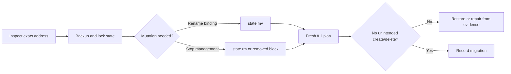
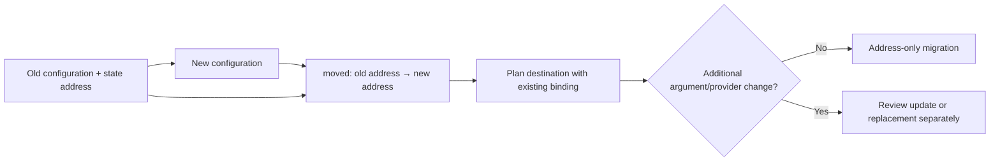
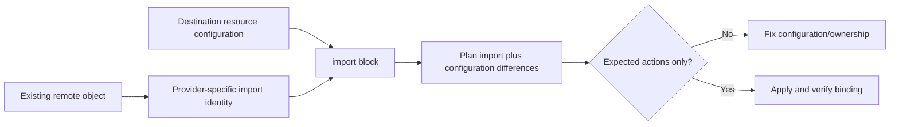
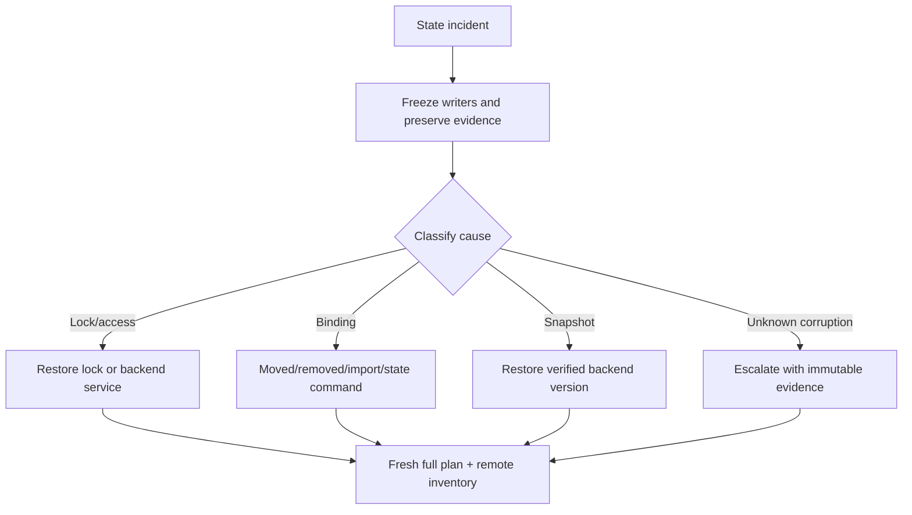

<!-- AUTO-GENERATED by scripts/sync-terraform-curriculum.mjs. Edit the canonical curriculum, not this file. -->

> [!NOTE]
> This page is generated from the reviewed Terraform Mastery curriculum at commit [`c3566e80e995`](https://github.com/thokchomlolet03-cpu/terraform-mastery/commit/c3566e80e995cf4d47c4b756af8674bfd89ef5fb). The source repository is authoritative.

## Lessons in this module

- [07.01 Supported state inspection and mutation](#0701-supported-state-inspection-and-mutation)
- [07.02 Declarative refactoring with `moved` blocks](#0702-declarative-refactoring-with-moved-blocks)
- [07.03 Importing existing objects into Terraform ownership](#0703-importing-existing-objects-into-terraform-ownership)
- [07.04 State incident recovery without speculative surgery](#0704-state-incident-recovery-without-speculative-surgery)

---

## 07.01 Supported state inspection and mutation

> Use Terraform's supported state interfaces, preserve the one-to-one binding
> invariant, and treat every mutation as an audited migration.

### Why this matters

State commands can rename or remove Terraform's management bindings without
changing the corresponding remote object. That makes them useful and dangerous:
an incorrect address can leave an object unmanaged or make the next plan propose a
duplicate.

### Learning outcomes

After this lesson, you should be able to:

- distinguish read-only inspection from binding mutation;
- use `state list` and `state show` safely;
- explain the effects of `state mv` and `state rm`;
- preserve backups, locking, ownership, and post-change evidence;
- prefer configuration-driven alternatives when a migration should be repeatable.

### Analogy: editing a museum catalog

Renaming a catalog entry does not move the artifact. Removing an entry does not
destroy the artifact; it only stops the catalog from tracking it.

#### Where the analogy breaks

Terraform state participates directly in future plans. A missing binding can lead
Terraform to propose another object. Remote-state operations also involve backend
locking, credentials, and sensitive data that a paper catalog analogy ignores.

### First-principles reconstruction

#### Inputs

- exact resource-instance addresses, including module and instance keys;
- latest locked backend state and a protected backup;
- matching configuration before and after the operation;
- provider import identity if ownership will be transferred.

#### Constraints

One remote object must not be bound to two Terraform addresses. An address's source
and destination resource types must be compatible for a move. Shell quoting must
preserve addresses containing string keys. State contains sensitive data.

#### Transformation

- `state list` enumerates tracked addresses.
- `state show ADDRESS` renders one instance for human inspection.
- `state mv SOURCE DESTINATION` changes a binding address.
- `state rm ADDRESS` removes a binding without requesting remote deletion.
- `state pull` and `state push` expose raw snapshots and belong to controlled
  recovery workflows, not routine refactoring.

#### Outputs

A successful mutation changes Terraform's operational memory. Required evidence is
a before/after address inventory, protected backup, mutation log, and fresh full
plan showing the intended result.

### Execution model



### Worked example

```bash
terraform state list
terraform state show 'local_file.user["ada"]'
terraform state mv \
  'local_file.user["ada"]' \
  'local_file.member["ada"]'
terraform plan
```

The configuration must already declare the destination and no longer declare the
source. For a version-controlled refactor within one configuration, a `moved`
block is usually preferable because every workspace can apply the migration.

### Safe experiment

1. Apply two local files in a disposable configuration.
2. Record addresses and take a state backup.
3. Rename one configuration block and use `state mv` in this local-only state.
4. Confirm a no-change plan.
5. Run `state rm` on the other binding and observe—but do not apply—the proposed
   recreation while its configuration remains.
6. Restore/import as needed, then destroy both files.

### Failure laboratory

Attempt a dry run or plan for an address with an incorrect `for_each` key. Compare
the diagnostic with the exact state list and write a shell-quoting rule that would
prevent the mistake.

### Retrieval questions

1. Which state commands are read-only?
2. What remote action does `state rm` request?
3. Why can leaving configuration after `state rm` create risk?
4. When is a `moved` block preferable to `state mv`?
5. What proves a state mutation was successful?

### Teach-back prompt

Explain a binding rename and a management handoff, including invariants, backups,
locking, configuration changes, plan evidence, and rollback.

### Official sources

- [`terraform state`](https://developer.hashicorp.com/terraform/cli/commands/state)
- [`terraform state mv`](https://developer.hashicorp.com/terraform/cli/commands/state/mv)
- [`terraform state rm`](https://developer.hashicorp.com/terraform/cli/commands/state/rm)
- [Resource address reference](https://developer.hashicorp.com/terraform/cli/state/resource-addressing)

### Website storyboard

Use a catalog visualization where learners rename or remove bindings and predict
the next plan while remote objects remain visible separately.

[View this lesson in the canonical curriculum source](https://github.com/thokchomlolet03-cpu/terraform-mastery/blob/c3566e80e995cf4d47c4b756af8674bfd89ef5fb/07_State_Manipulation_and_Safe_Refactoring/07_01_cli_state_operations.md)

---

## 07.02 Declarative refactoring with `moved` blocks

> A `moved` block tells Terraform to reinterpret an existing address as a new
> address before planning, making a refactor repeatable across workspaces.

### Why this matters

Renaming a resource or moving it into a module looks like delete-and-create unless
Terraform also knows the old-to-new address relationship. Recording that relation
in configuration lets code review and every environment see the same migration.

### Learning outcomes

After this lesson, you should be able to:

- write moves for resources, instances, and module addresses;
- predict a plan with and without the move;
- migrate between `count` and `for_each` identities deliberately;
- explain compatibility implications of deleting historical moves;
- distinguish address continuity from availability guarantees.

### Analogy: postal forwarding after an office move

A forwarding record maps an old office address to a new one so correspondence
continues during transition. Teams that update later can still follow the path.

#### Where the analogy breaks

A moved block changes Terraform's address interpretation, not the remote object or
its API configuration. If the new resource declaration changes provider type or
arguments incompatibly, the plan may still update or replace the object.

### First-principles reconstruction

#### Inputs

- a source address that may exist in state;
- a compatible destination address declared by the new configuration;
- the correct instance mapping for `count` or `for_each` changes;
- all supported upgrade paths for module consumers and workspaces.

#### Constraints

Each existing object can map to only one destination. Source and destination kinds
must be compatible. A workspace that already completed a move normally treats the
block as a no-op. Removing old moves can break consumers that upgrade from an older
version without passing through intermediate releases.

#### Transformation

Before planning the destination, Terraform checks state for the source address and
renames the object to the destination address in its working state. It then plans
the destination configuration normally.

#### Outputs

A correct pure refactor plan reports the address move without remote create/delete.
Any additional provider-planned change must be reviewed separately. “No remote
replacement” is demonstrated by the plan; it is not guaranteed by the word moved.

### Execution model



### Worked example

```hcl
resource "local_file" "member" {
  filename = "${path.module}/ada.txt"
  content  = "Ada"
}

moved {
  from = local_file.user
  to   = local_file.member
}
```

Instance identity migration must be explicit:

```hcl
moved {
  from = local_file.user[0]
  to   = local_file.user["ada"]
}
```

For published modules, retain moved blocks as compatibility history unless the
release policy intentionally makes a breaking change and documents the required
migration path.

### Safe experiment

1. Apply a local resource under its old address.
2. Rename it without a moved block and save the destructive plan as evidence.
3. Add the moved block and create a new plan.
4. Confirm the remote path and content are unchanged and actions are address-only.
5. Apply, plan again, and verify idempotence.
6. Destroy the local object.

### Failure laboratory

Map two old instances to the same destination or use an incompatible destination.
Capture the diagnostic and explain which identity invariant it protects. Restore
the valid mapping.

### Retrieval questions

1. When does Terraform consult the `from` address?
2. Why does a moved block work across multiple workspaces?
3. Can a moved block prevent all provider-planned changes?
4. How do you migrate numeric indices to domain keys?
5. Why might a module retain old moved blocks?

### Teach-back prompt

Design a root-to-child-module refactor and prove, from plans for old and already
migrated state, that the change is compatible.

### Official sources

- [Refactor with `moved` blocks](https://developer.hashicorp.com/terraform/language/modules/develop/refactoring)
- [`moved` block reference](https://developer.hashicorp.com/terraform/language/block/moved)
- [Refactor state](https://developer.hashicorp.com/terraform/language/state/refactor)
- [Module compatibility promises](https://developer.hashicorp.com/terraform/language/modules/develop/refactoring#remove-a-moved-block)

### Website storyboard

Animate old and new addresses around one unchanged remote object. A version slider
shows how retained move chains support workspaces upgrading at different times.

[View this lesson in the canonical curriculum source](https://github.com/thokchomlolet03-cpu/terraform-mastery/blob/c3566e80e995cf4d47c4b756af8674bfd89ef5fb/07_State_Manipulation_and_Safe_Refactoring/07_02_declarative_moved_blocks.md)

---

## 07.03 Importing existing objects into Terraform ownership

> Import creates a state binding to an existing object; matching configuration and
> a no-surprise follow-up plan are separate responsibilities.

### Why this matters

An import can succeed while the next plan proposes major changes because the
configuration does not match the provider's observed object. Safe adoption is an
ownership migration, not merely an import command.

### Learning outcomes

After this lesson, you should be able to:

- verify provider support and the correct import identity;
- write a configuration-driven `import` block;
- preserve the one-object-to-one-address invariant;
- treat generated configuration as a review starting point;
- prove adoption with an expected post-import plan.

### Analogy: registering an existing building

Registration links an existing building to a new official record. The record must
accurately describe the building, and the same building cannot be registered as
two independent properties.

#### Where the analogy breaks

Providers define import identity and may import one or multiple state objects.
Import reads the remote API, and later planning can propose modifications if
configuration, defaults, or provider normalization differ. Not all resource types
support import.

### First-principles reconstruction

#### Inputs

- confirmed organizational ownership and change authorization;
- exact provider version and resource import documentation;
- remote object identity in the provider's required format;
- a unique destination resource-instance address;
- configuration intended to manage the object after adoption.

#### Constraints

Terraform expects one remote object per resource address and one address per
managed object. Credentials need read access for planning and appropriate future
write access. Generated configuration can include provider defaults or values that
need redesign and must not be accepted blindly.

#### Transformation

Terraform evaluates the import block, asks the provider to import the remote
identity, refreshes imported state, and plans the destination resource
configuration. Apply records the binding. The import operation itself is an
ownership/state action, but other actions in the same plan can still modify remote
objects and must be reviewed.

#### Outputs

A safe adoption produces version-controlled resource and import configuration,
reviewed state binding, a plan with only expected import/change actions, ownership
documentation, and a rollback or handback strategy.

### Execution model



### Worked example

```hcl
resource "local_file" "adopted" {
  filename = "${path.module}/existing.txt"
  content  = "expected content"
}

import {
  to = local_file.adopted
  id = "${path.module}/existing.txt"
}
```

Use the exact import identity documented by the provider; this example is
illustrative and must be verified against the installed local provider.

When configuration does not yet exist, `terraform plan
-generate-config-out=generated.tf` can generate a starting point for supported
imports. The option and output require review; generated code is not an enterprise
module design or proof of a no-change plan.

### Safe experiment

1. Create a disposable local file outside Terraform.
2. Confirm the installed provider's import instructions.
3. Write the resource and import blocks.
4. Save and review the plan, including any content change.
5. Apply, run a second plan, and inspect the state binding.
6. Remove management or destroy the local object deliberately.

### Failure laboratory

Attempt to import the same object to a second address in a disposable state.
Observe or reason through the one-to-one violation, then remove the duplicate
configuration and restore a single owner.

### Retrieval questions

1. Who defines an object's import identity?
2. What does import change directly?
3. Why can the import plan still contain remote changes?
4. What does generated configuration not prove?
5. How do you verify exclusive Terraform ownership?

### Teach-back prompt

Present an adoption plan covering authorization, discovery, identity, config,
import, plan review, ownership cutover, verification, and rollback.

### Official sources

- [Import existing resources](https://developer.hashicorp.com/terraform/language/import)
- [`import` block reference](https://developer.hashicorp.com/terraform/language/block/import)
- [`terraform import`](https://developer.hashicorp.com/terraform/cli/commands/import)
- [Generate configuration](https://developer.hashicorp.com/terraform/language/import/generating-configuration)

### Website storyboard

Build an adoption checklist that will not unlock apply until identity, exclusive
ownership, configuration differences, and rollback evidence are supplied.

[View this lesson in the canonical curriculum source](https://github.com/thokchomlolet03-cpu/terraform-mastery/blob/c3566e80e995cf4d47c4b756af8674bfd89ef5fb/07_State_Manipulation_and_Safe_Refactoring/07_03_importing_unmanaged_infrastructure.md)

---

## 07.04 State incident recovery without speculative surgery

> Prefer backend recovery and supported binding operations; raw state push is an
> exceptional last resort that requires isolation, backups, review, and escalation.

### Why this matters

Editing serials, lineages, provider-private bytes, or resource arrays by hand is
not a standard disaster-recovery skill. It can bypass safeguards and create a
snapshot Terraform or a provider cannot interpret. Recovery should minimize
unverified mutation and preserve a path back.

### Learning outcomes

After this lesson, you should be able to:

- triage lock, access, backend, binding, provider, and corruption incidents;
- choose backend version restore, import/move/remove, or support escalation;
- explain the safety checks performed by `state push`;
- define the exceptional approval gate for `state push -force`;
- verify recovery with state, plan, remote, and audit evidence.

### Analogy: restoring a database from a trusted backup

Operators first stop writers, preserve logs, identify a known-good backup, and
test restoration. They do not begin by hex-editing the production database.

#### Where the analogy breaks

Terraform state is coupled to configuration, provider schemas, remote identities,
and backend lineage. A syntactically valid JSON file can still be semantically
wrong. A no-error refresh-only plan can update state but does not prove ownership,
configuration intent, or absence of unintended future changes.

### First-principles reconstruction

#### Inputs

- incident timeline, logs, lock information, and actor inventory;
- immutable copies of current and historical backend state;
- exact configuration, Terraform version, provider locks, and credentials;
- remote-object inventory and audit logs;
- backend recovery features and vendor support paths.

#### Constraints

No other writer may run during recovery. State and backups are sensitive. The
`state push` command checks lineage and serial to reduce accidental overwrite;
`-force` disables those protections. Raw state format and provider-private data are
not supported hand-editing interfaces.

#### Transformation

Classify the incident before acting:

1. Active/stale lock → verify holder and use normal unlock or tightly governed
   force-unlock.
2. Access/backend outage → restore service; do not mutate state.
3. Wrong/missing binding → use moved, removed, import, or supported state commands.
4. Bad snapshot → restore a verified backend version where possible.
5. Suspected format/provider corruption → preserve evidence and escalate to
   HashiCorp/provider/backend support before raw mutation.

#### Outputs

Recovery is complete only when exclusive writing is restored, state parses,
bindings match remote identities, a fresh full plan contains only expected actions,
and backend/audit controls show no competing writes.

### Execution model



### Worked example

A conservative response to accidental `state rm` is usually:

1. stop all runs;
2. preserve the current state and audit trail;
3. confirm the remote object's identity;
4. restore the binding with an import block;
5. review the full plan for any changes;
6. apply and verify one-to-one ownership.

Do not edit a resource object back into raw JSON.

### Safe experiment

In a disposable local-state directory only:

1. Apply one local resource and copy its state as a protected lab backup.
2. Remove its binding with a supported command.
3. Restore it using an import block.
4. Confirm a no-change or explicitly expected plan.
5. Compare the restored binding with the backup, then destroy the lab.

### Failure laboratory

Read the `state push` documentation and write an approval record for a hypothetical
`-force` request. It must prove why lineage/serial checks are wrong, why safer
recovery paths fail, who has isolated writers, which immutable backup exists, and
how rollback will be tested. Do not run the command.

### Retrieval questions

1. Why is syntactically valid state not necessarily correct state?
2. What safety checks does `state push` normally perform?
3. Which recovery paths precede raw state mutation?
4. What evidence is required before `-force` could be considered?
5. Why is a refresh-only plan insufficient as the only recovery test?

### Teach-back prompt

Lead a state incident tabletop from detection through containment, classification,
recovery selection, approval, execution, validation, and post-incident controls.

### Official sources

- [Refactor Terraform state](https://developer.hashicorp.com/terraform/language/state/refactor)
- [Remove a resource from state](https://developer.hashicorp.com/terraform/language/state/remove)
- [`terraform state push`](https://developer.hashicorp.com/terraform/cli/commands/state/push)
- [State locking and force-unlock](https://developer.hashicorp.com/terraform/language/state/locking)

### Website storyboard

Create an incident triage simulator. Raw state push stays locked unless learners
exhaust safer paths and provide isolation, backup, approval, and rollback evidence.

[View this lesson in the canonical curriculum source](https://github.com/thokchomlolet03-cpu/terraform-mastery/blob/c3566e80e995cf4d47c4b756af8674bfd89ef5fb/07_State_Manipulation_and_Safe_Refactoring/07_04_emergency_state_surgery_and_disaster_recovery.md)
