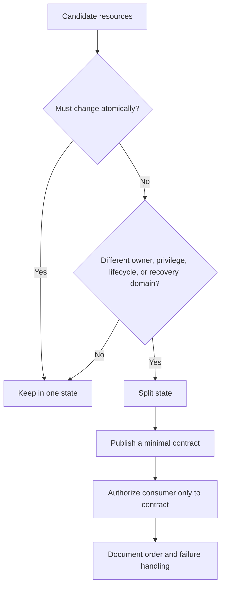
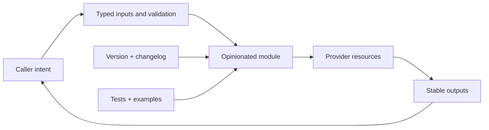
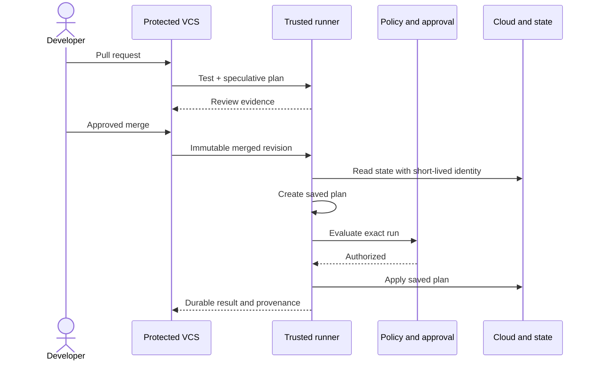
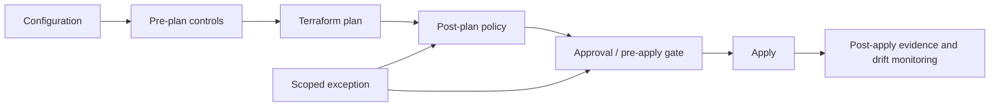
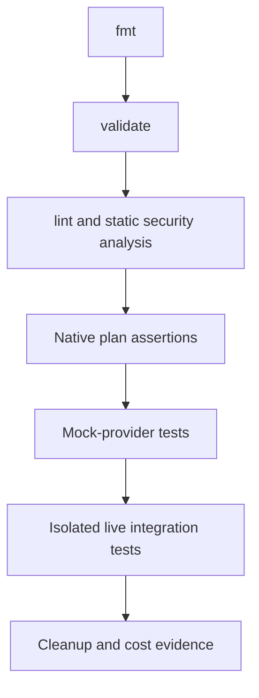
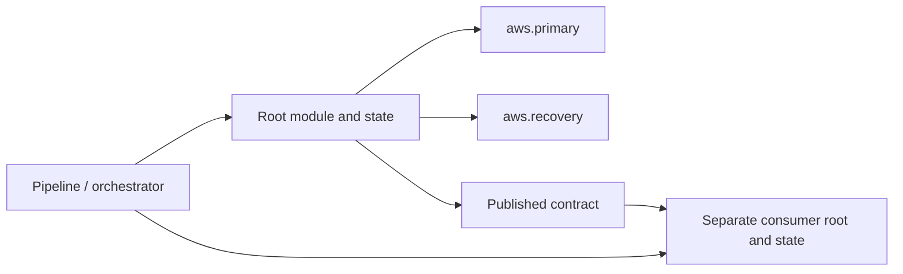

<!-- AUTO-GENERATED by scripts/sync-terraform-curriculum.mjs. Edit the canonical curriculum, not this file. -->

> [!NOTE]
> This page is generated from the reviewed Terraform Mastery curriculum at commit [`c3566e80e995`](https://github.com/thokchomlolet03-cpu/terraform-mastery/commit/c3566e80e995cf4d47c4b756af8674bfd89ef5fb). The source repository is authoritative.

## Lessons in this module

- [08.01 Blast-radius isolation and stack boundaries](#0801-blast-radius-isolation-and-stack-boundaries)
- [08.02 Reusable module contracts and evolution](#0802-reusable-module-contracts-and-evolution)
- [08.03 Governed Terraform delivery pipelines](#0803-governed-terraform-delivery-pipelines)
- [08.04 Policy as code and layered governance](#0804-policy-as-code-and-layered-governance)
- [08.05 Native tests and layered analysis](#0805-native-tests-and-layered-analysis)
- [08.06 Provider aliases and multi-stack orchestration](#0806-provider-aliases-and-multi-stack-orchestration)

---

## 08.01 Blast-radius isolation and stack boundaries

> Split state where ownership, lifecycle, privilege, or failure domains differ—not merely because a directory has become large.

### Why this matters

A state boundary is an operational boundary. It changes who can plan and apply, what is locked together, which failures can interfere, and how stacks exchange data. Too little separation creates contention and broad privileges; too much creates dependency sprawl and coordination work.

### Learning outcomes

After this lesson, you should be able to:

- select state boundaries using explicit decision criteria;
- distinguish a module boundary from a state boundary;
- design a versioned cross-stack contract;
- explain the security trade-off of `terraform_remote_state`;
- sequence changes without creating circular ownership.

### Analogy: watertight compartments

A ship contains flooding by dividing the hull into compartments. Each door reduces the area one leak can affect, but too many doors slow movement and require coordination.

#### Where the analogy breaks

Terraform stacks are not physically isolated. They can share cloud accounts, APIs, quotas, identities, and downstream contracts. Separate state limits Terraform's direct transaction and lock scope; it does not automatically isolate the cloud platform.

### First-principles reconstruction

#### Inputs

- resource ownership and team boundaries;
- change frequency and release cadence;
- privilege requirements and sensitive-data exposure;
- dependency direction, recovery targets, and provider/API limits.

#### Constraints

Each remote object should have one owning resource address. A stack can make one atomic plan only across objects in its own state. Cross-stack values are eventually coordinated contracts, not expression edges in one graph.

#### Transformation

Group resources that must change together. Split groups when independent lifecycle, access, risk, or recovery is more valuable than atomic planning. Publish the smallest stable interface needed by consumers.

#### Outputs

The design produces root modules with separate state, named owners, narrow execution identities, directional contracts, and a documented deployment and recovery order.

### Decision model



### Worked example

An organization might separate `network-prod`, `data-prod`, and `app-prod` because they have different privileges, owners, and change rates. The network stack publishes subnet IDs into an approved configuration store. The app stack reads only those keys.

`terraform_remote_state` is convenient, but a reader authorized to fetch outputs can access the full snapshot through the backend. Do not use it where state contains data the consumer must not read. HCP Terraform users should consider `tfe_outputs`; other platforms can publish DNS records, parameter-store values, or provider-specific discovery data.

### Safe experiment

1. Use Lab 05's local tier roots and contract files.
2. Predict which tier fails when a required upstream contract is absent.
3. Apply tiers in order and inspect only the published JSON contracts.
4. Compare this with placing all resources in one root module.
5. Destroy in reverse order and confirm no state or contract artifacts remain.

### Failure laboratory

Rename an upstream contract key without changing its consumer. Observe the consumer failure, then design a compatible migration: publish both versions, update consumers, and remove the old key only after evidence shows no readers remain.

### Retrieval questions

1. Which four signals justify a state boundary?
2. What atomic capability is lost after a split?
3. Why is a module boundary not necessarily a state boundary?
4. What access does a remote-state consumer effectively require?
5. How do you prevent a cross-stack contract cycle?

### Teach-back prompt

Defend a three-stack production design. Name its owners, privileges, lifecycle, contracts, sequencing, failure modes, and the evidence that each boundary reduces risk.

### Official sources

- [Remote state](https://developer.hashicorp.com/terraform/language/state/remote)
- [`terraform_remote_state` and alternatives](https://developer.hashicorp.com/terraform/language/state/remote-state-data)
- [S3 backend locking and recovery guidance](https://developer.hashicorp.com/terraform/language/backend/s3)
- [Module composition](https://developer.hashicorp.com/terraform/language/modules/develop/composition)

### Website storyboard

Let learners move resources between state compartments. Show lock scope, execution identity, contract edges, and the failure radius for each proposed layout.

[View this lesson in the canonical curriculum source](https://github.com/thokchomlolet03-cpu/terraform-mastery/blob/c3566e80e995cf4d47c4b756af8674bfd89ef5fb/08_Production_Architecture_and_Enterprise_Design/08_01_blast_radius_isolation.md)

---

## 08.02 Reusable module contracts and evolution

> A reusable module is a versioned infrastructure contract: opinionated enough to create a useful architectural concept and small enough to compose.

### Why this matters

Shared modules can multiply good controls—or multiply breaking changes. Enterprise quality comes from clear abstractions, typed interfaces, compatibility rules, tests, examples, ownership, and an upgrade path.

### Learning outcomes

After this lesson, you should be able to:

- decide when a module adds a useful abstraction;
- structure a distributable module using HashiCorp conventions;
- design narrow inputs and intentional outputs;
- distinguish root-module and shared-module version constraints;
- evolve resource addresses and interfaces safely.

### Analogy: a well-designed appliance

An appliance exposes a small control panel while hiding internal components. Its connector and operating limits form a contract; internal parts may change without forcing every user to rebuild the room.

#### Where the analogy breaks

Terraform callers can observe state addresses, provider behavior, and output values. Changes inside a module may still alter or replace real infrastructure, so semantic version labels do not prove runtime compatibility.

### First-principles reconstruction

#### Inputs

- a repeated architectural capability;
- caller use cases and variation points;
- provider and Terraform feature requirements;
- security defaults and compatibility expectations.

#### Constraints

Avoid thin wrappers that merely rename one resource's arguments. Keep module trees relatively flat. Child modules declare provider requirements but receive provider configurations from the caller. Every input and output needs a useful description.

#### Transformation

Model one coherent concept, expose required variation, validate invariants, publish only useful outputs, include runnable examples and tests, then release an immutable version with migration notes.

#### Outputs

A consumer gets a documented module package, predictable dependency constraints, test evidence, and a deliberate upgrade path.

### Contract model



### Recommended structure

```text
terraform-aws-service/
├── README.md
├── LICENSE
├── main.tf
├── variables.tf
├── outputs.tf
├── versions.tf
├── examples/
└── modules/          # optional nested modules
```

Only the root module is required, but this shape works with registry tooling. A shared module should generally set a minimum compatible provider version such as `>= 5.0`; the consuming root module owns the upper bound and lock-file selection. Registry modules support a `version` constraint. Git sources use a `ref`; pin it to an immutable tag or commit rather than a moving branch.

### Worked example

```hcl
variable "environment" {
  type        = string
  description = "Deployment environment used in names and tags."

  validation {
    condition     = contains(["dev", "stage", "prod"], var.environment)
    error_message = "environment must be dev, stage, or prod."
  }
}

output "service_endpoint" {
  description = "Private endpoint consumed by application stacks."
  value       = aws_lb.this.dns_name
}
```

If an internal resource address changes, ship a `moved` block when the relationship is unambiguous. If an input or output must change incompatibly, release a major version and publish a staged migration.

### Safe experiment

1. Create a local-only child module around `terraform_data` and `local_file` that represents a service manifest, not a single resource wrapper.
2. Add typed inputs, validations, outputs, an example, and a plan-mode native test.
3. Rename an internal resource using a `moved` block.
4. Confirm the upgrade produces no create/delete actions.
5. Destroy the example resources.

### Failure laboratory

Remove an output used by the example, run validation, and record the failure. Design a deprecation window that adds the replacement output before deleting the old one.

### Retrieval questions

1. What makes a module an abstraction rather than a wrapper?
2. Who should control the final provider version selection?
3. How does a Git module pin differ from a registry version constraint?
4. When does an internal rename require a `moved` block?
5. Which evidence should accompany a module release?

### Teach-back prompt

Present a module API review covering purpose, inputs, outputs, provider ownership, versioning, tests, compatibility, and a safe migration from one major version to the next.

### Official sources

- [Creating modules](https://developer.hashicorp.com/terraform/language/modules/develop)
- [Standard module structure](https://developer.hashicorp.com/terraform/language/modules/develop/structure)
- [Module composition](https://developer.hashicorp.com/terraform/language/modules/develop/composition)
- [Providers within modules](https://developer.hashicorp.com/terraform/language/modules/develop/providers)

### Website storyboard

Show a module as a contract box. Learners can change inputs, internal addresses, outputs, and versions, then see which changes are compatible and which require migration.

[View this lesson in the canonical curriculum source](https://github.com/thokchomlolet03-cpu/terraform-mastery/blob/c3566e80e995cf4d47c4b756af8674bfd89ef5fb/08_Production_Architecture_and_Enterprise_Design/08_02_enterprise_module_design.md)

---

## 08.03 Governed Terraform delivery pipelines

> Production automation should turn an approved revision into a controlled run with short-lived identity, policy gates, serialized state access, and durable evidence.

### Why this matters

Moving `terraform apply` off a laptop is only one control. A runner can still apply the wrong revision, reuse excessive credentials, expose a plan, bypass approval, or act on stale state. The whole chain must preserve identity, artifact, environment, and authorization.

### Learning outcomes

After this lesson, you should be able to:

- distinguish speculative, saved, and normal plan-and-apply runs;
- design a trustworthy pull-request and merge workflow;
- explain why a pull-request plan usually must not be applied after merge;
- use short-lived workload identity and protected environments;
- define evidence, concurrency, and recovery controls.

### Analogy: an airport departure process

Code review is the ticket check, policy is security screening, the saved plan is a manifest for one flight, approval opens the gate, and the execution identity authorizes the aircraft—not the passenger's personal keys.

#### Where the analogy breaks

Infrastructure can drift while approval is pending, providers make external API calls, and a saved plan can contain sensitive data. A pipeline is a distributed security system, not a single checkpoint.

### First-principles reconstruction

#### Inputs

- an immutable commit or configuration version;
- pinned Terraform/provider dependencies;
- backend configuration and current state;
- short-lived execution identity, policy, approval, and change metadata.

#### Constraints

A speculative plan is for review and cannot itself authorize an apply. A pull-request plan usually represents a different revision than the post-merge commit. Saved plans are opaque, sensitive artifacts and become stale if their state lineage changes.

#### Transformation

On a pull request, format, validate, test, scan, and create a speculative plan. After merge, create a new plan from the protected revision. Run policy and human gates against that exact run, then apply that saved plan in the same governed context.

#### Outputs

The system records source revision, tool versions, plan, approvals, policy results, actor/workload identity, apply result, state version, and incident path.

### Run model



### Worked example

```bash
terraform fmt -check -recursive
terraform init -input=false
terraform validate
terraform test
terraform plan -input=false -out=tfplan
# policy and approval inspect this run
terraform apply -input=false tfplan
```

Keep `tfplan` within the protected job or artifact boundary, restrict downloads, set retention, and never publish raw plan JSON to an untrusted pull request. Use OIDC or another workload federation mechanism rather than long-lived cloud secrets. Serialize applies per state while allowing safe checks to run concurrently.

### Safe experiment

1. Use a local-file root in a temporary directory.
2. Record its commit-like source checksum and create a saved plan.
3. Change configuration before applying and explain why applying the old artifact would not represent the new source.
4. Discard it, create a new saved plan, apply, and capture evidence.
5. Destroy and remove the plan artifact.

### Failure laboratory

Create a saved plan, perform a separate apply that changes its state, then attempt the old plan. Observe stale-plan protection. Write the pipeline rule that ensures replanning occurs after a changed state or merged revision.

### Retrieval questions

1. Why is a pull-request plan generally not the merge apply artifact?
2. What makes a saved plan sensitive?
3. Which identity should reach the cloud control plane?
4. What must be serialized per state?
5. Which evidence connects source, approval, and apply?

### Teach-back challenge

Threat-model a Terraform pipeline from untrusted pull request to production apply. Explain revision binding, identity, secrets, state locking, approval, policy, evidence, and recovery.

### Official sources

- [`terraform plan`](https://developer.hashicorp.com/terraform/cli/commands/plan)
- [`terraform apply`](https://developer.hashicorp.com/terraform/cli/commands/apply)
- [HCP Terraform remote saved plans](https://developer.hashicorp.com/terraform/enterprise/workspaces/run/cli)
- [Manage sensitive data](https://developer.hashicorp.com/terraform/language/manage-sensitive-data)

### Friction Hunter storyboard

Animate two tracks: an untrusted speculative run and a protected post-merge saved-plan run. Learners must attach the correct revision, identity, approval, and artifact before apply unlocks.

[View this lesson in the canonical curriculum source](https://github.com/thokchomlolet03-cpu/terraform-mastery/blob/c3566e80e995cf4d47c4b756af8674bfd89ef5fb/08_Production_Architecture_and_Enterprise_Design/08_03_ci_cd_zero_laptop_pipeline.md)

---

## 08.04 Policy as code and layered governance

> Governance converts organizational intent into scoped, testable decisions at multiple control points; a plan policy is one layer, not the whole system.

### Why this matters

Reviewers cannot consistently detect every prohibited region, missing tag, excessive privilege, or cost risk. Automated policy improves repeatability, but poor policies create false confidence, broad exceptions, and blocked delivery. Enterprise governance needs ownership, enforcement semantics, testing, evidence, and an exception lifecycle.

### Learning outcomes

After this lesson, you should be able to:

- select pre-plan, post-plan, pre-apply, and post-apply controls;
- distinguish advisory and mandatory enforcement;
- explain where Sentinel, OPA, and HCP run tasks fit;
- write policy requirements with unknown values in mind;
- design governed exceptions and policy tests.

### Analogy: building codes and inspections

A code defines acceptable outcomes, plan review catches design violations, site inspection checks execution, and a documented variance grants a narrow, time-limited exception.

#### Where the analogy breaks

Terraform plans contain unknown and sensitive values, providers can behave differently at apply time, and policy engines differ in inputs and semantics. A passed plan policy is not proof that the deployed system remains compliant.

### First-principles reconstruction

#### Inputs

- authoritative control statements and risk owners;
- configuration, plan, cost, identity, and external security data;
- enforcement scope and lifecycle stage;
- approved exception metadata.

#### Constraints

Rules must handle create, update, delete, no-op, replacement, unknown, and absent values. Tool and HCP Terraform features vary by edition and execution mode. Enforcement must fail predictably when required policy services are unavailable.

#### Transformation

Translate one control into machine-testable conditions, choose the earliest reliable stage, test allow/deny/unknown/exception cases, canary in advisory mode, then promote to mandatory with an owned remediation path.

#### Outputs

Every run yields a decision, reason, policy version, evaluated evidence, scope, exception reference, and owner. Post-apply monitoring detects drift outside Terraform's run.

### Governance model



### Worked example

A requirement such as “production storage must be encrypted” is incomplete. Define covered resource types, acceptable encryption mechanisms, treatment of unknown values, delete actions, legacy resources, exception owner, expiry, and remediation link. Test at least:

- compliant creation;
- noncompliant creation;
- update that disables encryption;
- deletion;
- unknown planned value;
- valid and expired exceptions.

HCP Terraform policy sets can scope Terraform, Sentinel, or OPA policies to workspaces/projects. Enforcement and available inputs differ: for example, policy evaluations and policy checks are distinct. Run tasks integrate external tools at pre-plan, post-plan, pre-apply, or post-apply stages and can be advisory or mandatory.

### Safe experiment

1. Produce JSON from a local saved plan containing `terraform_data` objects.
2. Write a small read-only policy script that requires an `owner` input.
3. Test compliant, missing, unknown, delete, and exception fixtures.
4. Record machine-readable decisions without exposing the full plan.
5. Remove all temporary plans and state.

### Failure laboratory

Implement a policy that checks only create actions. Feed it an update that removes the protected property. Explain the bypass, add the missing action case, and preserve the regression fixture.

### Retrieval questions

1. Why is “policy passed” not equivalent to “system compliant”?
2. Which values and actions complicate plan policy?
3. When should a run task be pre-plan versus post-plan?
4. What makes an exception governable?
5. Which evidence must a policy decision retain?

### Teach-back challenge

Design enforcement for one security requirement from control statement through policy tests, rollout, exception, apply evidence, and post-deployment monitoring.

### Official sources

- [Manage HCP Terraform policy sets](https://developer.hashicorp.com/terraform/cloud-docs/workspaces/policy-enforcement/manage-policy-sets)
- [Policy enforcement results and stages](https://developer.hashicorp.com/terraform/enterprise/workspaces/policy-enforcement/view-results)
- [HCP Terraform run tasks](https://developer.hashicorp.com/terraform/cloud-docs/workspaces/settings/run-tasks)
- [Terraform plan representation for Sentinel](https://developer.hashicorp.com/sentinel/docs/features/terraform/tfplan-v2)

### Friction Hunter storyboard

Create a governance timeline where a learner places each control at a run stage, chooses enforcement, and tests bypasses caused by deletes, updates, unknowns, and expired exceptions.

[View this lesson in the canonical curriculum source](https://github.com/thokchomlolet03-cpu/terraform-mastery/blob/c3566e80e995cf4d47c4b756af8674bfd89ef5fb/08_Production_Architecture_and_Enterprise_Design/08_04_policy_as_code_and_governance.md)

---

## 08.05 Native tests and layered analysis

> Test the cheapest reliable property first, then add higher-fidelity evidence only where provider behavior or real infrastructure matters.

### Why this matters

Formatting, validation, native tests, policy, and integration tests answer different questions. Treating them as interchangeable leaves gaps; running every test against real cloud resources wastes time and creates cost and cleanup risk.

### Learning outcomes

After this lesson, you should be able to:

- distinguish syntax, schema, contract, plan, mock, and live integration checks;
- write `terraform test` runs with meaningful assertions;
- explain the limits of mocked providers;
- design dedicated test accounts and cleanup evidence;
- order checks for fast, useful feedback.

### Analogy: testing a bridge before traffic

Engineers inspect drawings, simulate loads, test materials, and finally perform controlled field tests. Each layer catches a different defect at a different cost.

#### Where the analogy breaks

Provider schemas and cloud APIs evolve, mocks generate synthetic computed data, and a Terraform test may create real billable infrastructure. Test success is versioned evidence, not a permanent certification.

### First-principles reconstruction

#### Inputs

- configuration and dependency lock file;
- invariants expressed as observable assertions;
- real or mocked provider schemas;
- isolated credentials, quotas, budget, and cleanup controls for live tests.

#### Constraints

`terraform validate` checks configuration consistency, not remote API behavior. A `command = plan` run may still call provider data sources unless mocked. Mock values do not reproduce provider logic or real API constraints. Apply-mode tests can incur cost, and automatic cleanup can fail.

#### Transformation

Run deterministic static gates first, native contract and plan tests next, mock tests for graph/interface behavior, and a small set of live integration tests in disposable environments last.

#### Outputs

CI reports which invariant was tested, against which Terraform/provider/tool version, at what fidelity, and whether cleanup succeeded.

### Evidence ladder



### Worked example

```hcl
mock_provider "aws" {}

run "uses_required_tags" {
  command = plan

  variables {
    owner       = "platform"
    environment = "test"
  }

  assert {
    condition     = aws_s3_bucket.example.tags["Owner"] == "platform"
    error_message = "The module must propagate its Owner tag."
  }
}
```

This can prove configuration wiring. It cannot prove that AWS accepts a policy, that an endpoint is reachable, or that generated identifiers have real AWS formats. Those require provider-specific or live tests.

### Safe experiment

1. Run `terraform test` in Lab 02.
2. Read each assertion and predict whether it checks input validation, graph wiring, or provider behavior.
3. Add a deliberately false assertion and observe the diagnostic.
4. Restore it and run the suite again.
5. Confirm teardown and repository cleanliness.

### Failure laboratory

Use a mocked computed string as if it were a real ARN and write an assertion for ARN syntax. Observe why generated mock data is not trustworthy for that contract; supply an explicit override or move the check to an appropriate integration test.

### Retrieval questions

1. What does `terraform validate` not verify?
2. Can a plan-mode test call a real API?
3. What can a mock-provider test prove?
4. Why must test cleanup be monitored?
5. How should CI order checks?

### Teach-back prompt

Build an evidence ladder for a shared module and justify which risks belong to formatting, validation, native tests, mocks, policy, and live integration.

### Official sources

- [`terraform test` command](https://developer.hashicorp.com/terraform/cli/commands/test)
- [Terraform test language](https://developer.hashicorp.com/terraform/language/tests)
- [Provider mocking](https://developer.hashicorp.com/terraform/language/tests/mocking)
- [`terraform validate`](https://developer.hashicorp.com/terraform/cli/commands/validate)

### Website storyboard

Display a test-evidence ladder. Selecting a claim highlights the cheapest layer that can actually prove it and warns when a mock or static check is insufficient.

[View this lesson in the canonical curriculum source](https://github.com/thokchomlolet03-cpu/terraform-mastery/blob/c3566e80e995cf4d47c4b756af8674bfd89ef5fb/08_Production_Architecture_and_Enterprise_Design/08_05_native_testing_and_static_analysis.md)

---

## 08.06 Provider aliases and multi-stack orchestration

> Provider aliases choose API configurations inside one graph; orchestration coordinates separate graphs. Neither mechanism creates availability by itself.

### Why this matters

Multi-region systems cross identity, region, state, and failure boundaries. Confusing provider selection with stack orchestration can place resources in the wrong account, create hidden coupling, or turn disaster recovery into an untested diagram.

### Learning outcomes

After this lesson, you should be able to:

- configure and pass provider aliases explicitly;
- distinguish provider requirements from provider configurations;
- decide whether regions belong in one state or separate states;
- compare native Terraform, HCP Terraform, and third-party orchestration;
- design dependency contracts and recovery tests without circular stacks.

### Analogy: passports and itineraries

A provider configuration is a passport plus destination: it determines which authority receives a request. An orchestrator is the itinerary that sequences multiple trips.

#### Where the analogy breaks

Cloud resources can replicate asynchronously and have provider-specific dependencies. A single Terraform graph may span regions, while separate states require external sequencing and cannot share ordinary expression dependencies.

### First-principles reconstruction

#### Inputs

- accounts, projects, subscriptions, regions, and execution identities;
- recovery objectives and correlated-failure assumptions;
- resource ownership and dependency direction;
- operational tooling and support constraints.

#### Constraints

Aliased provider configurations are not inherited automatically by child modules. Child modules declare `configuration_aliases`; callers map actual provider configurations. Separate roots have separate locks and plans. Third-party wrappers add their own language, upgrade cycle, and failure modes.

#### Transformation

Choose the state boundary first. Within one root, define explicit provider configurations and pass aliases. Across roots, publish minimal contracts and use a pipeline or supported orchestrator to order changes. Exercise failover independently of deployment.

#### Outputs

The architecture records where each resource is managed, which identity and provider configuration reaches it, how contracts are published, and how deployment, rollback, and regional recovery are tested.

### Boundary model



### Worked example

```hcl
provider "aws" {
  region = "us-east-1"
}

provider "aws" {
  alias  = "recovery"
  region = "us-west-2"
}

module "replication" {
  source = "./modules/replication"

  providers = {
    aws.primary  = aws
    aws.recovery = aws.recovery
  }
}
```

The child module declares `configuration_aliases = [aws.primary, aws.recovery]` and places `provider = aws.primary` or `provider = aws.recovery` on resources. A shared child module generally declares its minimum compatible provider version; the root controls final selection.

Terragrunt and Terramate can reduce repetition and coordinate roots, but they are ecosystem tools, not Terraform language features. Evaluate them against simpler alternatives: generated configuration, repository templates, HCP Terraform projects/workspaces/stacks where applicable, or an explicit CI dependency graph. Pin wrapper versions and test their behavior like any other dependency.

For an S3 backend, current Terraform supports `use_lockfile = true`; DynamoDB-based locking is deprecated. Do not copy older wrapper examples that create new DynamoDB lock tables without a migration reason.

### Safe experiment

1. Build a local module that declares two aliases of the `local` provider.
2. Pass both configurations explicitly from a root module.
3. Predict which directory receives each file, apply, and inspect state addresses.
4. Remove one provider mapping and observe validation.
5. Restore the mapping and destroy all files.

### Failure laboratory

Define only aliased provider blocks and omit an explicit default while a resource expects the default. Explain Terraform's implied empty configuration and the resulting diagnostic or misconfiguration risk. Add a deliberate default and revalidate.

### Retrieval questions

1. What does a provider alias select?
2. Why must child modules declare `configuration_aliases`?
3. When might two regions require separate state?
4. What new risks does an orchestration wrapper add?
5. What replaced the recommended new-use DynamoDB locking pattern for S3?

### Teach-back challenge

Design a two-region system and defend its state boundaries, provider mappings, identities, contracts, orchestration, recovery objectives, and failover evidence.

### Official sources

- [Provider configuration](https://developer.hashicorp.com/terraform/language/providers/configuration)
- [Providers within modules](https://developer.hashicorp.com/terraform/language/modules/develop/providers)
- [`providers` module meta-argument](https://developer.hashicorp.com/terraform/language/meta-arguments/module-providers)
- [S3 backend locking](https://developer.hashicorp.com/terraform/language/backend/s3)

### Friction Hunter storyboard

Use a region-and-state canvas. Learners connect aliases, roots, identities, and contracts; the view flags implicit defaults, circular dependencies, broad state access, and untested recovery paths.

[View this lesson in the canonical curriculum source](https://github.com/thokchomlolet03-cpu/terraform-mastery/blob/c3566e80e995cf4d47c4b756af8674bfd89ef5fb/08_Production_Architecture_and_Enterprise_Design/08_06_multi_region_cross_state_and_terragrunt.md)
