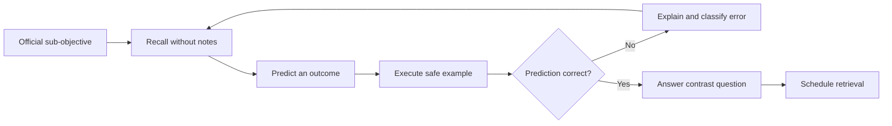
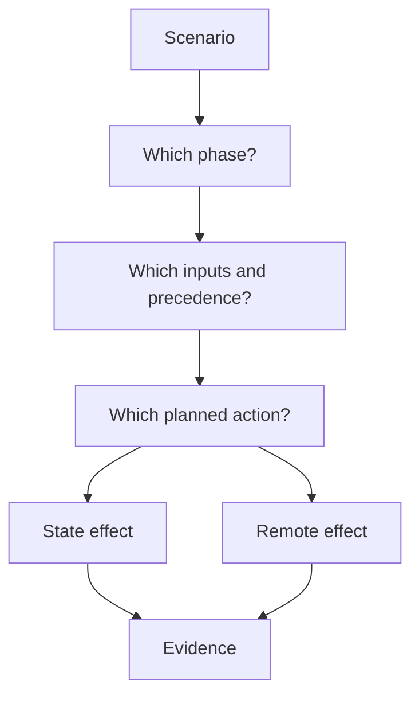
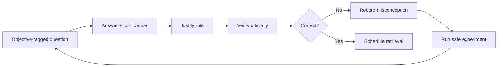

<!-- AUTO-GENERATED by scripts/sync-terraform-curriculum.mjs. Edit the canonical curriculum, not this file. -->

> [!NOTE]
> This page is generated from the reviewed Terraform Mastery curriculum at commit [`c3566e80e995`](https://github.com/thokchomlolet03-cpu/terraform-mastery/commit/c3566e80e995cf4d47c4b756af8674bfd89ef5fb). The source repository is authoritative.

## Lessons in this module

- [09.01 Associate 004 blueprint and evidence-based preparation](#0901-associate-004-blueprint-and-evidence-based-preparation)
- [09.02 Contrast drills for Associate 004](#0902-contrast-drills-for-associate-004)
- [09.03 Associate 004 practice and error review](#0903-associate-004-practice-and-error-review)

---

## 09.01 Associate 004 blueprint and evidence-based preparation

> Prepare against HashiCorp's published objectives, not invented weightings or collections of obscure trivia.

### Why this matters

Certification study becomes disorganized when every interesting Terraform detail is treated as examinable. The official Associate 004 content list is the scope contract. It currently names eight domains and maps each sub-objective to official documentation and tutorials.

### Learning outcomes

After this lesson, you should be able to:

- name the eight official Associate 004 domains;
- turn each sub-objective into observable evidence;
- distinguish Associate scope from advanced production and provider-development topics;
- use recall, prediction, execution, and correction as a study loop;
- verify current exam information before booking or sitting the exam.

### Analogy: a flight syllabus

A pilot trains against a published syllabus. Weather theory may be broad, but the syllabus defines the maneuvers that must be demonstrated. A training log reveals gaps better than rereading the manual.

#### Where the analogy breaks

The Associate exam uses true/false, multiple-choice, and multiple-answer questions rather than a live Terraform flight test. Hands-on practice remains useful because it makes conceptual answers retrievable and correct.

### First-principles classification

#### Inputs

- the current official Associate 004 content list;
- official documentation/tutorials mapped to each sub-objective;
- a local disposable Terraform environment;
- a record of attempted questions and error explanations.

#### Constraints

HashiCorp can update certification pages, product behavior, and HCP Terraform features. The official content list does not publish the percentage weights shown in the legacy version of this module. Provider-specific expertise is not required by the published blueprint.

#### Transformation

For each sub-objective: explain it from memory, predict a command or configuration result, verify safely, explain mistakes, and schedule retrieval. Mark mastery only when you can distinguish a correct answer from plausible alternatives.

#### Outputs

A coverage matrix connects every official sub-objective to one explanation, one safe exercise, one correct result, and one reviewed error or edge case.

### Official objective map

1. Infrastructure as Code with Terraform
2. Terraform fundamentals
3. Core Terraform workflow
4. Terraform configuration
5. Terraform modules
6. Terraform state management
7. Maintain infrastructure with Terraform
8. HCP Terraform

Do not assign unofficial percentages. Use the official page's lettered sub-objectives—such as 3b `init`, 4g custom conditions, 6d drift/state, and 8d HCP Terraform integration—as the checklist.

### Study loop

### Worked example

For 6b, “Describe state locking”:

- Recall: locking prevents concurrent supported operations from writing the same state when the backend supports it.
- Predict: a second local apply with a short timeout should fail while the first holds the lock.
- Execute: use Lab 03's local-only contention harness.
- Contrast: locking is not state storage, versioning, or resource-level cloud locking.
- Evidence: retain the observed lock diagnostic and a one-sentence correction.

### Safe experiment

1. Copy all official sub-objectives into a personal coverage table.
2. Link Modules 01–08 to each objective they actually cover.
3. Choose one weak objective and complete recall/predict/execute/explain.
4. Answer the official sample questions without notes.
5. Revisit errors after one day and one week.

### Failure laboratory

Take one advanced topic—such as writing a provider or choosing Terragrunt—and try to map it to an Associate 004 sub-objective. If it does not map directly, label it enrichment rather than letting it displace exam preparation.

### Retrieval questions

1. How many domains are in the official 004 content list?
2. Where should scope questions be resolved?
3. Does the official content list publish domain percentages?
4. Which question formats do the official samples demonstrate?
5. What evidence marks one sub-objective as mastered?

### Teach-back prompt

Explain your preparation system to another candidate and demonstrate how every study activity maps to a published 004 sub-objective and produces retrievable evidence.

### Official sources

- [Associate 004 preparation collection](https://developer.hashicorp.com/terraform/tutorials/certification-004)
- [Official Associate 004 content list](https://developer.hashicorp.com/terraform/tutorials/certification-004/associate-review-004)
- [Official Associate 004 learning path](https://developer.hashicorp.com/terraform/tutorials/certification-004/associate-study-004)
- [Official sample questions](https://developer.hashicorp.com/terraform/tutorials/certification-004/associate-questions-004)

### Website storyboard

Render the eight domains as a coverage map. Each sub-objective opens its explanation, experiment, retrieval card, confidence, and next-review date; enrichment topics appear separately.

[View this lesson in the canonical curriculum source](https://github.com/thokchomlolet03-cpu/terraform-mastery/blob/c3566e80e995cf4d47c4b756af8674bfd89ef5fb/09_Exam_Mastery_HashiCorp_Certified_Associate_004/09_01_exam_mechanics_vs_syntax.md)

---

## 09.02 Contrast drills for Associate 004

> Most wrong answers come from confusing neighboring concepts; learn the boundary, predict the result, and verify it.

### Why this matters

Associate questions present plausible alternatives. Memorizing a command name is not enough when the choices differ by lifecycle phase, source precedence, state effect, module scope, or HCP Terraform boundary.

### Learning outcomes

After this lesson, you should be able to:

- resolve common command and configuration contrasts;
- identify when a statement is conditional rather than absolute;
- predict state and infrastructure effects separately;
- reject outdated backend and secrets claims;
- explain the evidence behind each answer.

### Analogy: adjacent switches in a control room

Two switches can look similar while controlling different circuits. Operators label them by input, effect, and evidence rather than remembering only their color.

#### Where the analogy breaks

Terraform behavior depends on configuration, provider schema, backend, CLI version, and current state. Some exam answers are about general semantics, not one universal cloud outcome.

### First-principles classification

#### Inputs

- the command or configuration construct;
- configuration, variable sources, prior state, and observed remote objects;
- backend/provider capabilities and relevant flags.

#### Constraints

Do not infer an apply outcome without a plan. `sensitive` controls display but does not by itself encrypt storage. A rename changes an address but actual deletion may be blocked or fail. `for_each` is useful for stable keys, not universally superior.

#### Transformation

Separate each scenario into source precedence, evaluation phase, planned action, state effect, remote effect, and evidence. Then select the answer that matches all applicable dimensions.

#### Outputs

A correct response includes the answer, the governing rule, conditions, and one way to verify it safely.

### Contrast model

### Drill set

#### Variable precedence

Given a default, `TF_VAR_port`, `terraform.tfvars`, `staging.auto.tfvars`, and `-var='port=5000'`, the CLI argument wins. If multiple `-var` or `-var-file` arguments set the same value, order on the command line matters. HCP Terraform variable precedence has its own documented model; do not assume it is identical to local CLI use.

#### Detailed exit codes

For `terraform plan -detailed-exitcode`: `0` means success with no changes, `1` means error, and `2` means success with a non-empty diff. Without that flag, a successful plan normally exits `0` even when it proposes changes.

#### Normal plan versus refresh-only

A normal plan refreshes by default and compares refreshed values with configuration, often proposing to restore managed drift. A refresh-only plan proposes recording detected remote changes in state and output values without proposing changes to remote objects. Review it before applying.

#### Address rename

Renaming `aws_instance.web` to `aws_instance.frontend` makes Terraform see an old address removed and a new address added. A `moved` block tells Terraform they represent the same object. Verify the resulting plan; never promise “zero downtime” merely because the syntax is correct.

#### Provider lock file across platforms

The lock file records selected versions and checksums. Use `terraform providers lock -platform=...` when a team needs checksum coverage for specific target platforms. Do not hand-edit checksums.

#### S3 state locking

Current Terraform supports S3 lock files with `use_lockfile = true`. DynamoDB-based locking is deprecated. Older exam materials and systems may mention DynamoDB, but current operational guidance should identify its deprecation.

#### Sensitive values

`sensitive = true` redacts normal CLI/UI presentation. Sensitive values can still be stored in state and plan files. Security depends on avoiding persistence where possible and protecting backends/artifacts; ephemeral and write-only features apply only where supported.

### Safe experiment

1. Use a temporary local root with a variable and `terraform_data`.
2. test variable sources and `-detailed-exitcode` while recording results.
3. Create drift in a local-file lab and compare normal and refresh-only plans.
4. Rename an address with and without a `moved` block, but apply only the safe path.
5. Destroy and remove state and plans.

### Failure laboratory

Write one absolute statement for each drill, such as “refresh-only changes infrastructure.” Disprove it with official documentation or safe evidence, then rewrite it with the correct condition and scope.

### Retrieval questions

1. What changes the meaning of exit code `2`?
2. What does refresh-only propose to change?
3. Why must a moved-block result still be reviewed?
4. What does `sensitive` not guarantee?
5. What is the current S3 locking mechanism for new configurations?

### Teach-back challenge

Answer each drill aloud using phase, input, plan, state, remote effect, and evidence. Have a peer interrupt whenever you use “always” or “never” without a documented invariant.

### Official sources

- [Variable values and precedence](https://developer.hashicorp.com/terraform/language/parameterize#assign-values-to-input-variables)
- [`terraform plan`](https://developer.hashicorp.com/terraform/cli/commands/plan)
- [Refresh-only mode](https://developer.hashicorp.com/terraform/cli/commands/refresh)
- [S3 backend](https://developer.hashicorp.com/terraform/language/backend/s3)
- [Sensitive data](https://developer.hashicorp.com/terraform/language/manage-sensitive-data)

### Friction Hunter storyboard

Present two near-identical controls for every contrast. The learner predicts state and remote effects separately, reveals evidence, and rewrites any over-absolute explanation.

[View this lesson in the canonical curriculum source](https://github.com/thokchomlolet03-cpu/terraform-mastery/blob/c3566e80e995cf4d47c4b756af8674bfd89ef5fb/09_Exam_Mastery_HashiCorp_Certified_Associate_004/09_02_tricky_scenarios_and_edge_case_drills.md)

---

## 09.03 Associate 004 practice and error review

> Practice is useful only when every answer is mapped to an objective and every error changes the learner's mental model.

### Why this matters

Large banks of untraceable questions reward pattern matching. A smaller balanced set with contrastive explanations exposes whether you understand Terraform's workflow, configuration, modules, state, maintenance, and HCP Terraform boundaries.

### Learning outcomes

After this lesson, you should be able to:

- answer all three published Associate question formats;
- justify answers using a specific official objective;
- identify why distractors are wrong;
- classify errors by misconception rather than score alone;
- turn weak areas into safe experiments and retrieval cards.

### Analogy: reviewing a chess game

The final score says who won; analysis explains which decisions were flawed and what pattern should be recognized next time.

#### Where the analogy breaks

Terraform questions have documented product semantics rather than an adversary. The objective is reliable recall of current behavior, not outsmarting trick questions; HashiCorp explicitly says its questions are not intended as tricks.

### First-principles classification

#### Inputs

- an objective-tagged prompt with one unambiguous best answer;
- current official documentation;
- the learner's answer, confidence, and explanation.

#### Constraints

Question formats are true/false, multiple choice, and multiple answer. Avoid provider-specific facts outside the blueprint, undocumented internals, invented weights, and claims whose truth depends on missing context.

#### Transformation

Answer without notes, state confidence, explain the governing rule, inspect each distractor, verify against the linked objective, and record the misconception if wrong.

#### Outputs

An error log groups misses as scope, phase, precedence, state-versus-remote, module scope, command semantics, or HCP Terraform boundary.

### Review loop

### Practice set

Answer before expanding the explanation.

1. **True/false — 1b:** Declarative IaC makes infrastructure changes automatically correct.
   **False.** It makes desired configuration reviewable and repeatable; an incorrect declaration can still cause harmful changes.

2. **Multiple choice — 2a:** Which command installs required providers and updates dependency selections for a new working directory?
   A. `terraform validate` B. `terraform init` C. `terraform show` D. `terraform output`
   **B.** Init prepares the working directory and installs selected dependencies.

3. **Multiple answer — 3:** Which two commands normally create an execution plan as part of their behavior? Choose two.
   A. `terraform plan` B. `terraform fmt` C. `terraform apply` without a saved plan D. `terraform state list`
   **A and C.** Apply in automatic plan mode creates a plan before approval/execution.

4. **Multiple choice — 4a:** Which block reads existing information without declaring Terraform ownership of that object?
   A. `resource` B. `data` C. `output` D. `terraform`
   **B.** A data source reads data; a managed resource declares lifecycle ownership.

5. **True/false — 4b:** A reference from one resource argument to another resource attribute can create an implicit dependency edge.
   **True.** Terraform derives graph relationships from expression references.

6. **Multiple choice — 4g:** Which construct validates a rule about an input variable at its declaration?
   A. `validation` B. `backend` C. `provider` D. `moved`
   **A.** A variable `validation` block rejects values that fail its condition.

7. **Multiple choice — 5b:** Can a child module directly access an arbitrary variable declared only in its parent?
   A. Yes B. No; the caller must pass a value through a module input
   **B.** Module input/output interfaces establish scope and data flow.

8. **Multiple answer — 5d:** Which two are valid ways to control module code selection? Choose two.
   A. Registry module `version` constraint B. Git source immutable `ref` C. Editing `.terraform.lock.hcl` to add a module D. Provider `alias`
   **A and B.** The dependency lock file tracks providers, not remote module versions.

9. **True/false — 6b:** Every Terraform backend supports state locking.
   **False.** Locking behavior depends on backend support and configuration.

10. **Multiple choice — 6d:** What does `terraform plan -refresh-only` primarily propose?
    A. Recreate drifted objects B. Update state/output values to observed remote changes C. Skip refresh D. Delete state
    **B.** Refresh-only changes Terraform's recorded view, subject to review/apply.

11. **Multiple choice — 7a:** Which configuration block can declare an import so the operation is reviewable in a plan?
    A. `import` B. `moved` C. `check` D. `locals`
    **A.** Import blocks support configuration-driven import.

12. **Multiple answer — 7b/7c:** Which two help inspect or troubleshoot without directly editing raw state? Choose two.
    A. `terraform state list` B. `TF_LOG` C. Editing `terraform.tfstate` D. Deleting `.terraform` during apply
    **A and B.** Use supported CLI inspection and controlled logging.

13. **Multiple choice — 8c:** In HCP Terraform, what groups related workspaces for organization and access patterns?
    A. Project B. Provider alias C. Local value D. Resource instance
    **A.** Projects organize workspaces; confirm current feature details in HCP Terraform docs.

14. **True/false — 8b:** A policy failure can never block an HCP Terraform run.
    **False.** Depending on framework and enforcement level, policy failures can prevent a run from proceeding.

15. **Multiple choice — 8d:** Which command authenticates the Terraform CLI to HCP Terraform?
    A. `terraform login` B. `terraform fmt` C. `terraform graph` D. `terraform force-unlock`
    **A.** Login obtains/stores an API token through the supported CLI workflow.

### Safe experiment

1. Answer all questions without notes and record confidence from 1–3.
2. For every wrong or low-confidence answer, map the question to the official sub-objective.
3. Verify it using the content list's linked source.
4. Run one local experiment for a workflow/state misconception.
5. Re-answer only missed questions after a delay.

### Failure laboratory

Rewrite one question so two answers become conditionally correct. Identify the missing context, then repair the prompt until it has one defensible answer or an explicit number of selections.

### Retrieval questions

1. Which three question formats are published?
2. Why should every question have an objective tag?
3. What does confidence reveal beyond correctness?
4. How should a wrong answer change later study?
5. Which kinds of facts should be excluded from this question bank?

### Teach-back challenge

Choose three missed questions and teach the governing rule, why every distractor fails, how you verified it, and which safe experiment would expose the same misconception.

### Official sources

- [Official Associate 004 content list](https://developer.hashicorp.com/terraform/tutorials/certification-004/associate-review-004)
- [Official Associate 004 sample questions](https://developer.hashicorp.com/terraform/tutorials/certification-004/associate-questions-004)
- [Core Terraform workflow](https://developer.hashicorp.com/terraform/intro/core-workflow)
- [HCP Terraform overview](https://developer.hashicorp.com/terraform/cloud-docs/overview)

### Website storyboard

Build an objective-tagged quiz that records answer, confidence, explanation, and misconception. The dashboard shows error categories and schedules only weak concepts for retrieval.

[View this lesson in the canonical curriculum source](https://github.com/thokchomlolet03-cpu/terraform-mastery/blob/c3566e80e995cf4d47c4b756af8674bfd89ef5fb/09_Exam_Mastery_HashiCorp_Certified_Associate_004/09_03_comprehensive_practice_and_validation_questions.md)
