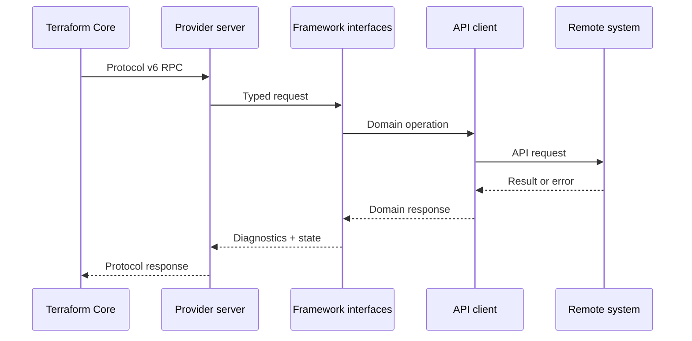
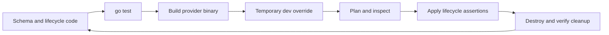

<!-- AUTO-GENERATED by scripts/sync-terraform-curriculum.mjs. Edit the canonical curriculum, not this file. -->

> [!NOTE]
> This page is generated from the reviewed Terraform Mastery curriculum at commit [`c3566e80e995`](https://github.com/thokchomlolet03-cpu/terraform-mastery/commit/c3566e80e995cf4d47c4b756af8674bfd89ef5fb). The source repository is authoritative.

## Lessons in this module

- [11.01 Terraform Plugin Framework architecture](#1101-terraform-plugin-framework-architecture)
- [11.02 Building and testing a custom Go provider](#1102-building-and-testing-a-custom-go-provider)

---

## 11.01 Terraform Plugin Framework architecture

> Terraform Core owns planning and state coordination; a provider translates protocol requests into domain API operations and returns diagnostics and proposed state.

### Why this matters

Provider development reveals the boundary between Terraform's language engine and an external platform. That boundary explains computed values, unknowns, replacement, refresh, import, diagnostics, and why provider defects can produce incorrect plans or state.

### Learning outcomes

After this lesson, you should be able to:

- locate Core, protocol, framework, provider, client, and remote API responsibilities;
- explain provider and resource interface methods;
- trace configuration, plan, prior state, and response state through an operation;
- distinguish schema validation from remote API behavior;
- identify correctness obligations for Create, Read, Update, and Delete.

### Analogy: an interpreter at a negotiation

Core speaks Terraform's typed protocol; a cloud API speaks its own domain model. The provider interprets requests, makes domain calls, and translates results and errors back.

#### Where the analogy breaks

The provider does more than translate words. It defines schemas, participates in planning, persists identity, normalizes values, handles unknowns, and can influence whether a change is in-place or replacement.

### First-principles reconstruction

#### Inputs

- provider configuration and environment-derived credentials;
- resource configuration, proposed plan, and prior state;
- framework request types and provider/API client behavior.

#### Constraints

Protocol v6 is the current recommended protocol and requires Terraform CLI 1.0 or later. Response data must obey the schema and planned-value consistency rules. Diagnostics must preserve actionable context without leaking secrets.

#### Transformation

The provider server performs the plugin handshake and exposes protocol RPCs. The Framework maps them to `Provider` and `Resource` interfaces. Implementations decode typed data, call an API client, translate results, append diagnostics, and update or remove state.

#### Outputs

Core receives schemas, diagnostics, planned behavior, refreshed values, and applied state. The remote system receives authenticated API operations from the provider client.

### Execution model



### Lifecycle contract

- `Metadata` supplies provider type and version metadata.
- `Schema` defines provider configuration; resource `Schema` defines configuration and state shape.
- `Configure` builds shared clients for resources and data sources.
- `Resources` and `DataSources` register constructor functions.
- `Create` reads the plan, creates one remote object, and records known applied values.
- `Read` refreshes state and removes the binding when the remote object no longer exists.
- `Update` applies mutable differences and writes the resulting state.
- `Delete` removes the remote object; successful deletion normally leaves no state.

### Safe experiment

1. Open the Module 11 lab's `main.go`.
2. Trace `dummy_server` from Terraform configuration through `Metadata`, `Schema`, and `Create` to output state.
3. Predict which method runs for a name change and which plan behavior an instance-size change has.
4. Run `./verify.sh` and compare the evidence.
5. Confirm state and plan artifacts are removed.

### Failure laboratory

Temporarily stop `Create` from setting the computed `id`. Run the lab and inspect the consistency or assertion failure. Restore the code and explain why a provider must return complete applied state.

### Retrieval questions

1. Which component owns the dependency graph?
2. Which component defines a resource's schema?
3. What data does Create read and write?
4. What should Read do when an object is gone?
5. Why are compile-time interface assertions useful?

### Teach-back prompt

Trace a replacement from configuration through planning, provider RPCs, external API operations, diagnostics, and the final state snapshot.

### Official sources

- [Plugin Framework provider servers](https://developer.hashicorp.com/terraform/plugin/framework/provider-servers)
- [Provider implementation](https://developer.hashicorp.com/terraform/plugin/framework/providers)
- [Create resources](https://developer.hashicorp.com/terraform/plugin/framework/resources/create)
- [Framework RPCs](https://developer.hashicorp.com/terraform/plugin/framework/internals/rpcs)

### Website storyboard

Animate a protocol request across Core, provider server, Framework method, API client, and remote system. Learners inspect configuration, plan, prior state, diagnostics, and response state at each boundary.

[View this lesson in the canonical curriculum source](https://github.com/thokchomlolet03-cpu/terraform-mastery/blob/c3566e80e995cf4d47c4b756af8674bfd89ef5fb/11_Peak_Mastery_Custom_Provider_Development/11_01_plugin_framework_architecture.md)

---

## 11.02 Building and testing a custom Go provider

> Build the smallest correct provider vertically—from server entrypoint to one resource lifecycle—then add validation, import, tests, logging, and release engineering.

### Why this matters

A provider that compiles can still lose identity, mishandle unknown values, hide API errors, leak secrets, or return state inconsistent with the plan. The learning target is not code volume; it is a defensible lifecycle contract with evidence.

### Learning outcomes

After this lesson, you should be able to:

- scaffold a provider with pinned Go dependencies;
- implement one resource's schema and lifecycle;
- use development overrides without editing personal CLI settings;
- test create, read, update, replacement, deletion, and cleanup;
- distinguish a learning simulation from a production provider.

### Analogy: building a vertical slice of a restaurant

Before expanding the menu, prove that one order can travel from waiter to kitchen to receipt, including errors and cancellation. A complete narrow path teaches more than many disconnected stubs.

#### Where the analogy breaks

Terraform repeats refresh and planning operations, values can be null or unknown, state outlives the provider process, and real APIs are only partly transactional.

### First-principles reconstruction

#### Inputs

- supported Go and Terraform versions;
- a tagged Plugin Framework dependency;
- provider address and resource schema;
- API client semantics, identity, errors, and test fixtures.

#### Constraints

Use the official scaffolding repository for a production starting point. Pin tagged Framework releases and review their changelog when upgrading. `dev_overrides` bypasses normal version/checksum selection for ordinary commands and is temporary development tooling—not a distribution method.

#### Transformation

Serve a provider factory, register a resource, decode Framework models, call a client, translate diagnostics, and set state. Add plan modifiers only when the remote API truly requires replacement. Build unit tests for pure logic and acceptance tests for protocol-plus-API behavior.

#### Outputs

A development binary, isolated test configuration, lifecycle evidence, cleanup evidence, and a list of missing production capabilities.

### Development loop



### Worked example

```go
var _ provider.Provider = &exampleProvider{}
var _ resource.Resource = &exampleResource{}

func (r *exampleResource) Create(
    ctx context.Context,
    req resource.CreateRequest,
    resp *resource.CreateResponse,
) {
    var plan exampleModel
    resp.Diagnostics.Append(req.Plan.Get(ctx, &plan)...)
    if resp.Diagnostics.HasError() {
        return
    }

    // Call the domain client, then record all applied values.
    resp.Diagnostics.Append(resp.State.Set(ctx, &plan)...)
}
```

For local development, build a correctly named executable into a dedicated directory and point a temporary `*.tfrc` file at it via `TF_CLI_CONFIG_FILE`. Do not overwrite `~/.terraformrc`. With a development override, ordinary commands use the local binary; `terraform init` still tries normal provider selection and is not required for this lab.

The included dummy provider has no external API. Its random ID and status exist only in state, so it cannot model remote disappearance, retries, authentication, eventual consistency, import, or crash recovery. Those are explicit next steps, not accomplishments to claim from this lab.

### Safe experiment

1. Run `cd lab_custom_go_provider && ./verify.sh`.
2. Observe compile-time checks and the isolated CLI configuration.
3. Confirm create returns `srv-` plus eight hexadecimal characters.
4. Confirm a name change preserves identity and an instance-size change plans replacement.
5. Confirm destroy and temporary-file cleanup.

### Failure laboratory

Remove `RequiresReplace` from `instance_size`, rerun the replacement assertion, and inspect the failure. Restore it, then explain why the plan modifier must represent real API immutability rather than a teaching preference.

### Retrieval questions

1. Why pin a tagged Framework dependency?
2. What does a development override bypass?
3. Why should Create read from the plan?
4. Which behaviors require a real API acceptance test?
5. What evidence distinguishes an update from replacement?

### Teach-back challenge

Review the dummy provider as if it were proposed for production. Identify what is correct, what is simulated, and what must be added for API clients, authentication, import, timeouts, retries, logging, acceptance tests, documentation, signing, and distribution.

### Official sources

- [Plugin Framework getting started](https://developer.hashicorp.com/terraform/plugin/framework/getting-started)
- [Official provider scaffolding framework](https://github.com/hashicorp/terraform-provider-scaffolding-framework)
- [Terraform CLI development overrides](https://developer.hashicorp.com/terraform/cli/config/config-file#development-overrides-for-provider-developers)
- [Plugin Framework repository and releases](https://github.com/hashicorp/terraform-plugin-framework)

### Friction Hunter storyboard

Create an interactive provider workbench where learners change one lifecycle method, predict the plan/state transition, run assertions, and classify which claims need mocks versus a real API.

[View this lesson in the canonical curriculum source](https://github.com/thokchomlolet03-cpu/terraform-mastery/blob/c3566e80e995cf4d47c4b756af8674bfd89ef5fb/11_Peak_Mastery_Custom_Provider_Development/11_02_writing_a_custom_go_provider.md)
