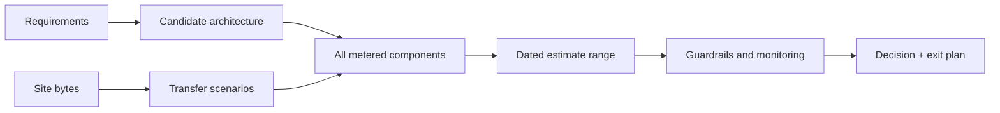
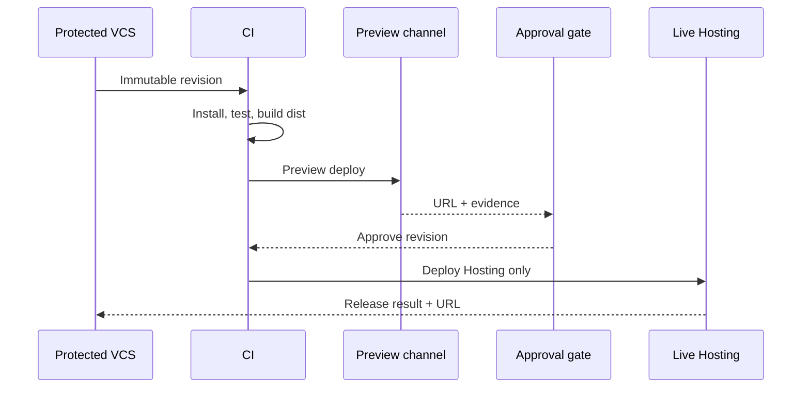
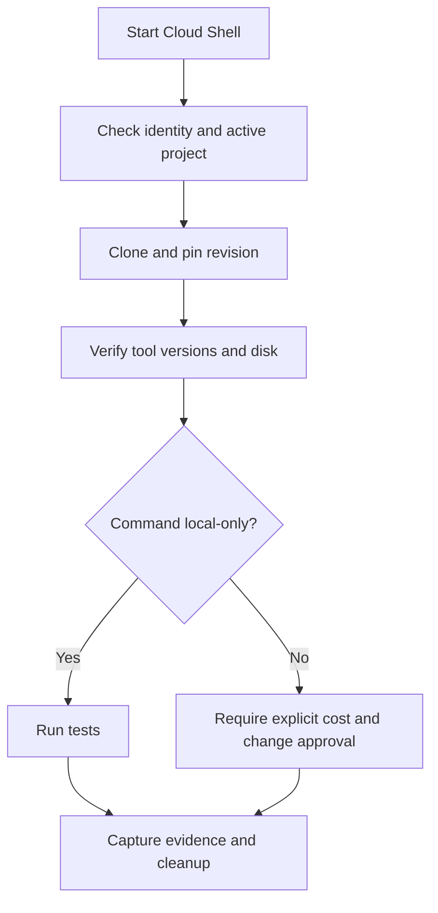
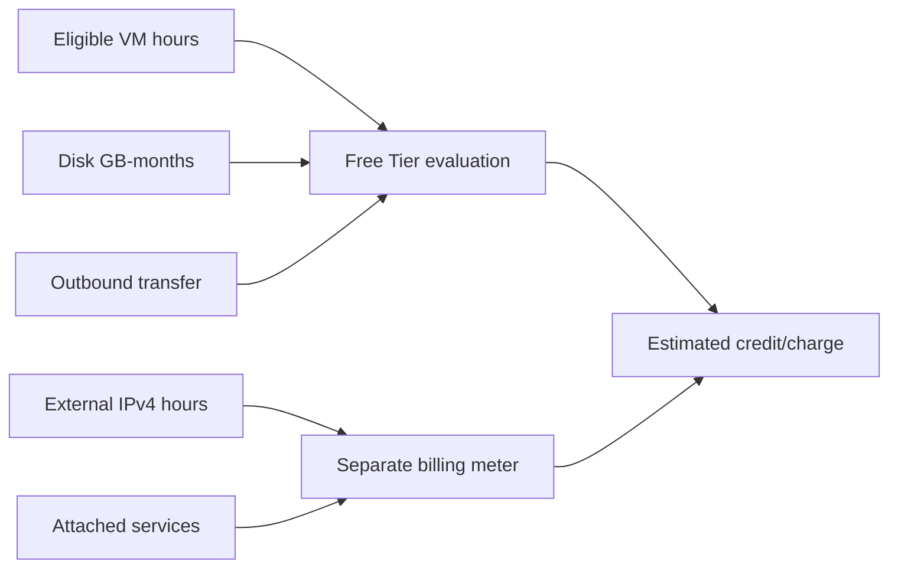

<!-- AUTO-GENERATED by scripts/sync-terraform-curriculum.mjs. Edit the canonical curriculum, not this file. -->

> [!NOTE]
> This page is generated from the reviewed Terraform Mastery curriculum at commit [`c3566e80e995`](https://github.com/thokchomlolet03-cpu/terraform-mastery/commit/c3566e80e995cf4d47c4b756af8674bfd89ef5fb). The source repository is authoritative.

## Lessons in this module

- [12.01 Cost-bounded static hosting decisions](#1201-cost-bounded-static-hosting-decisions)
- [12.02 Governed Firebase Hosting deployment](#1202-governed-firebase-hosting-deployment)
- [12.03 Reproducible browser-based labs with Cloud Shell](#1203-reproducible-browser-based-labs-with-cloud-shell)
- [12.04 Cost-aware Google Cloud Terraform planning](#1204-cost-aware-google-cloud-terraform-planning)

---

## 12.01 Cost-bounded static hosting decisions

> “Free tier” is an eligibility rule and quota, not a bill guarantee; choose architecture from current pricing, measured usage, and failure behavior.

### Why this matters

The legacy lesson promised an exact zero bill. That claim ignored external IPv4 charges, traffic spikes, quota cadence, billing eligibility, DNS costs, optional services, taxes, and future price changes. Cost engineering requires a dated estimate and controls, not a slogan.

### Learning outcomes

After this lesson, you should be able to:

- compare GitHub Pages, Firebase Hosting, and Google Cloud load-balanced storage;
- separate fixed, usage-based, and external costs;
- calculate a bounded estimate from current official prices;
- explain quota-exhaustion behavior and billing-plan differences;
- define monitoring and an exit strategy before deployment.

### Analogy: a mobile-data plan

A plan can include an allowance, but the bill depends on eligibility, measured usage, overage behavior, add-ons, and whether service stops or billing begins at the limit.

#### Where the analogy breaks

Cloud systems combine many meters and products. A single architecture can incur storage, data transfer, IP, load-balancer, logging, build, DNS, and domain-registration charges under different accounts.

### First-principles reconstruction

#### Inputs

- built-site storage size and monthly transfer forecast;
- domain, TLS, preview, CI, and availability requirements;
- current regional prices, quotas, billing plan, and account eligibility;
- failure preference: disable service, alert, cap eligible usage, or pay overage.

#### Constraints

Prices and quotas are time-sensitive. A custom domain still has registrar/DNS costs outside hosting. Budget alerts do not stop Compute Engine or persistent-resource charges. Google's 2026 spend-cap preview covers only listed eligible services and explicitly excludes ongoing fixed usage.

#### Transformation

For each option, enumerate every billable component, calculate baseline and traffic scenarios, model quota exhaustion, verify in the actual console, and record the evidence date.

#### Outputs

A decision record names assumptions, monthly ranges, excluded costs, monitoring, ownership, quota behavior, and the date/source for every price.

### Cost model



### Current comparison snapshot

As checked on 2026-08-24:

- Firebase Hosting's Spark pricing table lists 10 GB storage, 360 MB/day transfer, and custom-domain SSL. Its usage guide describes no-cost transfer up to 10 GB/month and says Spark sites are eventually disabled after exceeding the limit. Check the project console because cadence and enforcement matter.
- Google Cloud global forwarding rules list $0.025 per hour for the first five, before data processing and other attached services. That is about `$0.025 × 730 = $18.25` for a 730-hour month, not a universal total.
- GitHub Pages has separate eligibility, limits, and terms; evaluate it from its current official documentation when choosing it.

Firebase Hosting can be a good static-site option, but the correct conclusion is “within the documented no-cost quota under these assumptions,” not “guaranteed $0.00.”

### Safe experiment

1. Build the intended static site and measure `dist/` bytes.
2. Estimate 1,000, 10,000, and 100,000 monthly page views from measured transfer per view.
3. Compare those scenarios against current Firebase Hosting and alternative quotas.
4. Record DNS/domain, CI, and optional-product costs separately.
5. Make no deployment; produce a dated decision record first.

### Failure laboratory

Assume a crawler increases transfer tenfold. Determine whether each platform disables the site, charges overage, or requires a plan change. Add rate, cache, monitoring, and rollback decisions without claiming they eliminate all cost risk.

### Retrieval questions

1. Why is free-tier eligibility not a bill guarantee?
2. Which load-balancer charge creates a fixed baseline in the example?
3. Why does quota cadence matter?
4. Which costs exist outside the hosting platform?
5. What must be dated in a cost decision record?

### Teach-back challenge

Defend one hosting option using measured site size, three traffic scenarios, every billable component, quota-exhaustion behavior, monitoring, and an exit plan.

### Official sources

- [Firebase pricing](https://firebase.google.com/pricing)
- [Firebase Hosting usage, quotas, and pricing](https://firebase.google.com/docs/hosting/usage-quotas-pricing)
- [Google Cloud Load Balancing pricing](https://cloud.google.com/load-balancing/pricing)
- [Google Cloud spend-cap limitations](https://docs.cloud.google.com/billing/docs/how-to/budgets-spend-caps)
- [Terraform plan review](https://developer.hashicorp.com/terraform/cli/commands/plan)

### Friction Hunter storyboard

Create a calculator with site size, views, cache assumptions, plan, and optional services. It shows fixed and variable meters, quota behavior, source date, and uncertainty rather than a single “free” badge.

[View this lesson in the canonical curriculum source](https://github.com/thokchomlolet03-cpu/terraform-mastery/blob/c3566e80e995cf4d47c4b756af8674bfd89ef5fb/12_Zero_Cost_Cloud_Architecture_and_Global_Access/12_01_gcp_zero_cost_hosting_analysis.md)

---

## 12.02 Governed Firebase Hosting deployment

> A safe static-site release binds a reviewed source revision to a reproducible build, preview evidence, least-privilege deployment identity, and observable rollback.

### Why this matters

Hosting is only the final step. A deployment can publish stale content, expose secrets, overwrite routing, exceed quota, or make a broken build live. Manual CLI use is useful for first setup; production publishing needs protected configuration and evidence.

### Learning outcomes

After this lesson, you should be able to:

- distinguish Firebase Hosting from Firebase App Hosting;
- configure an Astro static build directory correctly;
- test locally and use preview channels before live release;
- establish CI using Firebase's supported GitHub integration;
- verify domain, certificate, quota, and rollback state.

### Analogy: publishing a new book edition

The source revision is the manuscript, the build is typesetting, a preview is the proof copy, and live deployment is distribution. You keep the prior edition so a defective release can be withdrawn.

#### Where the analogy breaks

A web deployment changes globally cached content and routing. DNS and certificate provisioning are asynchronous, previews have expiration, and usage quotas continue after publication.

### First-principles reconstruction

#### Inputs

- immutable website source and lock file;
- known Node/package-manager versions and Astro build command;
- Firebase project/site identity and `firebase.json`;
- deployment identity, protected branch, quota plan, and domain ownership.

#### Constraints

Firebase Hosting serves static assets; adding Functions, Cloud Run, or App Hosting introduces other products and pricing. Spark quota exhaustion can disable the site. Custom-domain certificate provisioning can take time and DNS ownership must be proven.

#### Transformation

Install dependencies from the lock file, run quality gates, build `dist/`, serve or emulate locally, deploy a preview, approve the exact revision, then deploy only Hosting to the live channel.

#### Outputs

Evidence includes source SHA, dependency/runtime versions, build result, preview URL, approval, live release ID/URL, domain certificate status, usage baseline, and rollback target.

### Release model



### First deployment

From the actual Astro project root—not this curriculum repository:

```bash
corepack enable
pnpm install --frozen-lockfile
pnpm run build
npx firebase-tools login
npx firebase-tools init hosting
npx firebase-tools emulators:start --only hosting
npx firebase-tools deploy --only hosting
```

Choose `dist` as the public directory. For a normal statically generated multi-page Astro site, do not configure a blanket single-page rewrite unless the application truly needs it. Review generated `firebase.json` and `.firebaserc` before commit.

For GitHub, use the current Firebase CLI workflow (`firebase init hosting:github`) and inspect every generated permission, secret, action reference, preview trigger, and live branch. Protect the live environment and avoid exposing deployment credentials to untrusted fork code. In higher-assurance environments, evaluate short-lived federation rather than long-lived service-account keys.

### Safe experiment

1. Build the site and serve `dist/` locally.
2. Check root, article, asset, 404, canonical URL, RSS, and search behavior.
3. Initialize Hosting in a disposable Firebase project or carefully review with `--debug` only when authorized.
4. Deploy a preview channel before live.
5. Verify release history, then delete the preview and project if it was disposable.

### Failure laboratory

Configure an incorrect public directory in a disposable setup. Observe the preview, correct it, and document which build assertion should prevent an empty or stale directory from reaching live.

### Retrieval questions

1. Why is `dist` the usual Astro Hosting directory?
2. When is a single-page rewrite inappropriate?
3. What should a preview prove?
4. Which revision does approval authorize?
5. What changes when dynamic services are added?

### Teach-back prompt

Explain a Firebase release from source to rollback, including build reproducibility, preview, identity, protected live deploy, custom-domain provisioning, quota monitoring, and evidence.

### Official sources

- [Firebase Hosting quickstart](https://firebase.google.com/docs/hosting/quickstart)
- [Test, preview, and deploy](https://firebase.google.com/docs/hosting/test-preview-deploy)
- [Connect a custom domain](https://firebase.google.com/docs/hosting/custom-domain)
- [Hosting usage and pricing](https://firebase.google.com/docs/hosting/usage-quotas-pricing)
- [Terraform's core review workflow](https://developer.hashicorp.com/terraform/intro/core-workflow)

### Website storyboard

Show a release conveyor from commit through build, local checks, preview, approval, live, domain TLS, monitoring, and rollback. Learners must attach evidence before each gate opens.

[View this lesson in the canonical curriculum source](https://github.com/thokchomlolet03-cpu/terraform-mastery/blob/c3566e80e995cf4d47c4b756af8674bfd89ef5fb/12_Zero_Cost_Cloud_Architecture_and_Global_Access/12_02_firebase_hosting_deployment_guide.md)

---

## 12.03 Reproducible browser-based labs with Cloud Shell

> Cloud Shell is a convenient temporary workstation, not a permanent enterprise runner or a promise that every required tool version is preinstalled.

### Why this matters

Browser access can remove local setup friction, but sessions, quotas, home storage, tool versions, credentials, and network access still constrain reproducibility. A useful workbook begins with preflight checks and keeps cloud mutations out of local-only labs.

### Learning outcomes

After this lesson, you should be able to:

- explain Cloud Shell's session, quota, and storage boundaries;
- perform a tool/version preflight before running labs;
- separate local-only tests from real Google Cloud operations;
- protect credentials and clean generated artifacts;
- choose CI or a managed workstation when Cloud Shell is the wrong boundary.

### Analogy: a library study desk

The desk is ready to use and your locker holds a limited set of materials, but the desk can close, tools may change, and it is not your permanent laboratory.

#### Where the analogy breaks

Cloud Shell is authenticated to a Google account and can reach real APIs. Commands that seem like exercises can mutate billable projects if credentials and project selection are active.

### First-principles reconstruction

#### Inputs

- repository URL and exact revision;
- required Terraform, Go, Graphviz, shell, and package-manager versions;
- Cloud Shell quota/storage state and active Google Cloud identity/project;
- classification of each command as local-only or cloud-mutating.

#### Constraints

The current default weekly quota is 50 hours. Cloud Shell supplies 5 GB of persistent home storage, which may be recycled after inactivity with notice. Preinstalled tool versions change. The Module 11 Framework currently requires Go 1.25 or later.

#### Transformation

Clone a pinned revision, inspect instructions, verify versions and disk space, run repository validation, execute local-only labs, capture evidence, and clean generated state/build artifacts.

#### Outputs

A run record states revision, tool versions, identity/project, checks executed, results, cleanup, and any environment deviation.

### Preflight model



### Worked procedure

```bash
git clone YOUR_REPOSITORY_URL terraform-mastery
cd terraform-mastery
git rev-parse HEAD

terraform version
go version
dot -V
df -h .
gcloud auth list
gcloud config get-value project

make validate
make labs
make provider
```

Do not assume `sudo apt-get` changes are durable. If a required tool is missing, use its official installation method in user-owned storage, pin a version, and record it. Do not run the Module 12 Google provider apply merely because Cloud Shell already has credentials.

### Safe experiment

1. Start Cloud Shell and inspect quota, disk, identity, project, and versions.
2. Clone a known revision.
3. Run `make validate`; then run the local-only labs and provider harness.
4. Confirm no cloud resources were created by inspecting the scripts and active project activity.
5. Clean build/state artifacts and record the result.

### Failure laboratory

Temporarily place an incompatible tool earlier in `PATH` or detect a version below the documented minimum. Observe the failure, fix the environment without changing system-wide configuration, and add a preflight rule.

### Retrieval questions

1. What is Cloud Shell's current weekly default quota?
2. What persists, and what may be recycled?
3. Why inspect the active project before running Terraform?
4. Which repository targets are local-only?
5. When should you choose CI or Cloud Workstations instead?

### Teach-back challenge

Onboard another learner into Cloud Shell and demonstrate revision pinning, tool preflight, identity boundaries, local-only execution, evidence, cleanup, and escalation for cloud-mutating commands.

### Official sources

- [Cloud Shell overview](https://cloud.google.com/shell/docs)
- [Cloud Shell quotas and limits](https://docs.cloud.google.com/shell/docs/quotas-limits)
- [Cloud Shell how-to guides](https://cloud.google.com/shell/docs/how-to)
- [Terraform Google provider authentication](https://registry.terraform.io/providers/hashicorp/google/latest/docs/guides/provider_reference)
- [Install and version Terraform](https://developer.hashicorp.com/terraform/install)

### Friction Hunter storyboard

Build a browser-lab preflight panel showing revision, versions, disk, identity, project, quota, and a red/green classification for local-only versus cloud-mutating commands.

[View this lesson in the canonical curriculum source](https://github.com/thokchomlolet03-cpu/terraform-mastery/blob/c3566e80e995cf4d47c4b756af8674bfd89ef5fb/12_Zero_Cost_Cloud_Architecture_and_Global_Access/12_03_cloud_shell_access_anywhere_workbook.md)

---

## 12.04 Cost-aware Google Cloud Terraform planning

> Encode known eligibility constraints, keep billable features off by default, and still verify official pricing and the plan before every real apply.

### Why this matters

An `e2-micro` VM can fit the Compute Engine Free Tier while attached resources still generate charges. The legacy example enabled an external IPv4 address that currently has a separate hourly price, exposed HTTP publicly, and claimed guaranteed zero charges.

### Learning outcomes

After this lesson, you should be able to:

- describe current Compute Engine Free Tier eligibility at a high level;
- identify adjacent billable resources such as external IPv4 and transfer;
- use variable validation and private defaults as guardrails;
- test the configuration with a mocked provider without credentials;
- perform a cost and security review before an authorized apply.

### Analogy: a discounted airline ticket

The base seat may qualify for a discount, while baggage, seat selection, transfers, and itinerary changes are separate charges. Eligibility must be checked at purchase time.

#### Where the analogy breaks

Cloud meters run continuously and can change through API operations, drift, traffic, or policy. Terraform guardrails cover only configuration paths they explicitly model.

### First-principles reconstruction

#### Inputs

- project/billing eligibility and current Free Tier documentation;
- region, machine hours, disk type/size, IP, transfer, image, and attached services;
- Terraform plan and current provider schema;
- security/access requirements and destruction plan.

#### Constraints

Current documentation lists eligible `e2-micro` usage across `us-west1`, `us-central1`, and `us-east1`, 30 GB-months of standard persistent disk, and limited outbound transfer. Eligibility is aggregated and subject to account/billing conditions. External IPv4 addresses on VMs have a separate hourly price with only a very small monthly free allowance.

#### Transformation

Validate eligible regions, fix the machine/disk shape, omit external IPv4 and ingress rules by default, generate a plan, inspect every resource and meter, obtain approval, monitor, and destroy when finished.

#### Outputs

The default configuration produces a private plan candidate—not infrastructure and not a cost guarantee. A real apply requires dated pricing evidence, billing controls, identity, approval, monitoring, and cleanup.

### Cost boundary



### Configuration strategy

The included `terraform_gcp_free_tier` root:

- restricts the region list and pairs zone with region;
- fixes the VM to `e2-micro` and a 30 GB `pd-standard` boot disk;
- defaults `enable_public_ipv4` to `false`;
- creates HTTP and SSH rules only from explicit source ranges;
- rejects world-open SSH;
- labels resources as learning and “verify before apply”;
- constrains the Google provider to the reviewed 7.x line and records the selected
  build in `.terraform.lock.hcl`.

These are guardrails, not proofs of future price or eligibility.

### Safe experiment

1. Run `terraform init` and `terraform test` in the example directory.
2. Confirm the mocked default plan has no access configuration or firewall rules.
3. Run `terraform plan` only with authorized Google credentials if needed.
4. Inspect the JSON plan and price every resource before apply.
5. Do not apply as part of this curriculum validation.

### Failure laboratory

Enable public IPv4 and public HTTP in a mocked test. Observe the additional plan shape, then look up the current external IPv4 meter and document the security and cost review required before approval.

### Retrieval questions

1. Which VM shape and regions are currently listed?
2. Why can an eligible VM still generate a bill?
3. What does the example omit by default?
4. What can mocked tests prove?
5. What evidence is required before apply?

### Teach-back prompt

Review the example as a change approver. Explain every meter, security exposure, guardrail, blind spot, monitoring control, and cleanup step without using “free” as a guarantee.

### Official sources

- [Google Cloud Free Tier](https://docs.cloud.google.com/free/docs/free-cloud-features)
- [External IP address pricing](https://cloud.google.com/vpc/network-pricing#ipaddress)
- [Google provider documentation](https://registry.terraform.io/providers/hashicorp/google/latest/docs)
- [Google Cloud pricing calculator](https://cloud.google.com/products/calculator)
- [Terraform provider mocking](https://developer.hashicorp.com/terraform/language/tests/mocking)

### Friction Hunter storyboard

Overlay a Terraform plan with cost meters. Public IP, disk, transfer, and optional services change from gray to billable colors as learners enable them, while pricing evidence shows its verification date.

[View this lesson in the canonical curriculum source](https://github.com/thokchomlolet03-cpu/terraform-mastery/blob/c3566e80e995cf4d47c4b756af8674bfd89ef5fb/12_Zero_Cost_Cloud_Architecture_and_Global_Access/12_04_meta_engineering_terraform_gcp_free_tier.md)
